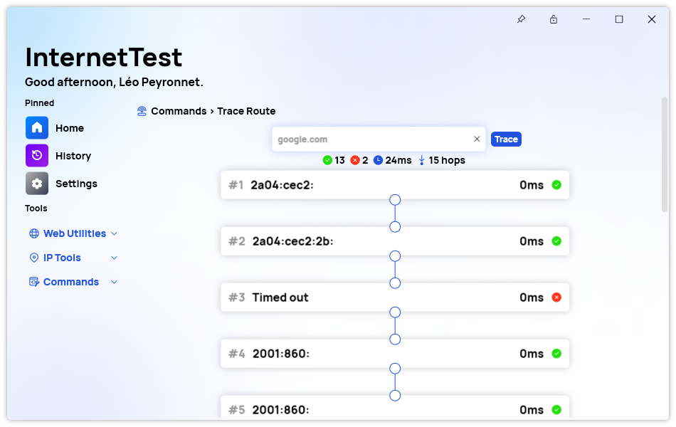

A new version of InternetTest Pro is now available and brings new features and improvements alongside with bug fixes.

## Changelog

### New

- Added translations (#442)
- Added the possibility to make a speed test (#442)
- Test button is disabled when making a speed test (#442)
- Speed field is now rounding the result (#442)
- Added translations (#443)
- Added TraceRouteItem (#443)
- Added TraceRoute page (#443)
- Added trace route system (#444)
- Added the possibility to make a trace route (#444)
- Added Overview panel (#444)
- Added placeholder in Trace route page (#444)
- Added the possibility to set the max number of hops (#445)
- Added the possibility to set the maximum timeout (#446)
- Added missing startup options in Settings
- Added the possibility to copy the addresses (#444)

### Fixed

- Fixed: Details don't get cleared in DNS page (#441)
- Fixed an issue with error displaying twice (#444)
- Fixed an issue with Synethia
- Fixed an issue with the UI on start
- Fixed an issue with Overview section in Traceroute

### Updated

- Updated PeyrSharp.Core
- Updated PeyrSharp.Env

## Traceroute page

The Traceroute page in InternetTest Pro incorporates an intuitive user interface that simplifies the process of tracing the path to a destination. At the heart of the page lies a textbox where users can input either a website address or an IP address. Once the user clicks on the accompanying button, the tool initiates a traceroute operation, analyzing the network path taken by data packets to reach the specified destination.

### Clear Visual Representation

InternetTest Pro's Traceroute page presents the results of the traceroute operation in an easily comprehensible and visually appealing manner. The outcomes are displayed within a series of boxes that are connected to form a pathway, mimicking the route taken by the data packets. Each box represents a particular address encountered along the way, providing valuable information such as the status and time it took to reach that specific node.

### Insightful Overview Section

In addition to the visual representation of the traceroute path, InternetTest Pro offers an informative overview section. This section enables users to quickly assess the overall performance and characteristics of the traced path. It provides essential statistics, including the number of successful and failed hops, the time it took for each hop, and the total number of hops encountered during the journey.

### Conclusion

The introduction of InternetTest Pro's Traceroute page marks a significant advancement in network analysis tools, providing users with a powerful and user-friendly solution to unravel the path their data takes across the internet. With its intuitive interface, clear visual representation, and informative overview section, this feature equips users with valuable insights into their network performance.
By effortlessly tracing the route to a destination and presenting the results in a visually appealing manner, InternetTest Pro simplifies the process of troubleshooting network issues.
Moreover, the Traceroute page in InternetTest Pro is particularly beneficial for users who prefer not to navigate the intricacies of the Windows command prompt. With its user-friendly interface and straightforward functionality, this feature eliminates the need for users to memorize and type complex command line instructions.

## Download

[Click here](tinyurl.com/DownloadITP7) to download InternetTest.
