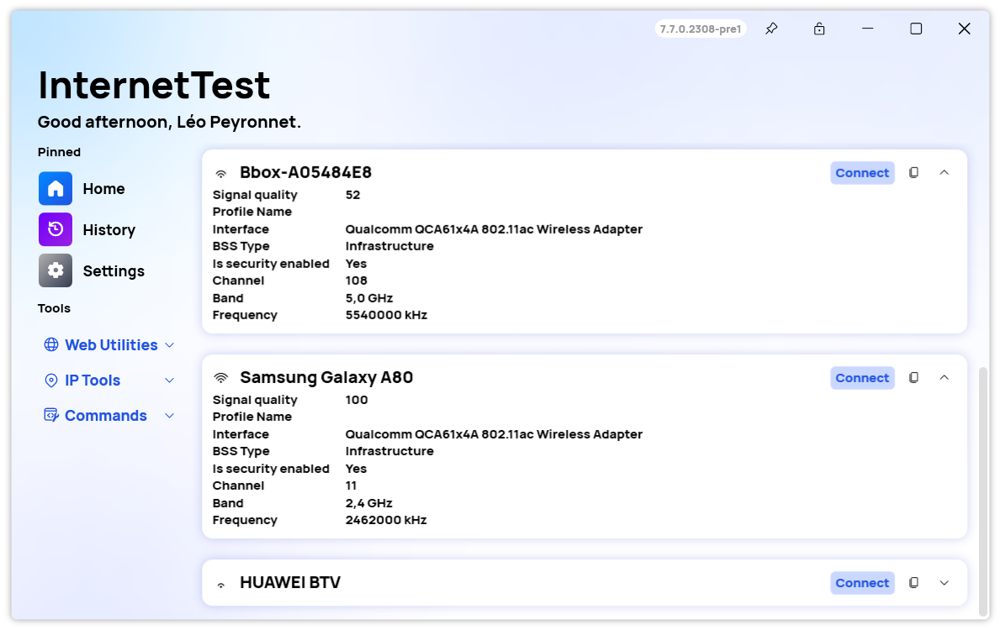
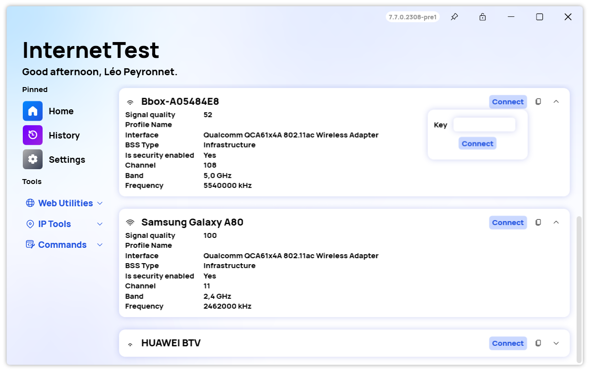

A new version of InternetTest Pro is available and it brings the new WiFi Networks page.

## The new WiFi Networks page
### What is it?
We are excited to announce a new feature for our InternetTest Pro app: the WiFi networks page. This page allows you to see all the available WiFi networks nearby and get detailed information about each one. You can access this page from the main menu of the app.

### Usage

To get more information about a WiFi network, simply tap on it to expand it. You will see the following information:

- Signal strength: how strong the WiFi signal is in your location.
- Interface name: the name of the wireless adapter on your device that is connected to the network.
- SSID: the service set identifier, or the name of the network.
- Frequency: the frequency band that the network operates on, in kHz.
- Band: the channel width that the network uses, such as 2.4 GHz or 5 GHz.
- Profile name: the name of the profile that you have saved for this network on your device.
- And more!

### Manage your connections

You can also connect to a WiFi network from this page by tapping on the Connect button. 

To refresh the list of WiFi networks, you can use the Scan button at the top right corner of the page. This will scan for any new or updated networks in your area.

## Changelog
### New
- Added translations (#461)
- Added WiFi Networks page (#461)
- Added NetworkInfo class (#462)
- Added WiFi Network Item (#462)
- Added the possibility to get all available networks (#462)
- Added the possibility to get the quality of networks (#463)
- Added translations (#464)
- Added the possibility to get information of available networks (#464)
- Added Band property (#464)
- Added Frequency property (#464)
- Added Refresh button (#464)
- Added Copy button (#464)
- Added the possibility to connect to a network (#465)
- Added Synethia action code (#465)
- Added placeholders (#461)

### Fixed
- Fixed an issue with the unit displayed

### Updated
- Updated PeyrSharp.Env (#459)
- Updated PeyrSharp.Core (#460)

## Website
InternetTest Pro now has a landing page so you can learn more about its feature. [Click here](https://leocorporation.dev/store/internettest) to access it.

## Download

[Click here](tinyurl.com/DownloadITP7) to download InternetTest.
