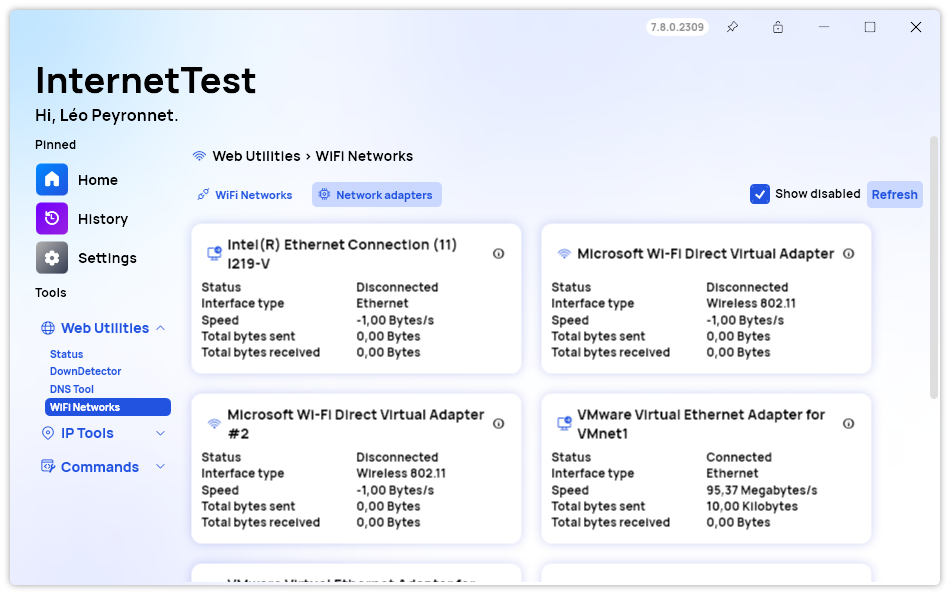
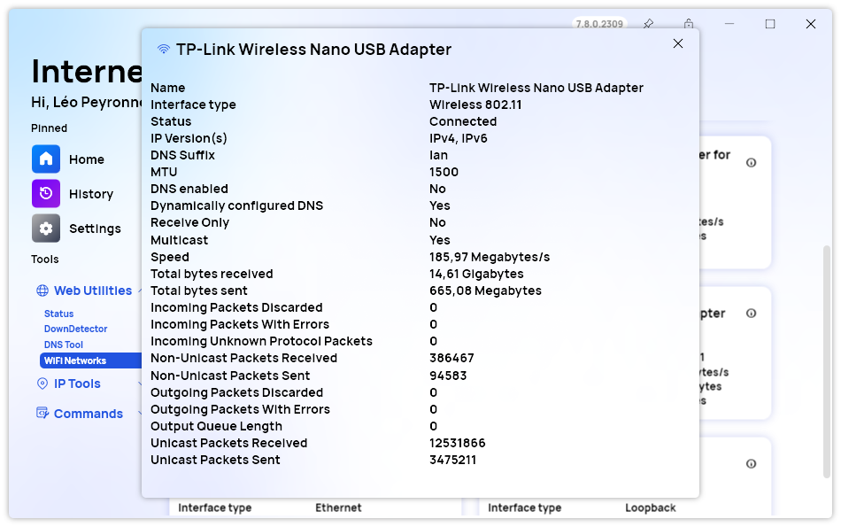
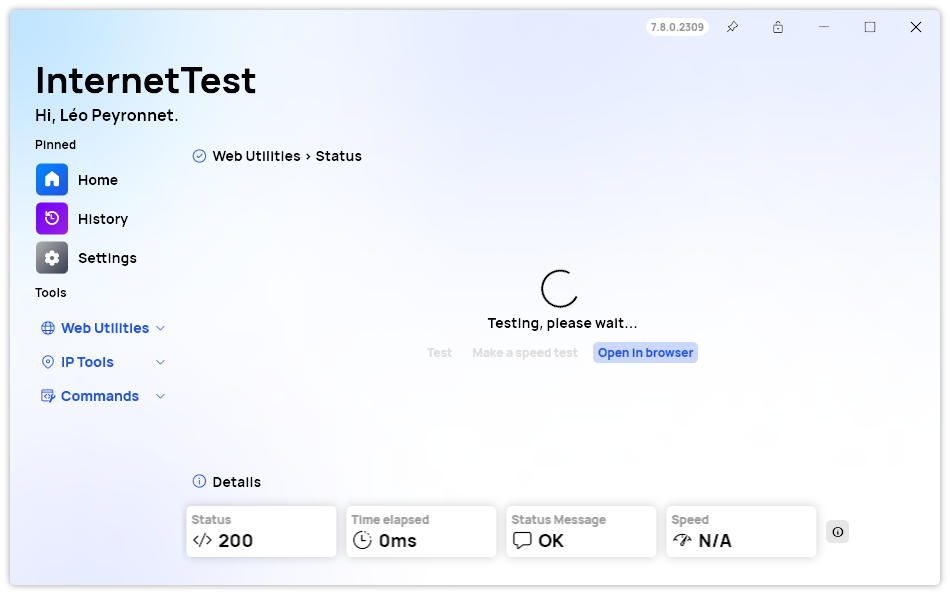

A new version of InternetTest Pro is now available and brings new features in the WiFi Network page, alongside with small improvements to the app.

## Network adapters section

One of the most notable additions is the Adapters section in the WiFi Networks page. This section allows you to see detailed information about your network adapters, such as name, type, status, speed, DNS configuration and IP address. You can also and refresh the adapter list and choose to show or hide disabled adapters from the list with a simple click.

Plus, we added a detailed window showing all the available information about a specific network adapter.

## More consistent UI and other improvements

### New Spinner UI

Another improvement is the spinner loading UI that we added to some of the pages that take longer to load, such as Traceroute, DownDetector and Status. This UI gives you a visual feedback that the app is working and not frozen.

### Improvements

We also fixed some minor issues, such as the alignment problem in the history page, and updated some of our dependencies to ensure optimal performance and compatibility.

## Changelog

You can find the detailed changelog below.

### New

- Added TabButton style (#480)
- Added translations (#480)
- Added Adapters section in WiFi Networks (#480)
- Added translations (#480)
- Added AdapterInfo class (#480)
- Added AdapterItem (#480)
- Added a list of adapters in Networks page (#480)
- Added formatted string method (#481)
- Added details popup (#481)
- Added Advanced button (#481)
- Added Refresh button (#481)
- Added the possibility to show/hide disabled adapters (#482)
- Added spinner loading UI in Traceroute (#483)
- Added spinner loading UI in DownDetector (#483)
- Added spinner loading UI in Status (#483)

### Fixed

- Fixed alignment issue in history page (#484)

### Updated

- Updated PeyrSharp.Env (#478)
- Updated PeyrSharp.Core (#479)
- Improved the way info is displayed (#481)

## Website

InternetTest Pro now has a landing page so you can learn more about its feature. [Click here](https://leocorporation.dev/store/internettest) to access it.

## Download

[Click here](tinyurl.com/DownloadITP7) to download InternetTest.
