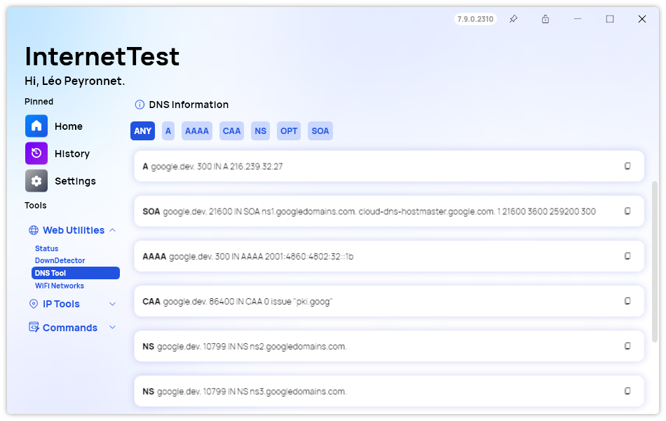
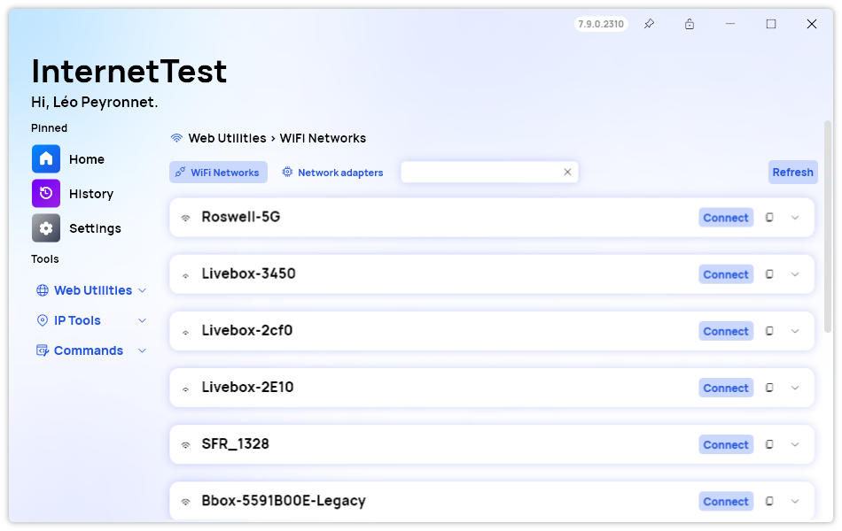
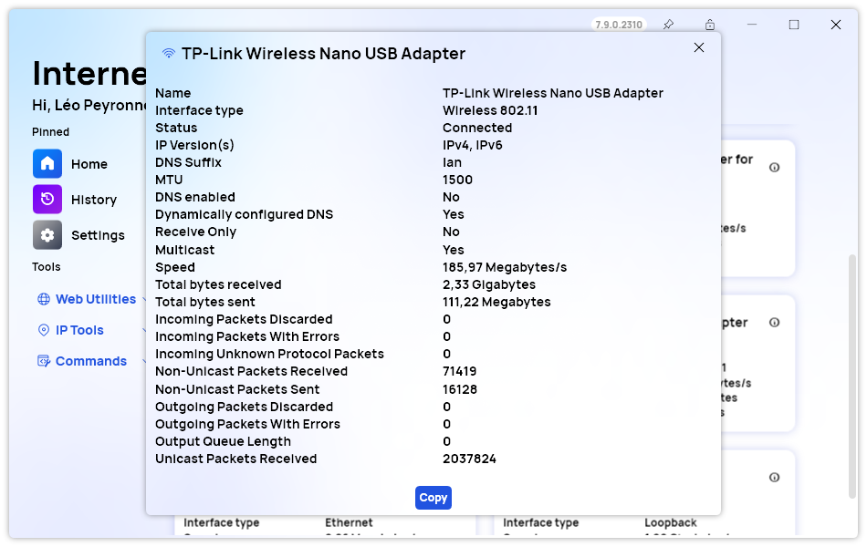

A new version of InternetTest Pro is available and it brings several new features to the app.

## Sort DNS Records

The DNS page in InternetTest Pro has received a significant upgrade in version 7.9.0.2310. With this update, we've introduced a new feature that allows users to manage DNS records more efficiently by type. Now, you can easily filter and view DNS records based on their types, making it simpler to monitor and maintain your DNS configuration.

## Search available nearby networks

The WiFi Networks page has now a search box, so you can search nearby available networks more easily. This feature simplifies the process of finding and connecting to nearby WiFi networks, whether you're at home, in the office, or on the go. It enhances your network selection process by providing a convenient and user-friendly interface to search for available networks, displaying essential information such as signal strength, security, and network names. With this enhancement, you'll experience a more streamlined and efficient network management experience.

## Improvements to Network Adapters section

We added a "Copy Details" feature, allowing users to easily duplicate the details of a network adapter. This can be immensely helpful when configuring multiple adapters or sharing adapter information with colleagues or technical support. In addition to this enhancement, we've dedicated time to addressing several issues related to this feature.

## Changelog

### New

- Added translations (#496)
- Added the possibility to disable IP location on start (#496)
- Added Filter Button style (#497)
- Added the possibility to filter DNS records (#497)
- Record filters are now sorted (#497)
- Added translations (#498)
- Added the possibility to copy details of a network adapter (#498)
- Added search box in WiFi Networks page (#499)
- Added the possibility to search WiFi networks (#499)

### Fixed

- Fixed wrong adapter icon (#495)

### Updated

- Updated PeyrSharp.Core (#493)
- Updated PeyrSharp.Env (#494)

## Website

InternetTest Pro now has a landing page so you can learn more about its feature. [Click here](https://leocorporation.dev/store/internettest) to access it.

## Download

[Click here](tinyurl.com/DownloadITP7) to download InternetTest.
