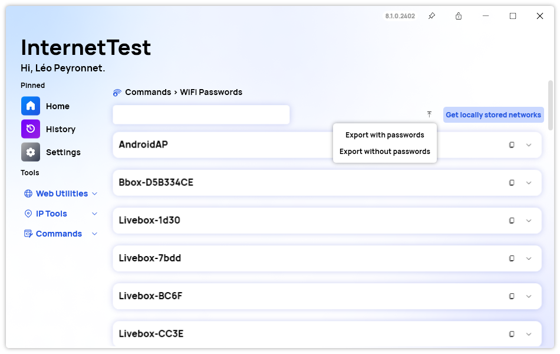
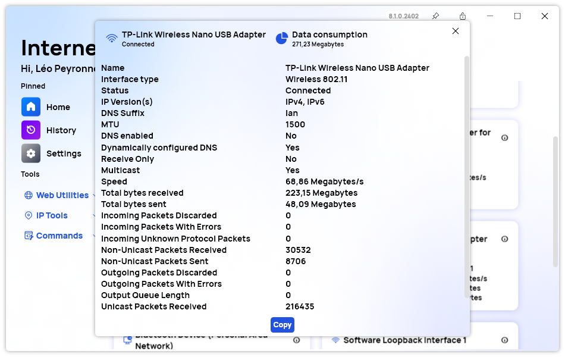

A new version of InternetTest Pro is available and it brings several improvements to the design of the app, as well as a new export WiFi Profiles feature.

## Export WiFI Profiles

You can export saved WiFi profiles on your devices to a folder where all the different profiles will be available inside XML files. You can also choose whether to store the WiFi key as plain text or keep it encrypted if you want.

## New Adapter Info window

We redesigned the Adapter Info window to make it easier to access to some key information such as: The current adapter status, the adapter name, and the total amount of data received and sent. This new UI makes it easier for you to see if you exceeded your data consumption quotas for example.

## Changelog

### New

- Added placeholder for Recover passwords Quick Action (#541)
- Added placeholder for WiFi Quick Action (#541)
- Added translations (#542)
- Added the possibility to export saved WiFi Networks (#542)
- Redesigned the Adapter details window (#543)
- The dismiss button is now hidden if the text box is empty (#544)

## Website

InternetTest Pro now has a landing page so you can learn more about its feature. [Click here](https://leocorporation.dev/store/internettest) to access it.

## Get the app

InternetTest Pro is available on Windows and requires the .NET 6 Windows Desktop Runtime. Please note that in the future, we plan to upgrade to the .NET 8 Windows Desktop Runtime which will be needed to execute the app.

- [Click here](https://tinyurl.com/DownloadITP7) to get the **Setup** version of InternetTest Pro
- [Click here](https://tinyurl.com/DownloadITPP) to get the **Portable** version of InternetTest Pro
