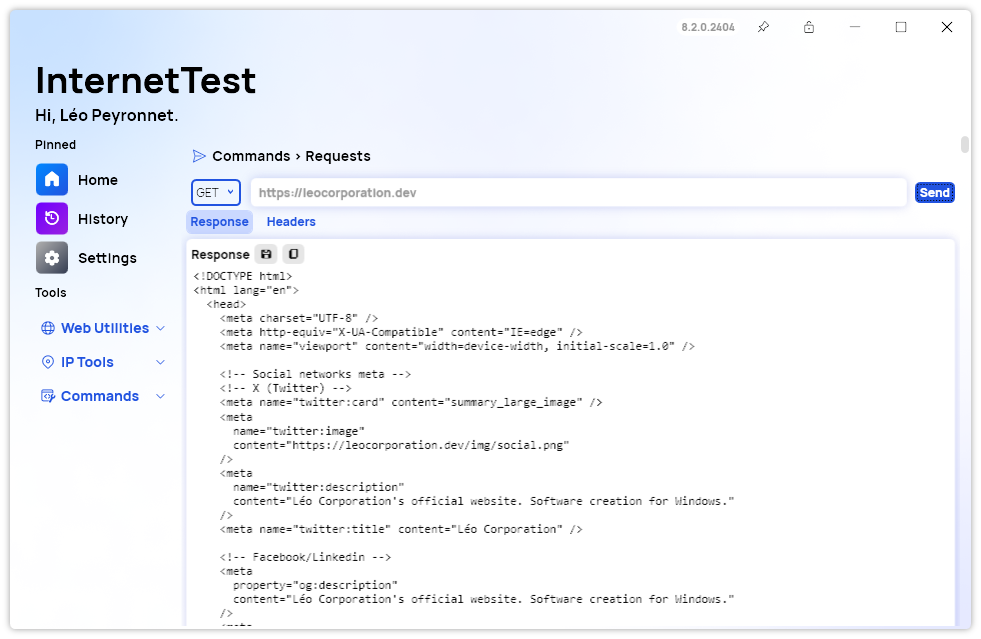

A new version of InternetTest Pro is available and it brings the new Requests feature.

## Introducing the HTTP Requests Feature

We are happy to introduce a brand new feature for InternetTest Pro: The "Requests" page. The HTTP Requests feature is a game-changer, providing users with the ability to interact with web servers directly from within the InternetTest Pro interface.

### Seamless Interaction

Gone are the days of relying on third-party applications or complex command-line tools to send HTTP requests. With InternetTest Pro, users can effortlessly send various types of requests—GET, POST, PUT, DELETE, HEAD, OPTIONS, PATCH, MERGE, COPY, and more—directly from the comfort of their Windows environment. This streamlined process ensures efficiency and convenience, allowing users to focus on their tasks without unnecessary distractions.

### Query Editor

One of the standout features of the HTTP Requests tool is its intuitive query editor, which puts the power of customization in the hands of the user. Need to include specific query parameters in your request? No problem. With the ability to toggle query parameters on and off seamlessly, users can tailor their requests with precision, ensuring accurate and relevant interactions with the target server.

### Response Section

Understanding the response from a web server is crucial for troubleshooting and optimization purposes. InternetTest Pro goes above and beyond by providing users with comprehensive feedback, including both the response content and headers. This valuable insight empowers users to analyze server responses effectively, making informed decisions and adjustments as needed. You can also save and copy all the details about the query in a few clicks.

## Framework Upgrade

Starting with version 8.2, InternetTest Pro now requires you to have the .NET 8 Windows Desktop Runtime installed on your computer to work properly. You can [click here](https://dotnet.microsoft.com/en-us/download/dotnet/8.0) to download it.

## Changelog

### New

- Added translations (#548)
- Created Requests page (#548)
- Added Requests page (#548)
- Added "Response" text (#549)
- Added the possibility to send an HTTP request (#549)
- Added Parameters Item (#549)
- Added Parameters section (#549)
- Added the possibility to copy the response (#550)
- Added the possibility to save the response (#550)
- Added translations (#551)
- Added the possibility to get the headers of the response (#551)
- Added the possibility to edit parameters (#552)
- Added the possibility to toggle parameters (#552)

### Fixed

- Fixed an issue with default page
- Fixed wrong request issue
- Fixed wrong background color

### Updated

- Upgraded to .NET 8 (#553)
- Updated Setup

## Website

InternetTest Pro now has a landing page so you can learn more about its feature. [Click here](https://leocorporation.dev/store/internettest) to access it.

## Get the app

InternetTest Pro is available on Windows and requires the .NET 8 Windows Desktop Runtime.

- [Click here](https://tinyurl.com/DownloadITP7) to get the **Setup** version of InternetTest Pro
- [Click here](https://tinyurl.com/DownloadITPP) to get the **Portable** version of InternetTest Pro
