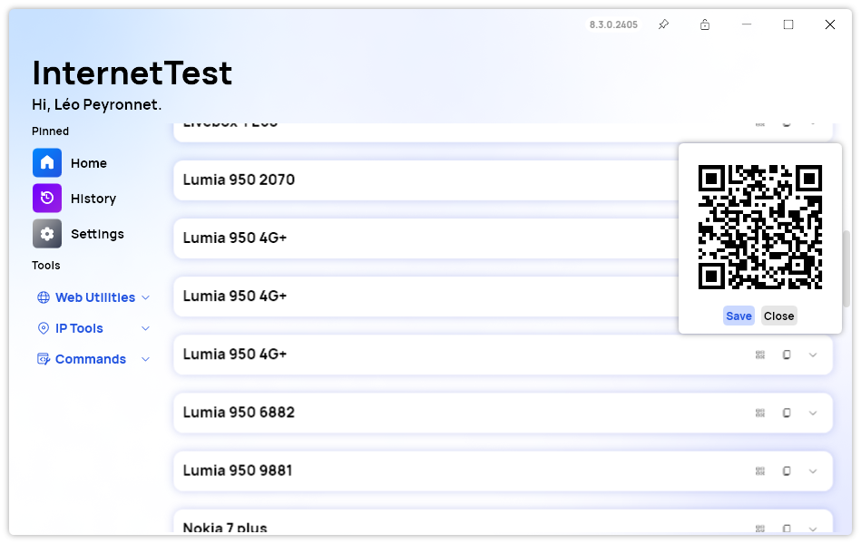
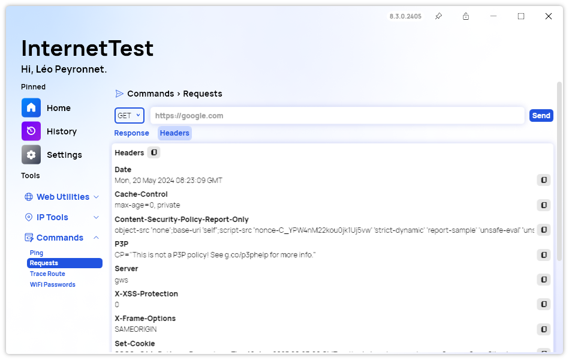

A new version of InternetTest is now available and it brings several improvements to the user experience, along with new features.

## Share saved WiFi networks using QR Codes

We added an innovative feature to InternetTest Pro allowing users to share WiFi networks effortlessly through QR codes. On the "WiFi passwords" page, users can now click on the QR code icon to generate a QR code that, when scanned, automatically connects a phone to the network. This convenient tool eliminates the hassle of manually entering WiFi credentials. Additionally, the generated QR code can be exported as a PNG file, making it easy to save and share on the user's hard drive. This feature enhances connectivity and simplifies the process of sharing WiFi access with friends and family.

## Improvements to user experience

InternetTest Pro has undergone significant user experience enhancements, making the app more intuitive and user-friendly. Various tooltips have been added, providing clearer descriptions of button functions and guiding users through their actions. The "About" section of the Settings page now includes a convenient link to the app's GitHub repository, facilitating access to source code and updates. On the Requests page, automatic URL formatting has been implemented, streamlining the process of entering and editing URLs. Additionally, users can now copy each header individually on the Requests page, allowing for more efficient handling and customization of request headers. These improvements collectively enhance the usability and functionality of InternetTest Pro.

## Changelog

### New

- Added QR Coder (#562)
- Added the possibility to create a QR Code for a network (#562)
- Added the possibility to share a network using a QR Code (#562)
- Added a new tooltip design (#563)
- Added translations (#564)
- Added tooltips in MainWindow (#564)
- Added tooltips in DNS page (#564)
- Added tooltips in DownDetector page (#564)
- Added tooltips in Locate IP page (#564)
- Added tooltips in Requests page (#564)
- Added tooltips in WiFi page (#564)
- Added tooltips in IP Config page (#564)
- Added License button (#565)
- Added link to GitHub repo in Settings (#565)
- Added automatic URL formatting in Requests page (#566)
- Added HeaderItem (#567)
- Added the possibility to copy each header individually in Requests page (#567)

### Fixed

- Fixed tooltip style issues (#563)
- Fixed alignment issue in tooltip style
- Fixed an issue with dark theme

## Website

InternetTest Pro has a landing page so you can learn more about its feature. [Click here](https://leocorporation.dev/store/internettest) to access it.

## Get the app

InternetTest Pro is available on Windows and requires the .NET 8 Windows Desktop Runtime.

- [Click here](https://tinyurl.com/DownloadITP7) to get the **Setup** version of InternetTest Pro
- [Click here](https://tinyurl.com/DownloadITPP) to get the **Portable** version of InternetTest Pro
