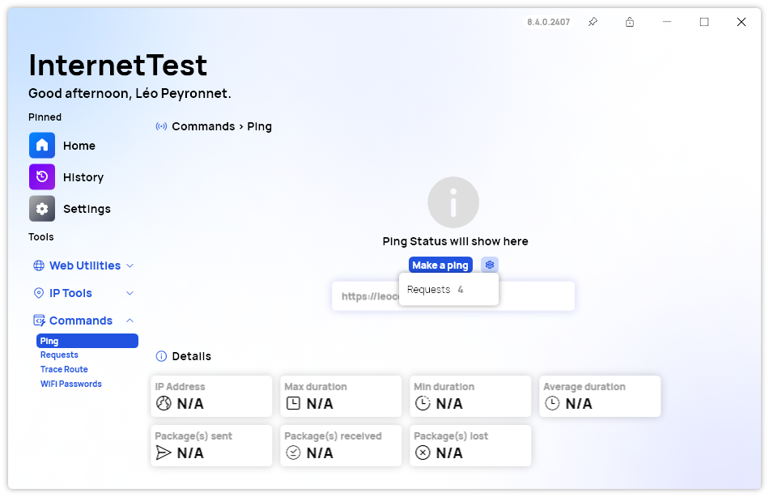

A new version of InternetTest is now available and it brings new features that may not seem that important at first, but can be very useful.

## New additions at a glance

We are excited to announce the latest update for InternetTest Pro, featuring significant enhancements designed to improve your internet utility experience. You can now export DNS records to CSV files, enabling efficient data analysis and management. The customizable ping requests feature allows you to specify the number of ping requests, providing more precise and controlled network diagnostics. Additionally, we have added the option to hide "Timed Out" statuses in Traceroute, making it easier to focus on successful hops and gain clearer insights into your network performance.

## Changelog

### New

- Added translations (#582)
- Added the possibility to export DNS records to CSV (#582)
- Added the possibility to select the number of requests during a ping (#583)
- Added the possibility to hide "Timed out" statuses in Traceroute (#584)
- Added a tooltip in Tracroute page (#584)

### Fixed

- Fixed average text formatting (#583)

### Updated

- Updated RestSharp
- Updated DnsClient
- Updated ManagedNativeWifi
- Updated QRCoder

## Website

InternetTest Pro has a landing page so you can learn more about its feature. [Click here](https://leocorporation.dev/store/internettest) to access it.

## Get the app

InternetTest Pro is available on Windows and requires the .NET 8 Windows Desktop Runtime.

- [Click here](https://tinyurl.com/DownloadITP7) to get the **Setup** version of InternetTest Pro
- [Click here](https://tinyurl.com/DownloadITPP) to get the **Portable** version of InternetTest Pro
