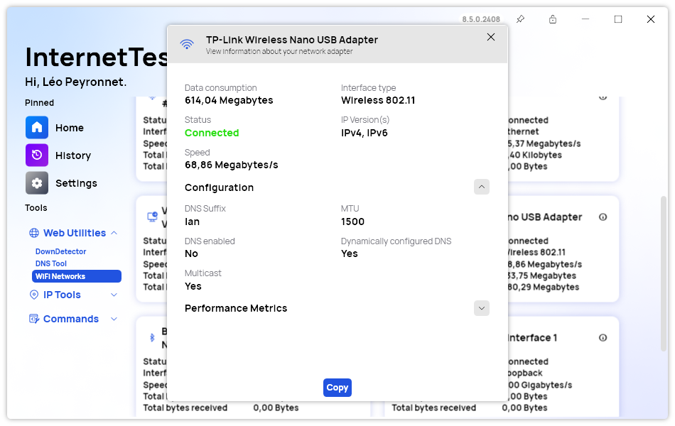
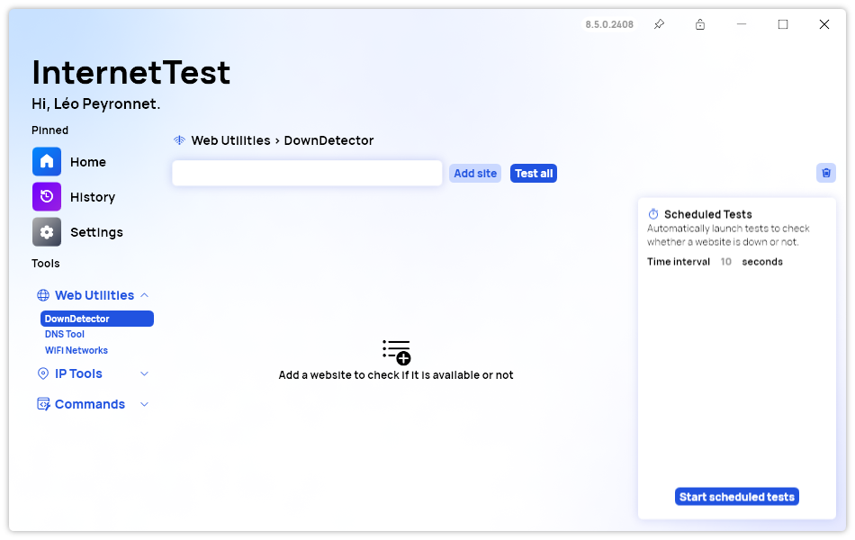

A new version of InternetTest is now available, bringing with it a new adapter window with a clearer and better design, as well as many other features.

## New Adapter Window

The latest update to InternetTest Pro brings a sleek and user-friendly design to the Adapter Window.

The centerpiece of the Adapter Window is its Main Section, meticulously crafted to provide users with a quick overview of their network connection status. This section displays crucial information such as:

- **Total Data Consumption:** Easily monitor your internet usage to keep track of data limits or identify unusual spikes in activity. This feature is particularly beneficial for users with capped data plans.
- **Connection Status:** Instantly determine whether your device is connected to the internet, with visual cues indicating the current status. This feature helps users quickly troubleshoot connectivity issues.
- **Network Adapter Type:** Identify the type of network adapter you are using, whether it’s wired or wireless, allowing for tailored troubleshooting and configuration.

This streamlined presentation ensures that all essential data is accessible at a glance, saving users time and effort in managing their network connections.

Beyond the Main Section, InternetTest Pro’s new Adapter Window design offers two additional sections dedicated to advanced and detailed information. These sections are designed for users who require deeper insights into their network configurations and performance.

## Other improvements

The recent update to InternetTest Pro introduces several notable enhancements, further improving its functionality and user experience. A "Show all Keys" button has been added to the Password page, making it easier to manage and review saved credentials. The inclusion of a Bluetooth icon for adapters provides quick visual identification of Bluetooth connections. Users can now clear DownDetector sites, streamlining the interface and keeping it clutter-free. Finally, the Locate IP page now features a clearing option, enhancing user control over displayed information. These updates collectively contribute to a more efficient and user-friendly networking tool.

## Changelog

### New

- Added new theme resources (#593)
- Added translations (#593)
- Added new Adapter window (#593)
- Added color to status text (#593)
- Added "Show all Keys" button in Password page (#594)
- Added Bluetooth icon for Adapters (#595)
- Added the possibility to clear DownDetector sites (#596)
- Added "Reset" resource (#597)
- Added the possibility to clear Locate IP page (#597)

### Updated

- Updated RestSharp

## Website

InternetTest Pro has a landing page so you can learn more about its feature. [Click here](https://leocorporation.dev/store/internettest) to access it.

## Get the app

InternetTest Pro is available on Windows and requires the .NET 8 Windows Desktop Runtime.

- [Click here](https://tinyurl.com/DownloadITP7) to get the **Setup** version of InternetTest Pro
- [Click here](https://tinyurl.com/DownloadITPP) to get the **Portable** version of InternetTest Pro
