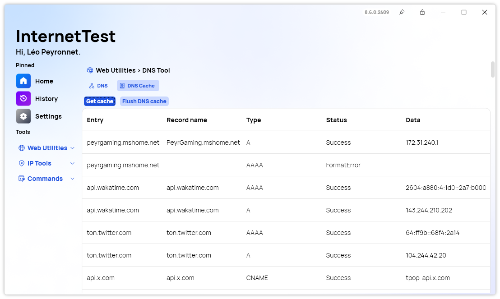

A new version of InternetTest is now available and adds the possibility to view your DNS cache and the possibility to erase it.

## New DNS Cache Feature

The latest version of InternetTest Pro, 8.6.0.2409, introduces a significant enhancement with its new DNS cache feature. This addition provides users with a detailed view of their DNS cache, which can be instrumental in diagnosing and resolving network issues. With the ability to access and examine cached DNS entries, users can gain insights into how domain names are being resolved and identify potential issues that may be affecting connectivity.

Moreover, the update includes a powerful tool for flushing the DNS cache directly from the application. This functionality clears outdated or corrupted DNS records, which can help resolve connectivity problems and improve network performance. The revamped DNS page now features a tab system, making it easier to navigate and manage these new options. This streamlined approach not only simplifies the process of managing DNS settings but also enhances overall efficiency, making network troubleshooting and optimization more accessible than ever.

## Changelog

### New

- Added the possibility to copy the IP (#611)
- Added translations (#612)
- Added Tab system in DNS page (#612)
- Added DNS Cache Info (#612)
- Added DNS Cache Item (#612)
- Added the possibility to get DNS Cache (#612)
- Added the possibility to flush DNS cache (#613)

### Updated

- Updated RestSharp (#610)

## Website

InternetTest Pro has a landing page so you can learn more about its feature. [Click here](https://leocorporation.dev/store/internettest) to access it.

## Get the app

InternetTest Pro is available on Windows and requires the .NET 8 Windows Desktop Runtime.

- [Click here](https://tinyurl.com/DownloadITP7) to get the **Setup** version of InternetTest Pro
- [Click here](https://tinyurl.com/DownloadITPP) to get the **Portable** version of InternetTest Pro
