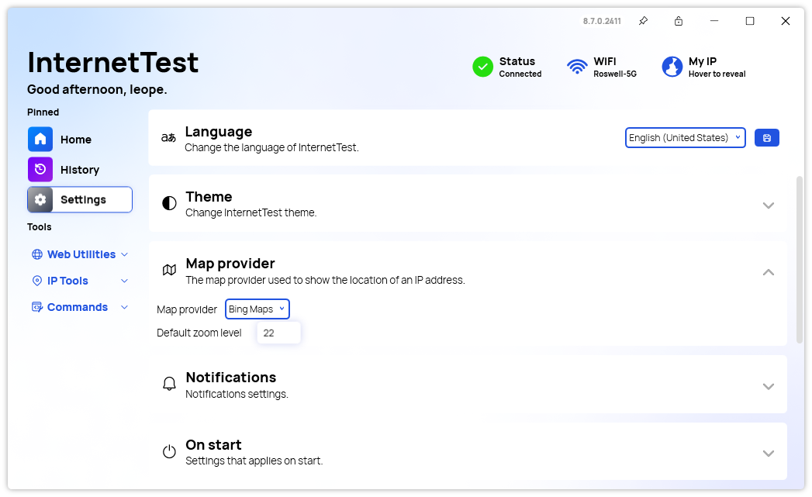

A new version of InternetTest is now available and it improves the portable mode, adds new map options and more.

## New Settings system behavior in portable mode

We updated the behavior of the app when used in Portable mode: The settings and other files required by InternetTest Pro are now stored in the same directory of the executable. This address an issue where the AppData folder would be erased in some configurations.

## Other changes

We also added a new option to select a default zoom level when locating an IP and viewing it on a map. Plus, we added support for this feature in the Bing Maps map provider.

Finally, we are introducing a new layout for the Quick Information section in the Home page: It is now available directly in the Header section of the app, so you can quickly monitor your status and network information.

## Changelog

### Added

- Added new Default Storage path (#622)
- Added Quick Information in header section (#623)
- Added translations (#626)
- Added possibility to set the default zoom level for Maps providers (#626)
- Added default zoom support for Bing maps (#626)

### Fixed

- Fixed caret not visible in TextBoxes (#624)
- Fixed theme selector not working on First Run (#625)

### Updated

- Updated RestSharp

## Files

You will find these files with this release:

- InternetTestProSetup.exe
- InternetTest.exe

## Website

InternetTest Pro has a landing page so you can learn more about its feature. [Click here](https://leocorporation.dev/store/internettest) to access it.

## Get the app

InternetTest Pro is available on Windows and requires the .NET 8 Windows Desktop Runtime.

- [Click here](https://tinyurl.com/DownloadITP7) to get the **Setup** version of InternetTest Pro
- [Click here](https://tinyurl.com/DownloadITPP) to get the **Portable** version of InternetTest Pro
