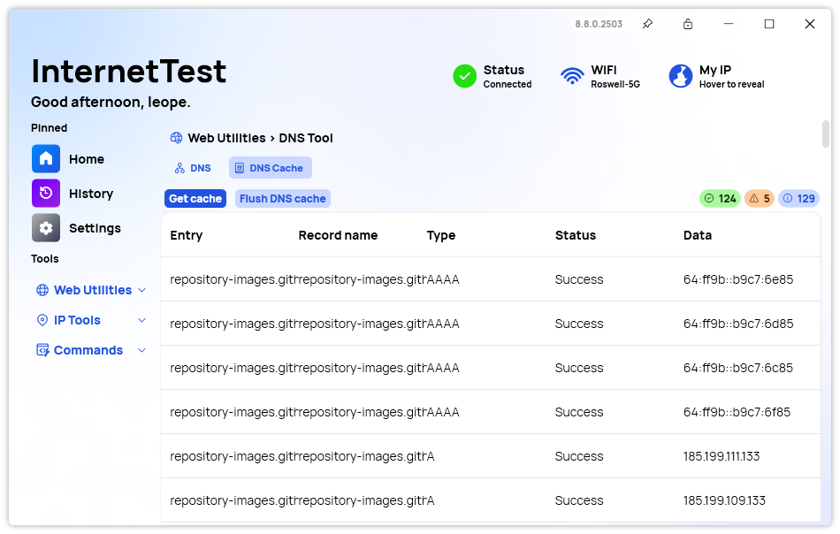
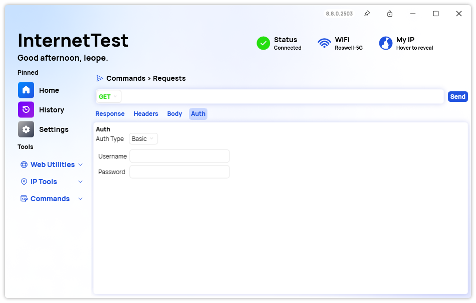
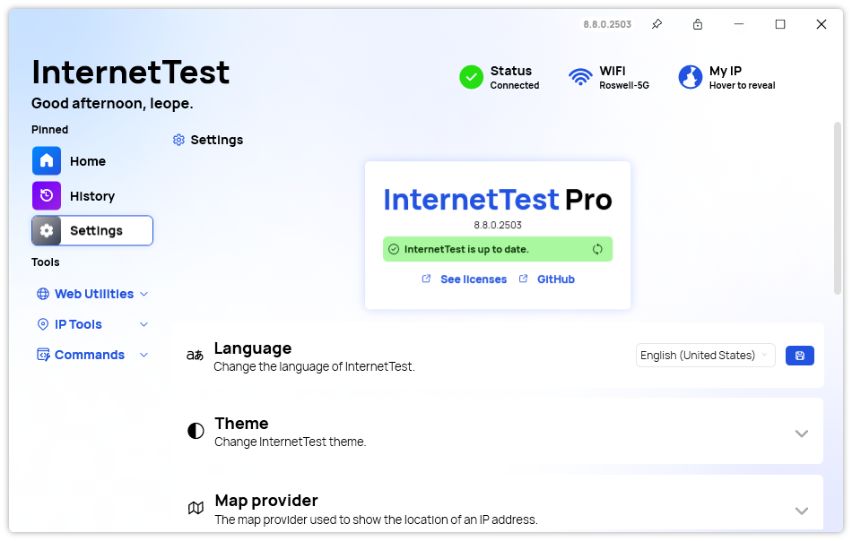

A new version of InternetTest is now available and it introduces an improved experience with the Request editor, enhanced DNS cache management, and more.

## Enhanced DNS Cache Management

One of the standout features in this update is the addition of an overview section in the DNS cache. This new section provides a comprehensive view of your cached DNS entries, allowing you to quickly assess their status and details.

## Improved Request Handling

The latest version of InternetTest Pro introduces several improvements to request handling, making it more secure and user-friendly. One of the notable additions is the ability to hide content when providing values in the Request Editor. This feature gives you greater control over what is displayed, allowing you to keep sensitive information hidden. Additionally, the auto-hide sensitive data feature automatically conceals sensitive data in requests, enhancing the security of your information.

Moreover, you can now provide a body and authentication information for your requests. This makes it easier to test APIs and other services that require these details, streamlining your workflow and improving productivity. The Request page has also been made more consistent, providing a smoother and more predictable user experience.

## New About Section

We also added a new About section to the app, giving you quick access to information about InternetTest Pro (update status, licenses, etc).

## Changelog

### New

-   Added new resources ([#638](https://github.com/Leo-Corporation/InternetTest/issues/638))
-   Added an overview section in DNS cache ([#638](https://github.com/Leo-Corporation/InternetTest/issues/638))
-   Added new Combobox Style ([#639](https://github.com/Leo-Corporation/InternetTest/issues/639))
-   Redesigned the Request Mode selector ([#639](https://github.com/Leo-Corporation/InternetTest/issues/639))
-   Added the possibility to hide content when providing values in Request Editor ([#640](https://github.com/Leo-Corporation/InternetTest/issues/640))
-   Added auto-hide sensible data feature in Requests ([#640](https://github.com/Leo-Corporation/InternetTest/issues/640))
-   Added locales ([#641](https://github.com/Leo-Corporation/InternetTest/issues/641))
-   Added the possibility to provide a body for a request ([#641](https://github.com/Leo-Corporation/InternetTest/issues/641))
-   Added the possibility to provide Auth info for a request ([#641](https://github.com/Leo-Corporation/InternetTest/issues/641))
-   Made Request page more consistent ([#641](https://github.com/Leo-Corporation/InternetTest/issues/641))
-   Added new About section ([#642](https://github.com/Leo-Corporation/InternetTest/issues/642))

### Fixed

-   Fixed wrong translation in Traceroute popup ([#637](https://github.com/Leo-Corporation/InternetTest/issues/637))

## Website

InternetTest Pro has a landing page so you can learn more about its feature. [Click here](https://leocorporation.dev/store/internettest) to access it.

## Get the app

InternetTest Pro is available on Windows and requires the .NET 8 Windows Desktop Runtime.

-   [Click here](https://tinyurl.com/DownloadITP7) to get the **Setup** version of InternetTest Pro
-   [Click here](https://tinyurl.com/DownloadITPP) to get the **Portable** version of InternetTest Pro
