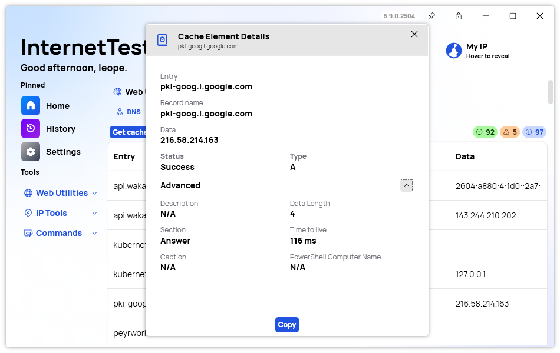

The latest release of InternetTest Pro is here, and it's a special one. This update marks the final major feature release based on the 7X codebase. After this, we'll be setting our sights on the future: a full rewrite for version 9, built on a brand-new architecture. That means while it might take some time for v9 to arrive, the groundwork we're laying now will power a faster, smarter, and even more robust InternetTest experience moving forward.

## What's New in This Update

We've refined network interface filtering, improving how we filter and display network information with .NET 9+. WiFi networks now show an indicator for the current network, making it easier to know at a glance which one you're connected to. Our DNS tools are stronger than ever with a new DNS Details Window, localized DNS Info Windows, and additional tooltips to make diagnosing DNS issues more intuitive. The user interface has also received a refresh with a brand-new theme, and the context menus have been upgraded with new styles and a "Copy" option to speed up workflow.

## Bug Fixes and Improvements

This update also fixes a few important issues. Scrollbars can now be fully used when the app is maximized, addressing a long-standing usability annoyance. We've fixed a pattern issue and resolved some null property bugs that affected the DNS Cache Info section, improving stability and reliability overall.

## Closing the 7X Chapter

This release is not just a collection of features and fixes — it's the closing chapter of the 7X codebase. Over the years, 7X has been the backbone supporting a wide range of powerful features like speed tests, DNS lookups, traceroutes, WiFi scanning, IP configuration details, website availability checks, and much more. With this final update, we wanted to polish the experience, fix lingering issues, and lay a smooth path toward what's next.

## The Road to InternetTest Pro 9

We're already deep into planning v9. It won't be just an incremental update — it will be a total rebuild. A new codebase, a new architecture, and a new future. This means a cleaner and faster foundation, better scalability for future features, stronger performance across devices, and even tighter integration with modern Windows technologies. However, building something from the ground up takes time. We want to get it right, not rush it. So while v9 is under construction, 7X will continue to be supported with minor patches if needed.

## Changelog

### New

-   Refactored .NET 9+ Network Interfaces filtering
-   Added an indicator in WiFi Networks for the current network (#655)
-   Added new locales (#656)
-   Added option to show all networks adapters (#656)
-   Added the possibility to display all available adapters (#656)
-   Added locales for DNS Info Window (#657)
-   Moved local enums to public namespace (#657)
-   Added DNS Details Window (#657)
-   Added Context Menu style (#657)
-   Added Copy Context menu (#657)
-   Added a tooltip in DNS Records tool (#658)
-   Added new Theme UI (#660)

### Fixed

-   Fixed scroll bars cannot be used when maximized (#654)
-   Fixed pattern issue
-   Fixed null properties issue in DNS Cache Info (#657)

## Website

InternetTest Pro has a landing page so you can learn more about its feature. [Click here](https://leocorporation.dev/store/internettest) to access it.

## Get the app

InternetTest Pro is available on Windows and requires the .NET 8 Windows Desktop Runtime.

-   [Click here](https://tinyurl.com/DownloadITP7) to get the **Setup** version of InternetTest Pro
-   [Click here](https://tinyurl.com/DownloadITPP) to get the **Portable** version of InternetTest Pro
