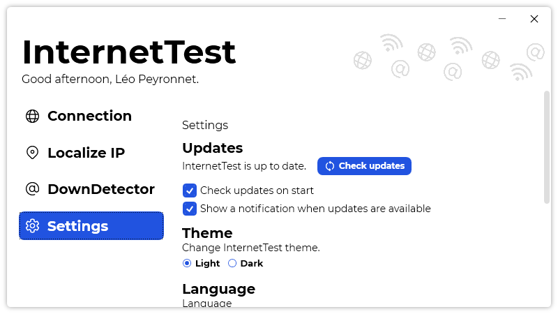
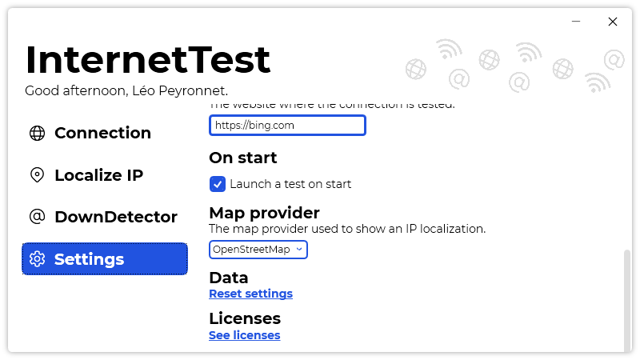

A new version is available for InternetTest, and it is the version 5.1.0.2104.

## Changelog
### New
- Added translations
- Added a notification when updates are available (#192)
- Added the possibility to set if InternetTest should check updates on start (#193)
- Added the possibility to reset settings (#194)
- Added the possibility to get an IP's details in the selected language (#196)
- Added an error message when the specified IP isn't valid (#197)
- Added the possibility to enable or disable a test on start (#198)
### Fixed
- Fixed: InternetTest shows error if there isn't internet (#191)
### Updated
- Updated Setup

## Download

[Click here](https://tinyurl.com/DownloadInternetTest) to download InternetTest.

## Screenshots

