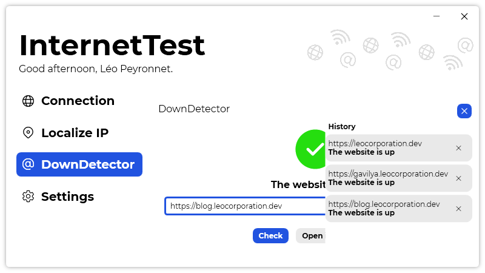

A new version of InternetTest is now available, and it is the version 5.2.0.2105.

## Changelog
### New
- Added translations
- Added the possibility to set the default startup page (#201)
- Added an "historic" button in DownDetector page (#202)
- Added the possibility to localize a website's IP (#203)
- Added the possibility to change https to http (#204)
### Updated
- Updated LeoCorpLibrary

## Download

[Click here](https://tinyurl.com/DownloadInternetTest) to download InternetTest.

## Screenshot
