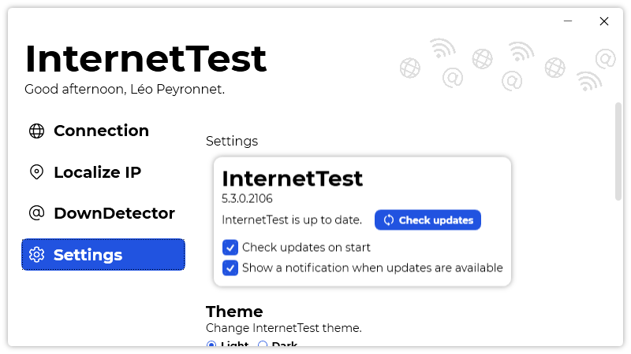

A new version of InternetTest is available and it is the version 5.3.0.2106.

## Changelog
### New
- Redesigned "About" section in settings (#211)
- Added the possibility to export settings (#212)
- Added the possibility to import settings (#212)
- Added the possibility to have an historic of connection tests (#214)
- Added the possibility to save an IP address' informations (#215)
### Updated
- Updated LeoCorpLibrary
- Improved blue color when using dark mode (#213)

## Download

[Click here](https://tinyurl.com/DownloadInterentTest) to download InternetTest.

## Screenshot

