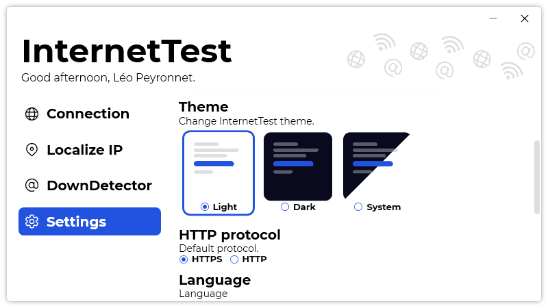

A new version of InternetTest is now available, and it is the version 5.4.0.2107.

## Changelog
### New
- Added the possibility to set the theme to system (#223)
- Added theme assets (#224)
- Redesigned the theme picking UI (#224)
- Added notification when a test is completed (#225)
- Added the possibility to disable notifications (#226)
### Updated
- Updated LeoCorpLibrary
- Notifications are no longer shown on start (#226)

## Download

[Click here](https://tinyurl.com/DownloadInternetTest) to download InternetTest.

## Screenshot

