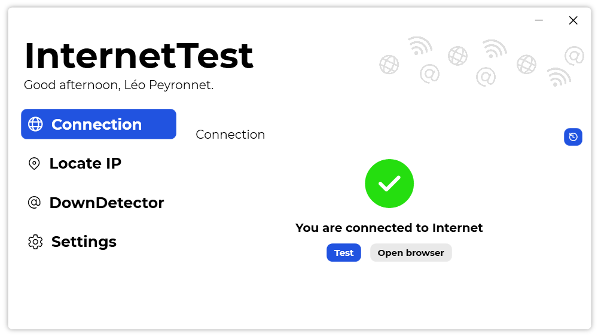

A new version of InternetTest is now available, and it is the version 5.5.0.2108.

## Changelog
### New
- Added Yandex Maps as a map provider (#237)
- Added animations on Tab buttons (#238)
### Fixed
- Fixed: Links' hitboxes are taking all the width of the settings page (#235)
- Fixed: The "Licenses" section isn't visible in settings (#236)
- Fixed translations issues: "Localize" should be "Locate" (#243)
### Updated
- Updated LeoCorpLibrary
- Updated Setup

## Download

[Click here](https://tinyurl.com/DownloadInternetTest) to download InternetTest.

## Screenshot

