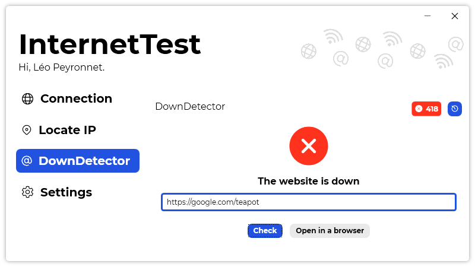

A new version of InternetTest is now available, and it is the version 5.7.0.2110.

## Changelog
### New
- Added translations (#255)
- Added a loading screen on "Connection" page (#255)
- Added a loading screen on "DownDetector" page (#256)
- The "History" button is hidden when the history is empty (#257)
- Added the possibility in "DownDetector" to view the status code (#258)
### Updated
- Updated LeoCorpLibrary

## Download

[Click here](https://tinyurl.com/DownloadInternetTest) to download InternetTest.

## Screenshot
