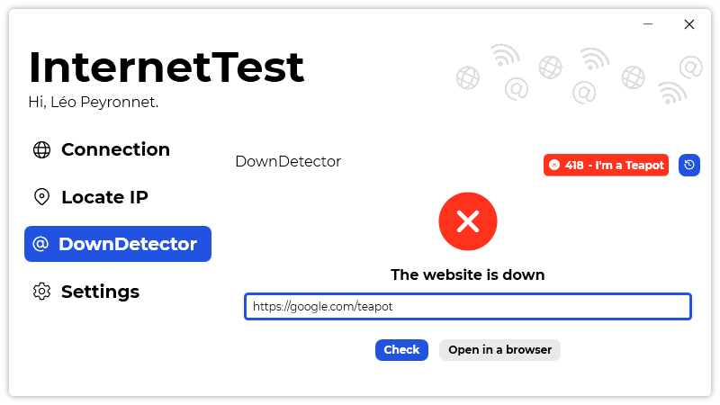

A new version of InternetTest is now available, and it is the version 5.8.0.2111.

## Changelog
### New
- Added a tooltip in "DownDetector" to show the meaning of the status code (#264)
- Added more info when clicking on the "Status code" border (#265)
- Added "Here" map provider (#266)
- Added a point corresponding to the location on Google Maps (#267)
- Added a point corresponding to the location on OpenStreetMap (#268)
### Fixed
- Fixed an issue with Google Maps point not showing (#267)
### Updated
- Updated LeoCorpLibrary

## Download

[Click here](https://tinyurl.com/DownloadInternetTest) to download InternetTest.

## Image
