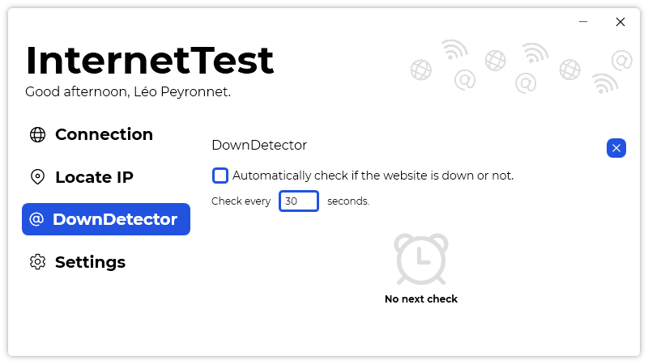

A new version of InternetTest is now available, and it is the version 5.9.0.2112.

## Changelog
### New
- Filled icons are now used in "History" panels (#274)
- Added translations
- Added the possibility to check every x seconds if a website is down or not (#275)
- Added a minimum interval of two seconds in "DownDetector" (#275)
- Added an error message when no interval is specified (#275)
- Added an error message when no website is specified (#275)
- Added a timer until next website check (#276)
- Added an animation for the timer (#276)
- Added a notification when a DownDetector test is done (#277)
- Added the possibility to disable the "DownDetector" notification (#278)
### Fixed
- Fixed an issue with system theme no longer working on Windows 11
- Fixed an issue with icons
### Updated
- Replaced obsolete methods (#280)
- Updated LeoCorpLibrary
- Improved margins (#275)
- Refactored code

## Download

[Click here](https://tinyurl.com/DownloadInternetTest) to download InternetTest.

## Image
