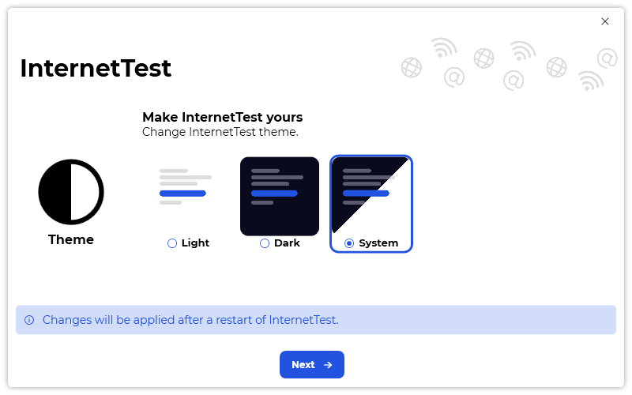

A new version of InternetTest is now available, and it is the version 6.0.0.2202. This a major version that brings new features, performance improvements and more. Note that to upgrade to InternetTest 6, you’ll need to install the .NET 6 Runtime.

## Changelog
### New
- Added translations (#294)
- Added "First run" window (#294)
- Added assets (#294)
- Added "Welcome" page (#294)
- "First run" experience now shows on first run (#294)
- Added "Tutorial" page (#294)
- Added "Theme" page (#294)
- Added "Language" page (#294)
- Added "Update" page (#294)
- Added the possibility to end the "First run" experience (#294)
- Improved animations on the side bar (#295)
- Added an animation when changing the page of InternetTest (#295)
- Added "Expander" style (#296)
- Added "Theme" category in Settings (#296)
- Added "Language" category In Settings (#296)
- Added "Notifications" category (#296)
- Added "On start" category in Settings (#296)
- Added "Test site" category in Settings (#296)
- Added "HTTP Protocol" category in Settings (#296)
- Added "Map provider" category in Settings (#296)
- Added "Data" category in Settings (#296)
- Added "Licenses" category in Settings (#296)
- Added a "Credits" section in the "License" category (#297)
### Fixed
- Fixed alignment issues (#296)
- Fixed a stretching issue in Settings
### Updated
- Updated LeoCorpLibrary
- Updated Setup
- Upgraded to .NET 6 (#298)

## Download

[Click here](https://tinyurl.com/DownloadInternetTest) to download InternetTest 6.

## Screenshots

