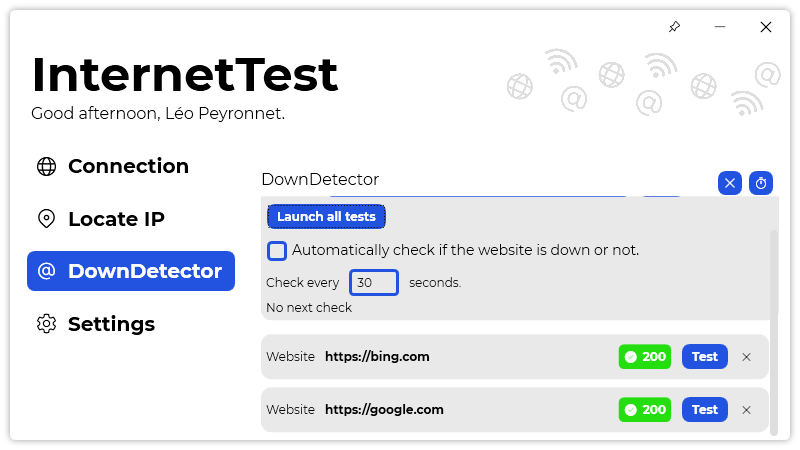

A new version of InternetTest is now available, and it is the version 6.1.0.2203.

## Changelog
### New
- Added translations (#307)
- Added Website item (#307)
- Added a "Multiple websites" section in DownDetector (#307)
- Added the possibility to test different websites at the same time (#307)
- Added the possibility to check every x seconds multiple websites (#308)
- Added "Delete" button on "Website" item (#307)
- Added placeholder text in DownDetector (#308)
- Added translations (#309)
- Added styles (#309)
- Added the possibility to hide the IP address (#309)
- Added the possibility to pin the window (#310)
### Fixed
- Fixed an issue with LeoCorpLibrary (#306)
- Fixed an issue with status code method
### Updated
- Updated LeoCorpLibrary
- Refactored GetStatusCode() method
- The icon of the button changes when clicked (#307)

## Download

[Click here](https://tinyurl.com/DownloadInternetTest) to download InternetTest.

## Screenshot
