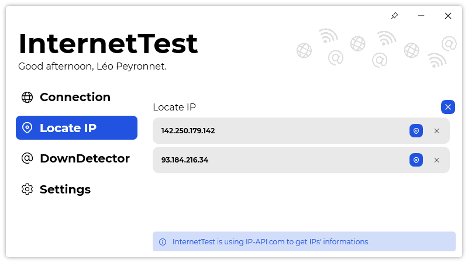

A new version of InternetTest is now available, and it is the version 6.2.0.2205.

## Changelog
### New
- Added "History" section (#321)
- Added "IP History" item (#321)
- Added an history in "Locate IP" page (#321)
- Added translations (#322)
- Added "History" section in Settings (#322)
- Added the possibility to disable the history in "Locate IP" page (#322)
### Fixed
- Fixed: Users can check invalid URLs (#319)
- Fixed an issue where the text isn't visible (#321)
- Fixed margin issue with history (#321)
- Fixed scrolling issues (#321)
- Duplicates in history can no longer exist (#321)
### Updated
- Updated LeoCorpLibrary
- Updated Simplified Chinese translation
- Made the "Locate" button locate the IP (#321)
- "History" button is hidden if history is empty

## Download

[Click here](http://tinyurl.com/DownloadInternetTest) to download InternetTest.

## Screenshot
