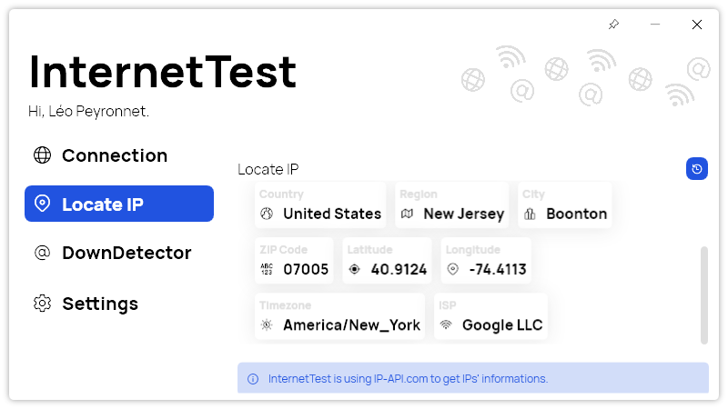

A new version of InternetTest is now available, and it is the version 6.3.0.2207.

## Changelog
### New
- Added dashboard items in "Locate IP" page (#332)
- Added data when locating an IP (#332)
- Added translations (#332)
- Added a placeholder in "Locate IP" page (#332)
- Added Open Source mention in Settings (#333)
- Added font files (#334)
- Added WebInfo record (#335)
- Added translations (#335)
- Added more information in "Connection" page history (#335)

### Fixed
- Fixed issues with the new "Locate IP" page design (#332)
- Code cleanup

### Updated
- Updated LeoCorpLibrary
- Updated font (#334)
- Removed old font (#334)

## Download

[Click here](tinyurl.com/DownloadInternetTest) to download InternetTest.

## Screenshot
