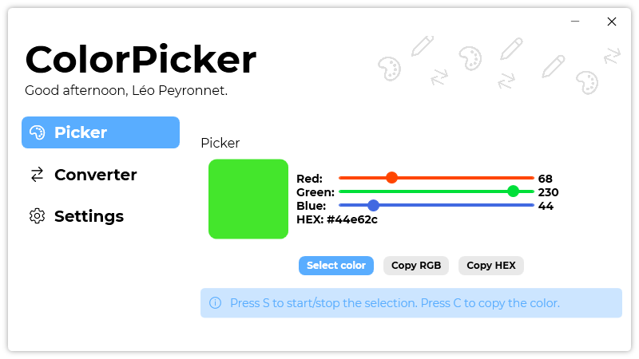
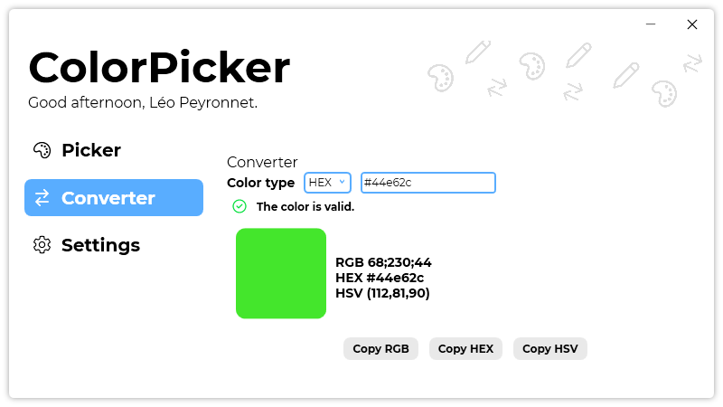
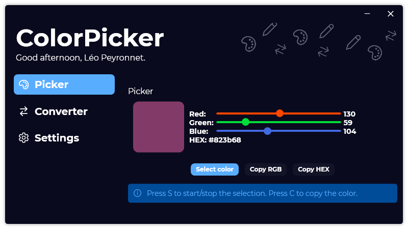

A year ago, we have announced the second major version of ColorPicker, which was a big step forward for ColorPicker. Today, we are proud to announce the third version of ColorPicker, with a new design and new features.

## Introduction

ColorPicker was the first software for developers. Its goal was to empower a part of the development and/or design process: Color selection. Sometimes, when you want to use a color in a project, and you do not know any information about it, like the RGB values, or the HEX color code, it is very frustrating. Therefore, we created ColorPicker. ColorPicker’s main goal was to solve this problem. Using your mouse pointer, you could point a place on your screen, and get information about the color, at the time, you could only get RGB values. Then, we have released ColorPicker 2, with a new design and new features, like the new manual color-picking tool, and the possibility to get HEX color code. With ColorPicker 3, we wanted to put all this features you love, and make them even better.

## What is new?

ColorPicker 3 introduces a brand-new design like [Passliss’](https://blog.leocorporation.dev/2021/02/introducing-passliss.html) design, with a navigation bar on the left, and the content on the other side. This minimalist approach is aiming to improve the user experience overall.

ColorPicker 3 also adds a new “Converter” page, to help you convert different color types easier. For instance, you can convert a RGB color to HEX and HSV.

ColorPicker 1 was only available in light mode, ColorPicker 2 was only available in dark mode, and ColorPicker is available in both. You can now set in ColorPicker’s settings if you want to use light or dark mode.

## Open Source

With this third version, we have decided to open-source ColorPicker 3, and the Git repository is – of course – available on [GitHub](https://github.com/Leo-Corporation/ColorPicker).

## Upgrading

ColorPicker 3 is not an update and will not be proposed as an update of ColorPicker 2. If you want to upgrade to ColorPicker 3, you will need to download and install ColorPicker 3. Also, ColorPicker 2’s support will end soon, so no more updates will be delivered to it.

## Download

[Click here](https://tinyurl.com/DownloadColorPicker) to download ColorPicker 3.