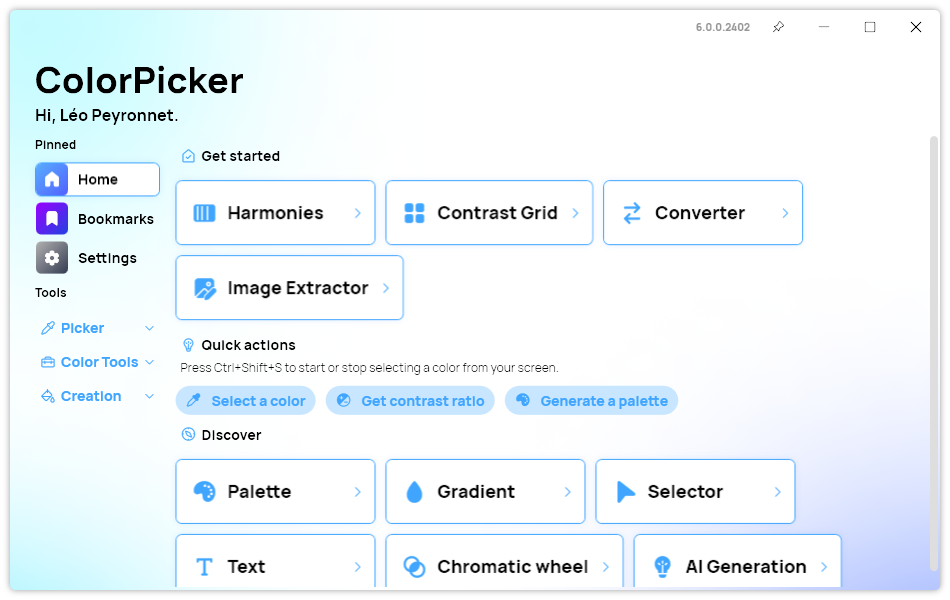
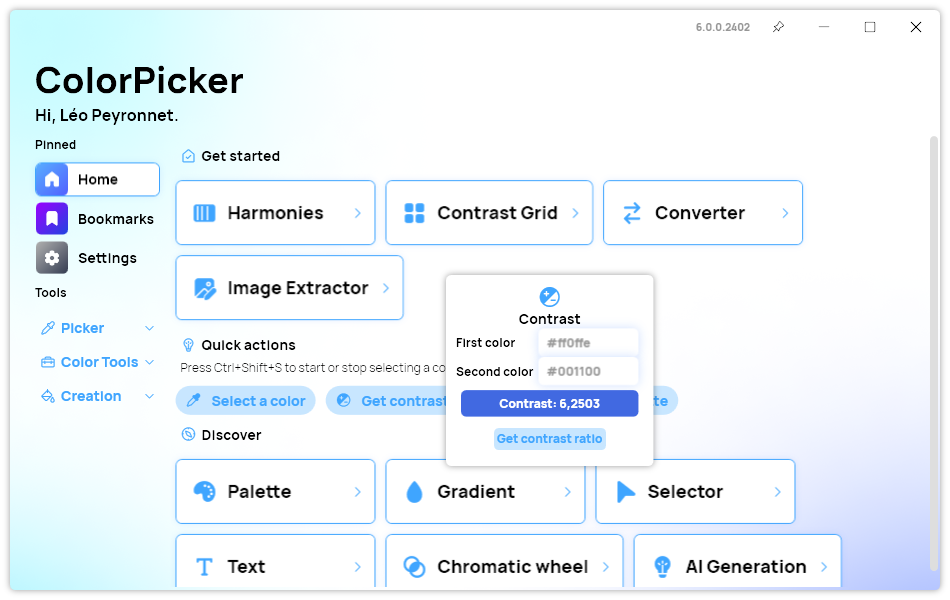
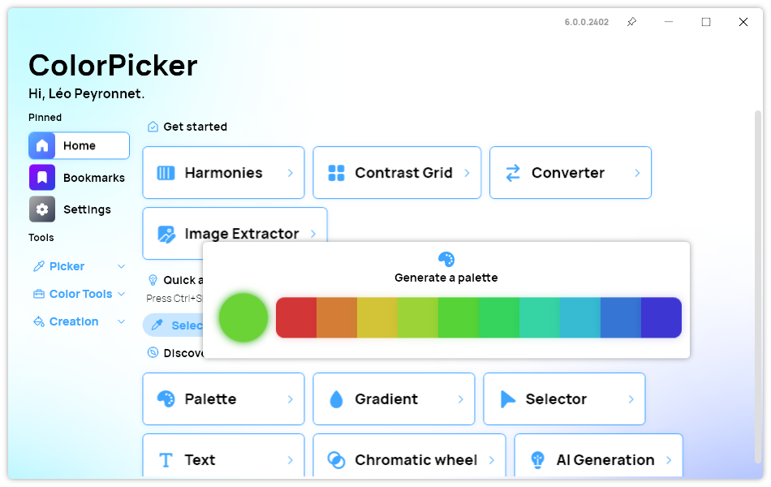
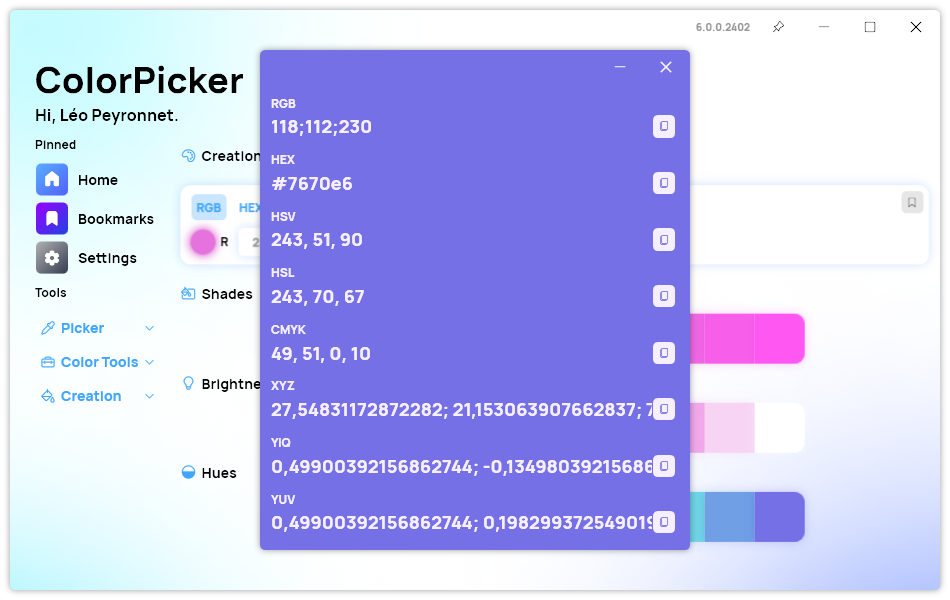
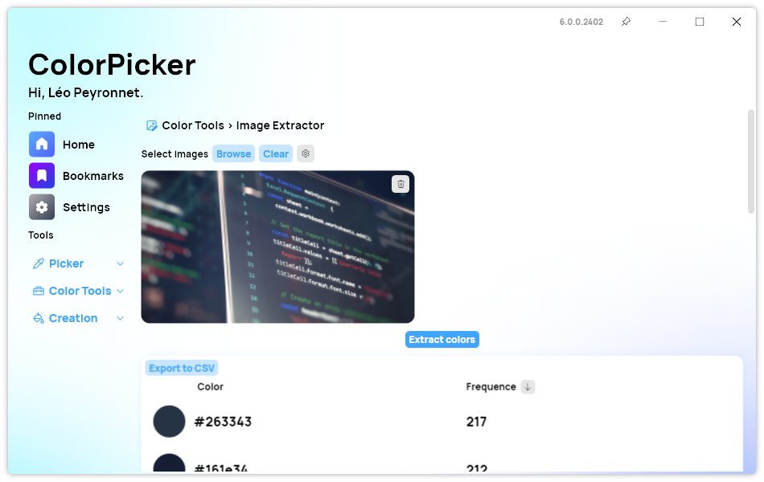
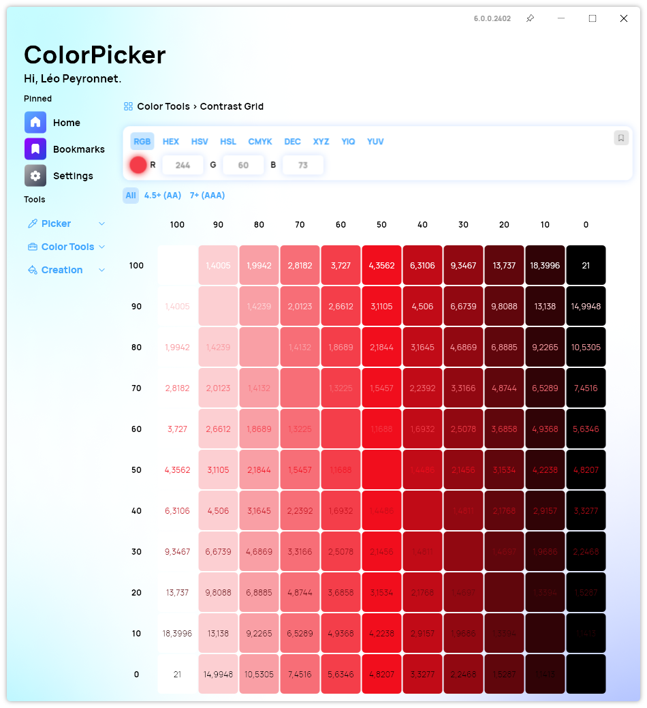
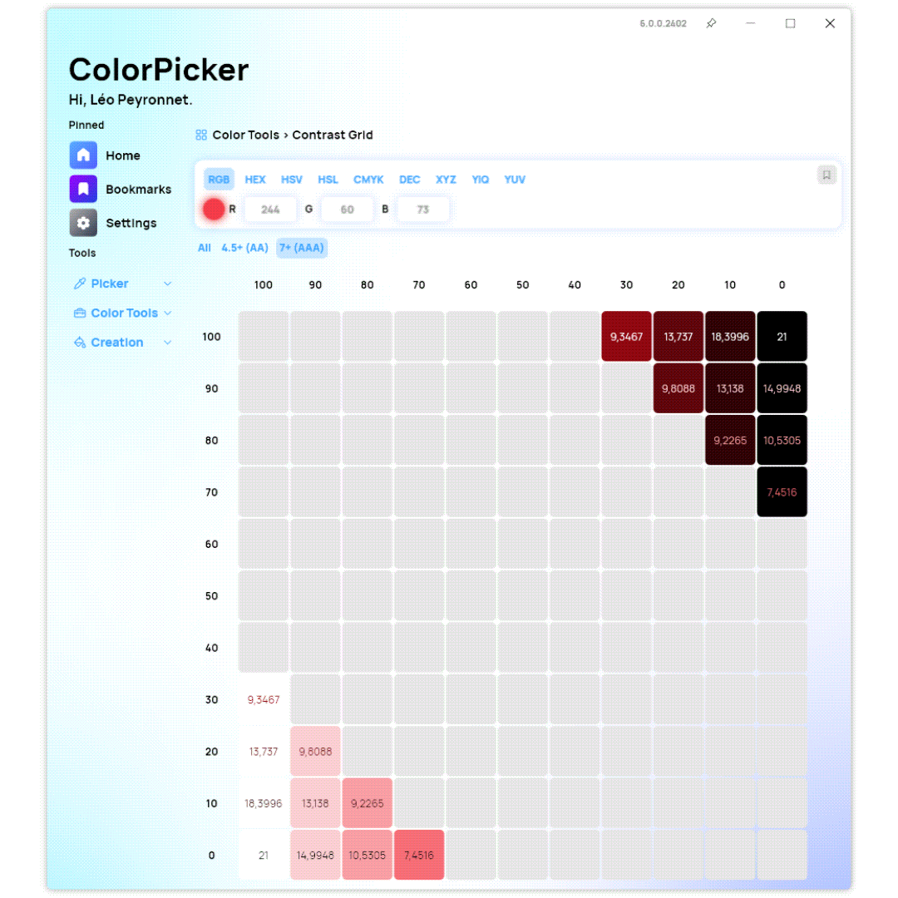

## Introduction

Last year, we've introduce the next iteration of ColorPicker: ColorPicker Max (v5). The goal was to create a more advanced tool for developers, designers and artists by introducing a new set of features. With ColorPicker Max 6, this goal remains almost the same: We added several new features while providing at the same time a better user experience across the app. Let's see all the new features introduces by this 6th major version of ColorPicker.

## Redesigned dashboard

### New cards

We are introducing a brand-new design for page cards in the dashboard: They look more modern and interactive, which enhances at the same time the experience new users will have when they first launch the app.
With a clean and intuitive layout, navigating through the Home page is now a visually stimulating experience, inviting you to explore the endless possibilities of color manipulation.

### Quick Actions

In our quest to make color exploration more intuitive, we've introduced a brand-new Quick Actions system right at your fingertips. Say goodbye to endless clicks and complicated menus – with Quick Actions, performing common tasks is now just a tap away.

#### Select a Color

Need to pinpoint that perfect shade of blue or capture the essence of a vibrant sunset? Simply select the "Select a Color" Quick Action, and our intuitive color picker tool will empower you to choose one from your screen.

#### Contrast Ratio

Ensuring accessibility is essential in design, and with the "Contrast Ratio" Quick Action, you can effortlessly evaluate the legibility of text against different background colors. Whether you're fine-tuning the typography of a website or crafting an attention-grabbing poster, achieving optimal contrast has never been simpler.

#### Random Palette

Need some inspiration? You can now generate color palettes thanks to the "Random Palette" Quick Action, which generates a harmonious array of colors at the click of a button. Whether you're seeking inspiration for your next project or simply want to explore new color combinations, this feature promises to spark your creativity and ignite your imagination.

## Redesigned Color Details window

We also took time to redesign the Color Details window, bringing a clear and more intuitive user interface. We added new hover effects, and improve the content alignment, making it more easy for you to work with this feature.

## Image Color Extractor

In our latest update, ColorPicker Max introduces an exciting new feature: Image Color Extraction. Now, unlocking the palette of colors from your favorite images is just a click away. With a range of customizable options, this tool puts the power of color exploration directly into your hands.

### Import Images with Ease

Gone are the days of manual color picking. With the ability to import images directly into ColorPicker Max, you can effortlessly extract the vibrant hues from your chosen visuals.

### Color Analysis

With the Image Color Extractor can you retrieve all colors present in an image, but you can also view their frequencies, providing valuable insights into the dominant tones at play.
Plus, you can fine-tune the color extraction process with precision settings, allowing you to adjust the level of detail to suit your needs. Please note that if you use large images, the more precise the extraction is, the longer the process will take.

### Export the extracted data

Seamlessly export your extracted colors to a CSV file for further analysis or integration into your projects. With support for both comma and semicolon formats, sharing and collaborating with colleagues has never been easier.

## Contrast Grid

ColorPicker Max 6 brings a new feature to the app: The Contrast Grid, which is designed to revolutionize your color selection process. With a focus on accessibility and efficiency, this tool provides invaluable insights into the contrast ratios of your chosen colors, empowering you to make informed design decisions effortlessly.

### Visualize Contrast with Ease

With the Contrast Grid feature, gaining a comprehensive understanding of color contrast has never been simpler. By generating a grid that showcases the contrast ratios between your selected color and a range of background hues, you can visualize how your color choices impact readability and accessibility across various contexts.

### Optimize Accessibility

Incorporating accessibility principles into your design workflow is crucial, and the Contrast Grid feature makes it easier than ever. By identifying the best contrast scores, you can ensure that your content is easily legible for all users, regardless of their visual abilities. You can get more details about each color by right-clicking one in the grid.

## New customization options

With the latest update to ColorPicker Max, users now have the option to customize their HEX value formatting to either uppercase or lowercase by default. This small yet significant enhancement allows for a more personalized experience, taking into account your individual preferences and streamlining workflow efficiency.

## How to upgrade from ColorPicker Max 5?

This new version doesn't introduce breaking changes, therefore you will be able to upgrade directly through the app by checking for updates in the Settings page. However, please note that ColorPicker Max 6 requires the .NET 8 Windows Runtime to be installed on your system. If the .NET 8 Windows Runtime is not installed, ColorPicker will ask you to install it. Finally, if you use the portable version, you will have to download the app executable file again, but your settings will remain unchanged.

## Download the app

[Click here](https://tinyurl.com/DownloadColorPickerMax) to download ColorPicker Max.

[Learn More](https://leocorporation.dev/store/colorpickermax) about ColorPicker Max.

## Full changelog

### New

- Added new navigation system (#369)
- Added new navigation style (#369)
- Redesigned Color window (#370)
- Redesigned page card (#371)
- Added "Select a Color" quick action (#372)
- Added contrast quick action (#372)
- Added palette quick action (#372)
- Added the possibility to expand code areas in Gradient page (#373)
- Added header in Quick Actions (#372)
- Created Image Extractor page (#374)
- Added translations (#374)
- Added Image Item (#374)
- Added Color Frequence Item (#374)
- Added the possibility to get all colors and their frequencies of an image (#375)
- Limited amount of colors to display (#375)
- Added the possibility to set precision in Image Extractor (#376)
- Added the possibility to delete an image (#374)
- Added the possibility to clear images (#374)
- Added border for Color Displayer (#374)
- Added the possibility to export all colors to a CSV File (#377)
- Added the possibility to import multiple images (#378)
- Added the possibility to show a maximum number of colors (#379)
- Added the possibility to sort colors by their frequencies (#380)
- Added placeholder (#374)
- Added the possibility to get color details in Color Extractor (#374)
- Created Contrast Grid page (#381)
- Added the possibility to input a color (#381)
- Added Color Grid item (#382)
- Added the possibility to get the contrast grid of a color (#382)
- Added translations (#383)
- Added the possibility to only show the best scores (#383)
- Added the possibility to get details of a color (#384)
- Added the possibility to use upper cases or lower cases for HEX (#385)

### Fixed

- Fixed missing style issue
- Fixed alignment issue
- Fixed an issue with dark mode
- Fixed toggle issue

### Updated

- Updated translations (#372)
- Improved CheckBox style
- Image area is hidden when there is no image (#374)
- Upgraded to .NET 8
- Applied .NET 8 Coding style
- Removed Action Card
