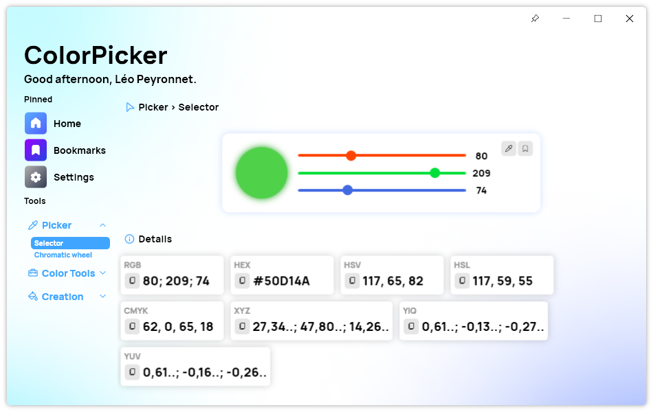
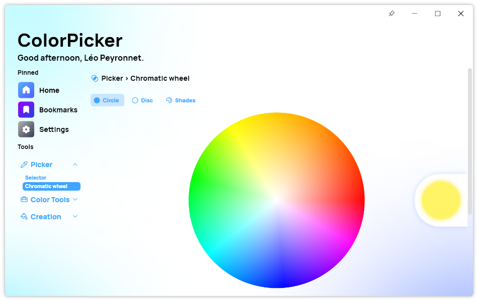
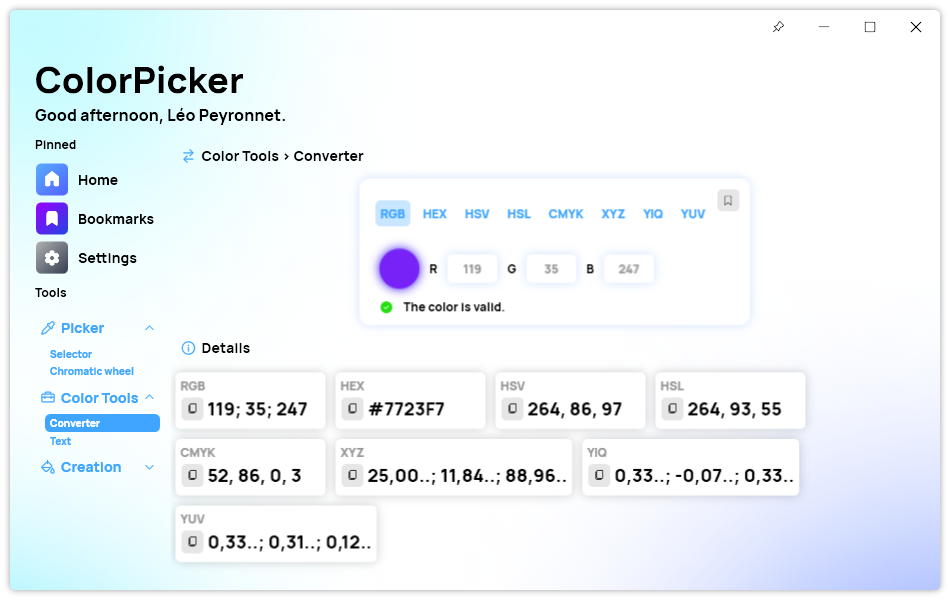
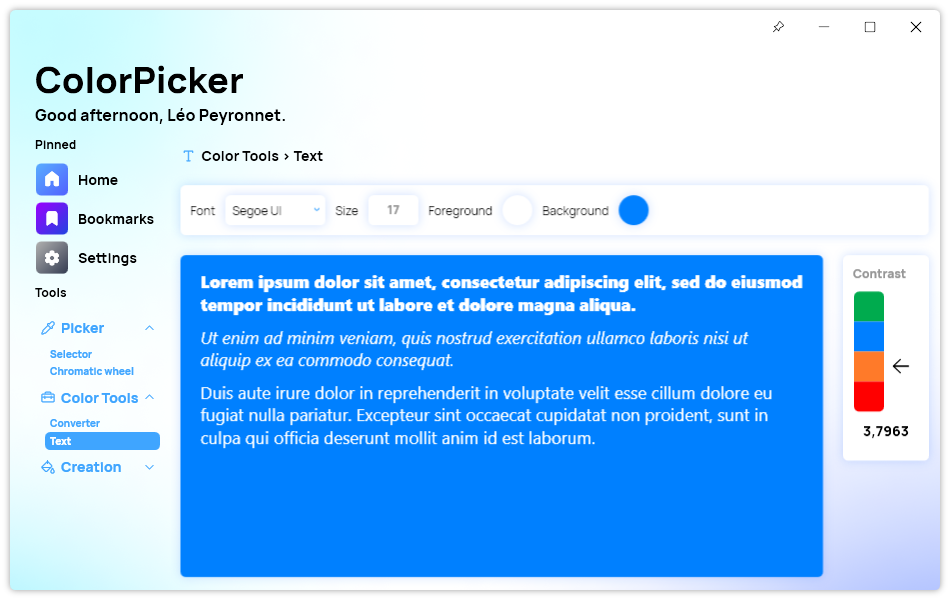
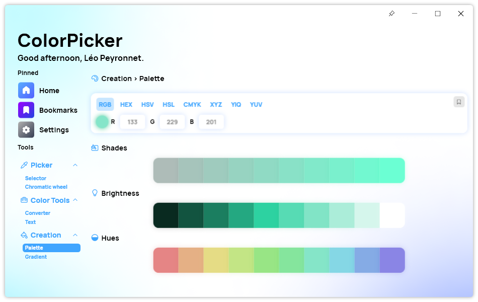
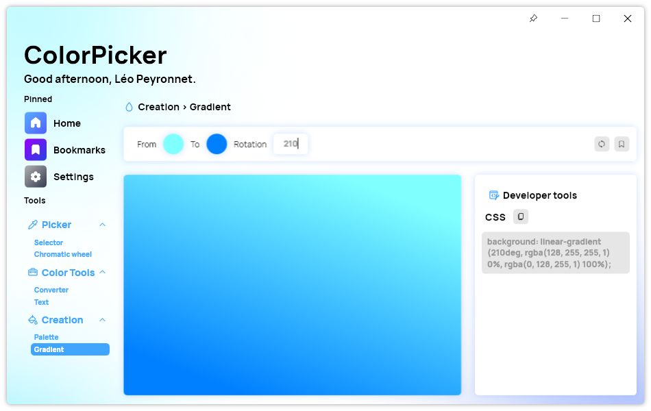
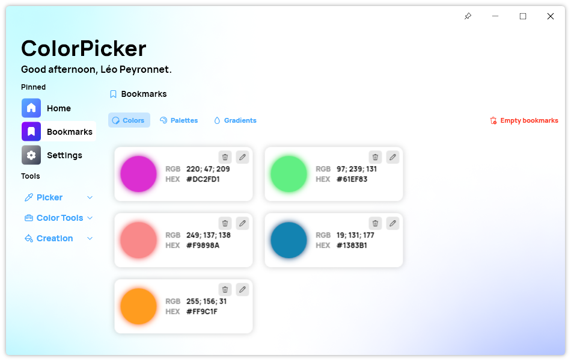
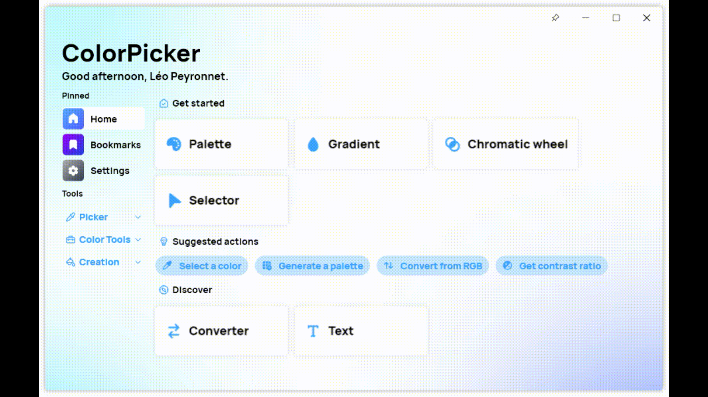

## Introduction
ColorPicker Max is the latest version of the popular color picker tool that has been trusted by designers, artists, and developers around the world. As the next major evolution of this application, ColorPicker Max introduces a host of new features and improvements that make it more powerful, flexible, and user-friendly than ever before. In this article, we will take a closer look at the newest features and enhancements that make ColorPicker Max the ultimate choice for anyone who needs to work with color on a daily basis. From the powerful Converter tool to the versatile Gradient generator, we will explore all the ways in which ColorPicker Max can help you work more efficiently and effectively with color. So let's dive in and discover what this amazing tool has to offer!

## Selector

One of the most exciting features of ColorPicker Max is its ability to select a specific color using different sliders or from a pixel on the screen. This allows users to easily and accurately pick any color they need for their projects. Additionally, the color detail panel shows all the details of the color, including RGB values, HEX, HSL, HSV, CMYK, XYZ, YIQ, and YUV. Users can also copy any of these values to the clipboard by simply clicking on them.

## Chromatic wheel

Another great feature of ColorPicker Max is its Chromatic Wheel, which allows users to select a color from the wheel, with the ability to choose different chromatic wheels. The tool also includes a converter that lets users enter a color using a specified color type, and then shows the color converted in all color types, making it easy to find the color you need.

## Converter

ColorPicker Max offers several useful tools for manipulating colors, and two of the most powerful are the Converter and Text tools.

The Converter tool allows users to easily convert colors between different color types, such as RGB, HEX, HSV, HSL, CMYK, YIQ, XYZ, and YUV. Users can enter a color using a specified color type, and the tool will automatically display the color converted into all other color types in a color detail panel. If the user enters an invalid color, a message will appear to let them know.

For some color types, the Converter tool also displays dedicated textboxes that allow users to enter different values for each variable, such as hue, saturation, and value. The tool also provides a preview of the color specified by the user.

## Text tool

The Text tool is another powerful feature of ColorPicker Max that allows users to set the font, font size, foreground color, and background color for text. The tool also includes a feature that calculates the contrast ratio between the foreground and background colors and displays it as an arrow on a scale, indicating whether the contrast is sufficient for legibility.

With the Text tool, users can set the color for both regular text and links, and the tool includes a preview of the resulting text as it will appear on a webpage. The ability to set custom font and color styles can be incredibly useful for web designers, graphic designers, and anyone else who needs to manipulate colors and text on a regular basis.

In short, both the Converter and Text tools are powerful and flexible features that can greatly enhance a user's ability to work with and manipulate colors. Whether you're a designer, developer, or simply someone who enjoys exploring the world of color, ColorPicker Max has everything you need to get the most out of your work.

## Palette and Gradient

ColorPicker Max also offers a variety of tools for creating color palettes and gradients. The palette tool lets users get different shades, brightness, and hues of a specified color, and also provides the ability to bookmark and save the palette for later. The gradient tool allows users to generate a random gradient with two stops, change the rotation of the gradient, and even export the gradient as CSS.

## Bookmarks

ColorPicker Max allows you to bookmark your favorite colors, palettes, and gradients, making it easy to quickly access them later on. You can organize your bookmarks into different categories, such as regular colors, palettes, and gradients, and easily remove individual bookmarks or clear all bookmarks at once.

To add a bookmark, simply navigate to the color, palette, or gradient you'd like to save and click the bookmark icon. You can access your bookmarks at any time by clicking on the Bookmarks button in the sidebar, and then selecting the category you'd like to view.

Bookmarks make it easy to keep track of your favorite color schemes and design elements, allowing you to work more efficiently and effectively.

## Modern experience

The user interface and user experience of ColorPicker Max are both top-notch. The background is a mesh gradient with subtle colors that adapts to the light or dark theme, while the window is resizable and responsive. The tool also includes a dashboard with the most relevant features for the user and a section for least relevant features, making it easy to find what you need.

In conclusion, ColorPicker Max is an excellent tool for developers, designers, and anyone else who needs to work with colors regularly. Its range of features and ease of use make it a must-have for anyone who wants to work with colors more efficiently. [Try ColorPicker Max today](https://tinyurl.com/DownloadColorPickerMax) and experience the difference for yourself!

## Download
To get started with ColorPicker Max, [head to our website and download the installation package](https://tinyurl.com/DownloadColorPickerMax). The app is available for Windows.

Once the installation package has finished downloading, double-click it to begin the installation process. Follow the on-screen instructions to complete the installation.

Once installed, you can launch ColorPicker Max from your applications folder or the Start menu. When you launch the app for the first time, you'll be prompted to choose your default language, theme, and other settings.

## How to upgrade from ColorPicker 4?
It's important to note that ColorPicker Max is not simply an upgrade to ColorPicker 4. While it does share some similarities with its predecessor, ColorPicker Max is a standalone application that needs to be installed manually. Users of ColorPicker 4 will not be able to upgrade to ColorPicker Max through their current application and will need to download and install ColorPicker Max separately.

Despite the need for a manual installation, we believe that the new features and enhancements offered by ColorPicker Max make it worth the effort. The powerful and flexible new tools, as well as the improved user interface and user experience, are designed to help users work more efficiently and effectively with color. So, if you're ready to take your color work to the next level, we encourage you to [download and install ColorPicker Max today](https://tinyurl.com/DownloadColorPickerMax).

## Video
Check the official trailer for ColorPicker Max.


  

    <iframe width="560" height="315" src="https://www.youtube.com/embed/VRGkiRKs88k" title="YouTube video player" frameborder="0" allow="accelerometer; autoplay; clipboard-write; encrypted-media; gyroscope; picture-in-picture; web-share" allowfullscreen></iframe>
  

