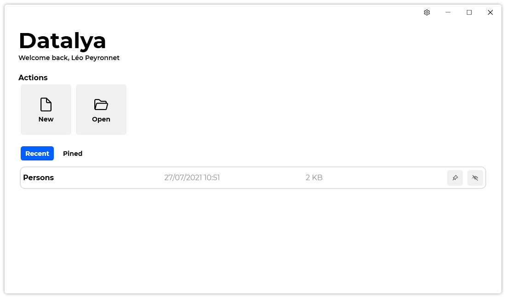
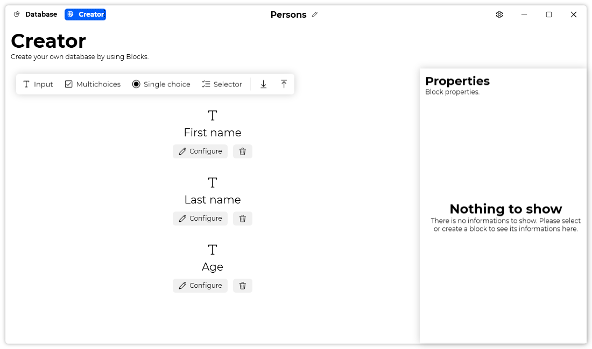
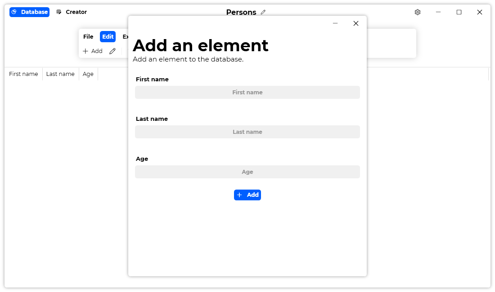
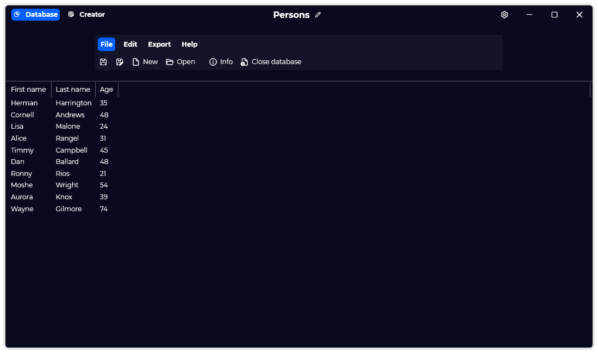

## Introduction
Last year, we’ve launched two products: GestionBiblio X and GestionPerso X. They were specialized database management tools. They provided a brand new and modern user interface at the time. The goal was to rewrite the codebase from Visual Basic to C#, to introduce new features and a new design language. However, these two softwares were only available in French, not in English, and they weren’t receiving updates as much as other Léo Corporation’s softwares. This is why we are today introducing the next generation of database management at Léo Corporation: Datalya.

## What's Datalya?
Datalya is a modern and yet simple database management software for Windows. The main innovation of Datalya is Blocks. Blocks are different types of input for a user. For instance, you can have a simple text input, to a checkbox input, without forgetting the dropdown input. These Blocks are customizable, you can name theme, add choices, and more. You can even export your Blocks as a Template, so you can reuse them quickly in other databases. In a nutshell, Blocks are used to create your Database.

You can find Blocks in the “Creator” part. Talking about parts, Datalya is divided into two parts: The Creator part, and the Database part. We’ve talked about the Creator part already, so let’s move on to the Database part.

The Database part is where the database is. You’ll notice a ribbon UI at the top, and the database’s content filling the rest of the window. By default, it’s empty: Indeed, we need to add an item to the database first. You can go to “Edit” tab in the ribbon, and then click on “Add”. You’ll see that a window with your Blocks has appeared, and in this window, you can fill the fields and then add the item.

Once you’ve added the item, you can edit it, delete it, etc.

The other new feature is the possibility to export a database to an Excel spreadsheet. You can go to the “Export” tab of the ribbon and click on “Export to Excel”. Note that Datalya only supports .xlsx files.

When launching Datalya, you’ll see the home screen, this is where all your recent files are shown for you to jump into a database quickly. You can even pin your most important databases if you have a lot of them.

Datalya is also customizable: it is available in English and French, and it has a dark mode! You can also change update settings and reset them anytime.

There is still a lot of features that we didn’t covered in this article, but we will let you discover them by yourself. We’ve been working on Datalya for a few months now, and we focused on the design and on the user experience with the product, to deliver you an enjoyable experience while working on a database.

As always, Datalya will be free and Open-Source.

## What’s next for GestionBiblio X and GestionPerso X

The release of Datalya also means that our old GestionBiblio X and GestionPerso X softwares are now deprecated, and we recommend that the users of theses products switch to Datalya. If you are a user of one of these products, you can create a new database in Datalya by selecting ether the “Books” template or the “People” template.

## Website

[Click here](https://datalya.leocorporation.dev/) to go the website of Datalya.

## Download
[Click here](https://tinyurl.com/DownloadDatalya) to download Datalya.