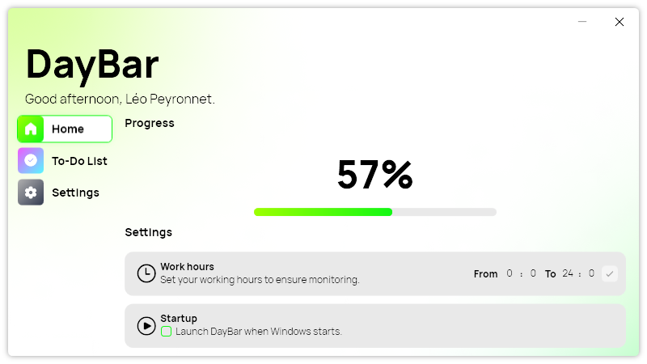
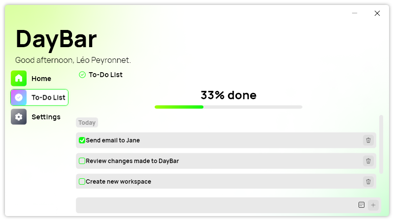
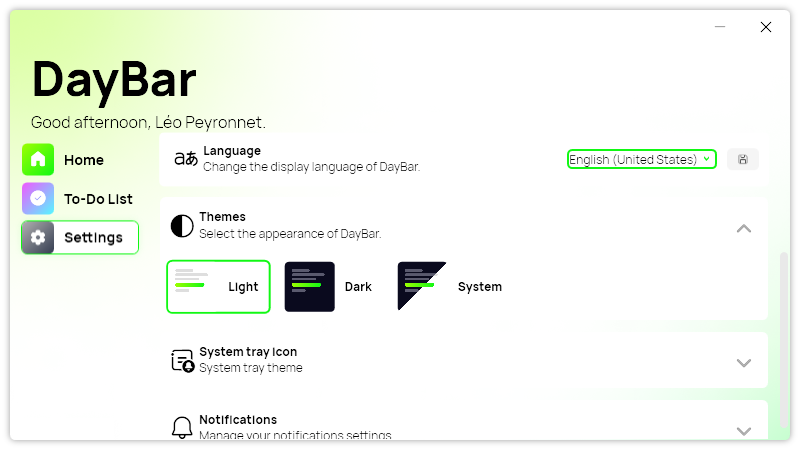

## Introduction

In today's fast-paced world, time is our most valuable asset. How we manage it can significantly impact our productivity and overall well-being. Enter DayBar 2 – the upgraded version of the beloved time-tracking tool that revolutionizes how you perceive and utilize your time.

With the release of DayBar 2, we've taken user feedback and innovative design principles to heart, resulting in a sleek and modern interface that seamlessly integrates with the aesthetics of other Léo Corporation Apps. But that's just the beginning.

## New features

### Modern design

DayBar 2 boasts a fresh, modern design that not only enhances the user experience but also aligns with the high standards set by other Léo Corporation applications. Say goodbye to cluttered interfaces – DayBar 2's intuitive layout ensures that keeping track of your time feels like second nature.

### ToDo List feature

The crown jewel of DayBar 2 is its brand new todo list feature. We understand that time management goes hand in hand with task management, which is why we've integrated a robust todo list right into DayBar. Now, users can create tasks, mark them as completed, set due dates, and even remove them with just a few clicks.

### New settings page

We also took time to rethink the way you can set your settings by adding a new settings page, where you can quickly find all the settings you need to craft your perfect experience.

## How to upgrade

DayBar 2 is available as a direct and automatic update for DayBar 1 users. You only have to check for updates in the app settings to receive DayBar 2.

## Download

[Click here](https://tinyurl.com/DayBar) to download DayBar.

## Full changelog

### New

- Added new theme resources (#16)
- Added new styles (#16)
- Added new navigation bar (#16)
- Removed legacy code (#16)
- Added Settings page (#17)
- Added translations (#17)
- Added missing resources (#17)
- Added About section (#17)
- Removed About page (#17)
- Added settings page to menus (#17)
- Added theme section to Settings page (#17)
- Removed Theme page (#17)
- Added Notifications section to Settings page (#17)
- Removed Notifications page (#17)
- Added new background for the main window (#18)
- Added translations (#19)
- Created ToDo page (#19)
- Added ToDo page to navigation bar (#19)
- Added Todo system (#19)
- Added ToDo Item (#20)
- Added the possibility to add and remove tasks (#21)
- Added Progress section (#22)

### Fixed

- Fixed navigation issue
- Fixed theme issue
- Fixed scrolling issue
- Fixed an issue with dark theme

### Updated

- Updated PeyrSharp.Env (#14)
- Updated Copyrights
- Upgraded to .NET 8 (#23)
- Updated Setup
- Improved user experience on ToDo page
