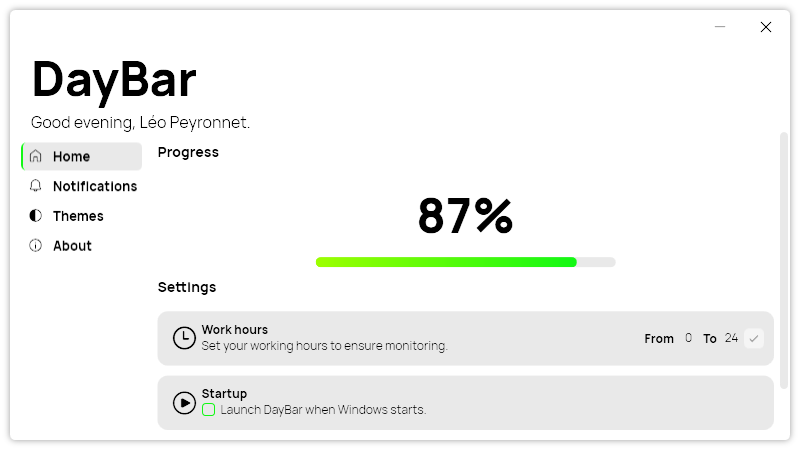
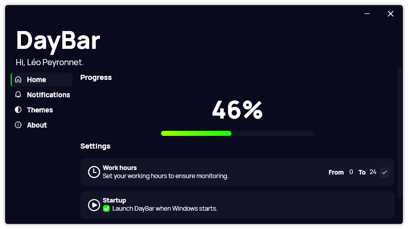
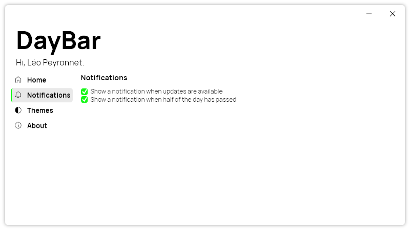
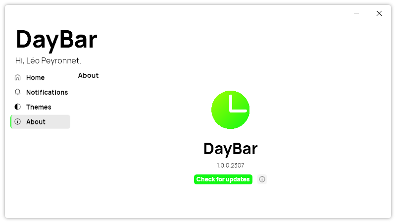

## Introduction

In a world filled with constant distractions and endless to-do lists, effective time management has become more crucial than ever. Introducing DayBar, a remarkable time tracking tool that was born out of a deep-rooted desire to help individuals optimize their time, increase productivity, and achieve their goals. In this blog post, we will not only explore the exceptional features of DayBar but also delve into the inspiring backstory that led to its creation.

### The Inspiration

At the heart of DayBar lies the vision of Léo Corporation, a software development company committed to creating innovative and user-friendly applications. Driven by a passion for productivity and time management, the team at Léo Corporation observed the challenges individuals faced in keeping track of their progress throughout the day. They recognized the need for a simple yet powerful tool that could provide a tangible representation of time, foster time awareness, and enable users to make informed decisions about their daily activities.

### The Journey of Creation

With this mission in mind, the dedicated team at Léo Corporation embarked on a journey to bring DayBar to life. Countless hours of brainstorming, designing, and coding were invested in crafting an intuitive and versatile time tracking solution. The team tirelessly researched and tested various features, ensuring that DayBar would cater to a wide range of user needs and preferences.

### Empowering Time Management

DayBar was meticulously developed to empower users to take control of their time. The team understood that effective time management is essential for personal and professional success. By visualizing the passing of time and providing a clear representation of progress, DayBar aims to foster greater awareness and enable users to make conscious decisions about how they allocate their time.

## Features

### Time Visualization

DayBar provides a visual representation of your progress throughout the day or work hours. Placed conveniently in the system tray, it offers a quick and intuitive glance at the percentage of time that has elapsed. This visual feedback empowers you to stay aware of your productivity and make real-time adjustments to your workflow, ultimately leading to more focused and effective time management.

### Customizable Work Hours

DayBar recognizes that everyone's schedule is unique. With its customizable work hours feature, you can define your preferred time blocks for focused work. Whether you're an early riser, a night owl, or need specific periods for different activities, DayBar allows you to tailor your time tracking to align with your individual workflow and maximize your productivity during your most productive hours.

### Personalized Themes

DayBar understands the importance of a visually pleasing and personalized experience. Choose from a variety of themes to customize the appearance of the application. Whether you prefer a light and minimalistic interface for a clean look or a dark theme to reduce eye strain during late-night work sessions, DayBar lets you create an environment that suits your style and enhances your overall user experience.

### Intelligent Notifications

To help you stay on track and make the most of your time, DayBar offers customizable notifications. Set intervals that align with your workflow, and receive gentle reminders to assess your progress and evaluate your task management. These notifications serve as valuable nudges, keeping you motivated, focused, and accountable to your goals throughout the day.

### Multilingual Support

In a globalized world, language should never be a barrier to productivity. DayBar ensures inclusivity and accessibility by providing support for multiple languages. Choose between English and French to seamlessly navigate and utilize the application in your preferred language, enhancing your overall user experience and ensuring a smooth interaction with DayBar's features.

## Conclusion

Time management is a fundamental skill for success and personal well-being. DayBar revolutionizes the way we track and optimize our time, providing a comprehensive set of features that empower individuals to make the most of every moment. From visualizing your progress to customizing work hours, personalizing themes, receiving intelligent notifications, and supporting multiple languages, DayBar is a game-changer in the realm of time tracking tools. Embrace DayBar as your ultimate time management companion and unlock your potential for enhanced productivity, improved work-life balance, and greater overall satisfaction. Embrace the power of DayBar and embark on a journey towards mastering your time and achieving your goals.

## Download today!

[Click here](https://tinyurl.com/DayBar) to download DayBar for Windows.
