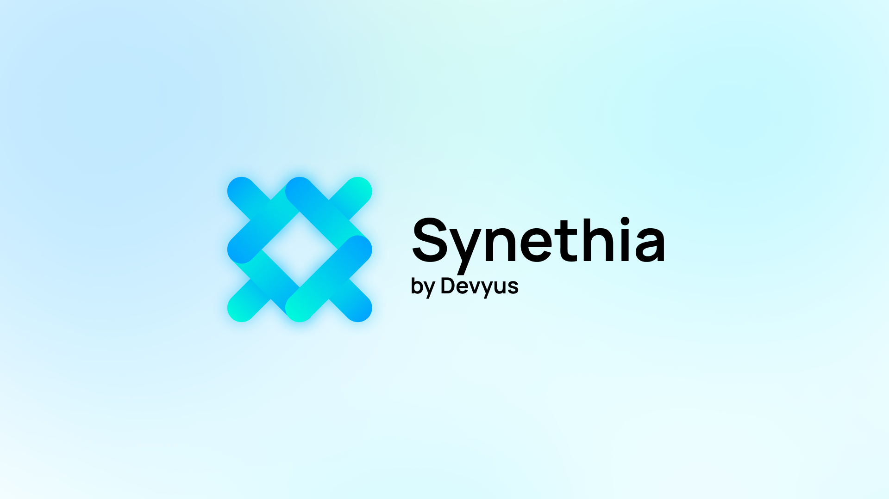
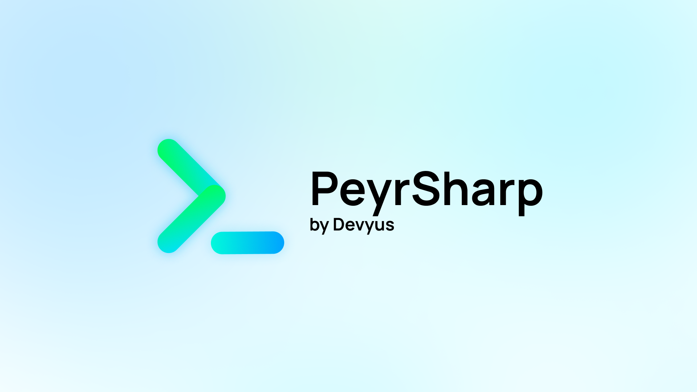

## Introduction
Léo Corporation is excited to announce the launch of Devyus, a new division dedicated to developing products and projects for developers. As technology continues to evolve and the role of developers becomes increasingly critical to businesses and organizations, Devyus is committed to improving the workflow and productivity of developers around the world.

At the heart of Devyus are two innovative products - PeyrSharp, a C# library designed to make developers' jobs easier, and Synethia, a basic C# algorithm that can determine the behavior of a user with an application. These products are designed to streamline the development process, helping developers work more efficiently and effectively.

PeyrSharp is a comprehensive library that simplifies many of the common tasks developers face on a daily basis. With PeyrSharp, developers can write code faster and with fewer errors, allowing them to focus on more important tasks. And with Synethia, developers can gain valuable insights into how users interact with their applications, allowing them to make data-driven decisions and create unique experiences for each user.

At Devyus, we understand that the role of developers is constantly evolving, and we are committed to staying ahead of the curve. Our team of experts is constantly exploring new technologies and techniques, so that we can bring the best products to market. And because we believe in the power of collaboration, we are always open to feedback and suggestions from the developer community.

So whether you are a seasoned developer or just starting out, Devyus is here to help. With our innovative products, expert team, and commitment to improving the workflow of developers, we are confident that we can make a real difference in the lives of developers everywhere.

We look forward to working with you!

## Devyus Products
We already have interesting product for you!
- [PeyrSharp](https://peyrsharp.leocorporation.dev/)
- [Synethia](https://synethia.leocorporation.dev/)

## What does that mean for Léo Corporation?
As a subsidiary of Léo Corporation, Devyus will continue to be backed by the resources and expertise of our parent company. This means that all Devyus products, including PeyrSharp and Synethia, will continue to be published under the Léo Corporation name.

However, with Devyus, we aim to streamline our development-focused offerings and create a more cohesive and dedicated platform for developers. Future products developed by Devyus will be published under the Devyus name, further solidifying our commitment to improving the workflow and experience of developers.

For current users of PeyrSharp and Synethia, rest assured that nothing has changed. These products will continue to be supported by Léo Corporation and Devyus, ensuring that developers can continue to use them with confidence.