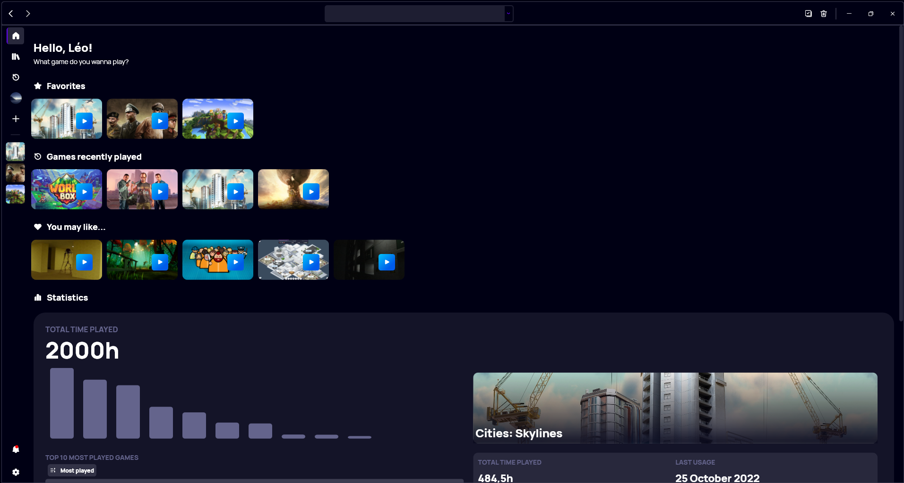
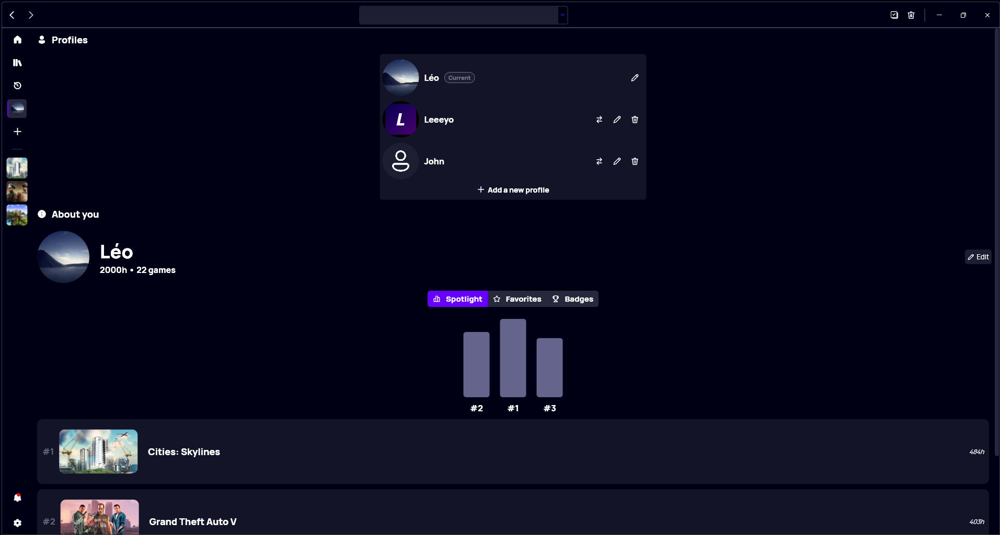
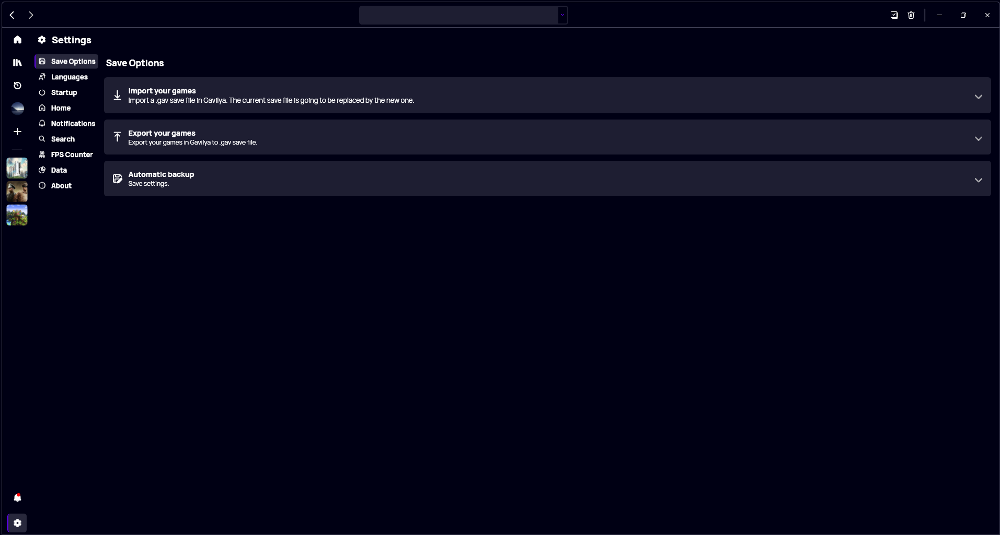
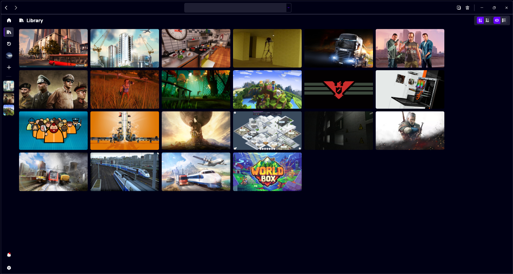

Almost two years after its first stable release, we're proud to introduce you Gavilya 3, the next evolution of our game launcher.

## A new design
With this new iteration of Gavilya, we decided to improve the user experience alongside with the user interface. Gavilya 3 now features a sidebar where you can find the home page, your games, those you played recently, and also your favorites. You can access you notifications directly from sidebar too. Located on the left side of the app, the sidebar gathers all of Gavilya's features in one place. With the new sidebar, all buttons and menus in the title bar have been removed.

## Improved profiles
Profiles are an important feature of Gavilya. In version 3, the profile experience has been improved; we merged your profile page with the profile switcher, making it easier than ever to create and manage profiles in Gavilya.

## Modern settings
The settings window of Gavilya wasn't really intuitive; therefore, we completely re-imagined the settings experience. Settings can now be access straight from the sidebar, and it will shows up in a new page instead of a window. You can now focus more on what you want to do with the new settings page design: It's simple and intuitive. The design is similar to the one used in our other apps.

## New card view
We've also redesigned a key part of Gavilya: The card view. You will notice that the play button is no longer visible by default: To bring it back, simply hover the card and it will show up again. When hovering a card, you can also now see the name of the game at a glance.

## Sorting options
We've also added sorting options to Gavilya: You can sort your games by the alphabetical order or not.

## Other improvements
We've also improved the design consistency across all the pages of Gavilya. We made improvements to performances and fixed some issues. You can now disable notifications as well.

You can find the full changelog of this release [here](https://github.com/Leo-Corporation/Gavilya/releases/tag/3.0.0.2210).

## Download
[Click here](https://bit.ly/Gavilya) to download Gavilya.

## Video
Check the official trailer for Gavilya 3.


  

    <iframe width="560" height="315" src="https://www.youtube.com/embed/kDGLLng3lCE" title="YouTube video player" frameborder="0" allow="accelerometer; autoplay; clipboard-write; encrypted-media; gyroscope; picture-in-picture" allowfullscreen></iframe>
  

