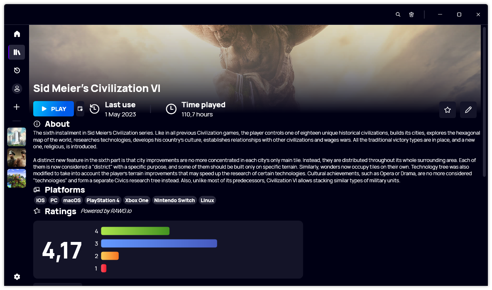
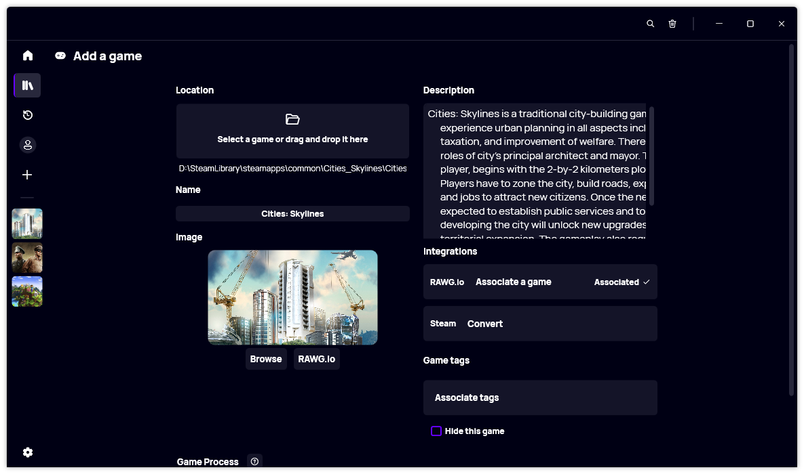
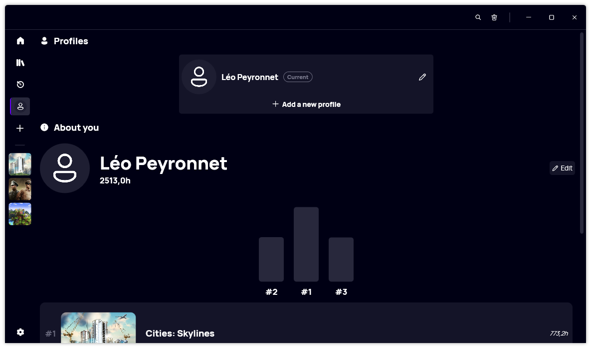

Greetings, gaming enthusiasts! We're thrilled to unveil a monumental evolution in the world of game launchers - the much-awaited Gavilya 4. This latest version marks a significant turning point, as it arrives with a complete rewrite of the original codebase, bringing forth a host of enhancements that promise to redefine your gaming experience. Developed by Léo Corporation, Gavilya has always been dedicated to simplifying your gaming routine, and this new iteration takes that commitment to unprecedented heights.

## A New Era Unfolds: From the Ground Up

Gavilya 4 isn't just an update; it's a complete reimagining of the entire game launcher. Three years since the inception of the original Gavilya, we've embarked on an ambitious journey to create a platform that lays the groundwork for seamless future expansions. This rewrite is more than just lines of code; it's a testament to our dedication to delivering an unparalleled gaming experience.

## Speeding into the Future: Performance Improvements

One of the most exciting aspects of Gavilya 4 is the remarkable performance enhancement it brings to the table. With loading times now up to 5 times faster, you'll spend less time waiting and more time playing. We've also worked tirelessly to optimize RAM usage, ensuring that your gaming experience is smoother and more responsive than ever before. Say goodbye to those frustrating moments when your system's resources were stretched thin.

## Elegance in Simplicity: Redefined User Interface

Change is inevitable, but we've ensured that Gavilya 4's UI maintains its core essence while embracing a sleeker and more intuitive design. While you may notice some subtle changes, the user-friendly approach that Gavilya is known for remains intact. We understand the importance of familiarity, and Gavilya 4 strikes the perfect balance between modernity and your well-loved gaming routine. We also took the opportunity of this major version to remove irrelevant features, such as the integrated notification center, the "Badges" and "Favorites" section of the profile page.

## Under the Hood: Codebase Refinement

One of the most profound advantages of this rewrite is the substantial improvement in the codebase's maintainability. Our developers have meticulously crafted a foundation that's not only robust but also more adaptable to future innovations. This means that as the gaming landscape evolves, Gavilya will be ready to accommodate new features and functionalities with unmatched efficiency.

## Seamless Transition: Upgrading to Gavilya 4

For our dedicated Gavilya users, upgrading to version 4 is a breeze. While you'll encounter some changes in the UI, the transition won't disrupt your gaming routine. To make the shift, you'll need to reimport your games using the migration installer that will open automatically upon starting the app. This process ensures that your game library remains intact and seamlessly accessible in the new version.

## A Future Full of Promise

As we introduce Gavilya 4, we're not just unveiling a game launcher; we're presenting a commitment to innovation, performance, and your unparalleled gaming experience. Whether you're a casual gamer or a dedicated enthusiast, Gavilya 4 is poised to revolutionize the way you interact with your gaming library.

Join us as we step into this exciting new era of gaming convenience and sophistication. [Download Gavilya 4](https://tinyurl.com/DownloadGavilya) today and rediscover your games like never before. Your journey into the future of gaming starts now!

## Website

[Click here](https://gavilya.leocorporation.dev) to go to the official website of Gavilya.
[Click here](https://tinyurl.com/DownloadGavilya) to download Gavilya.
