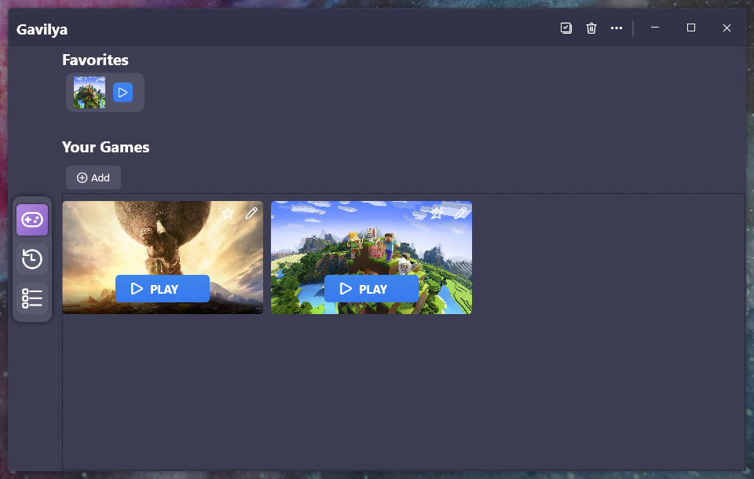
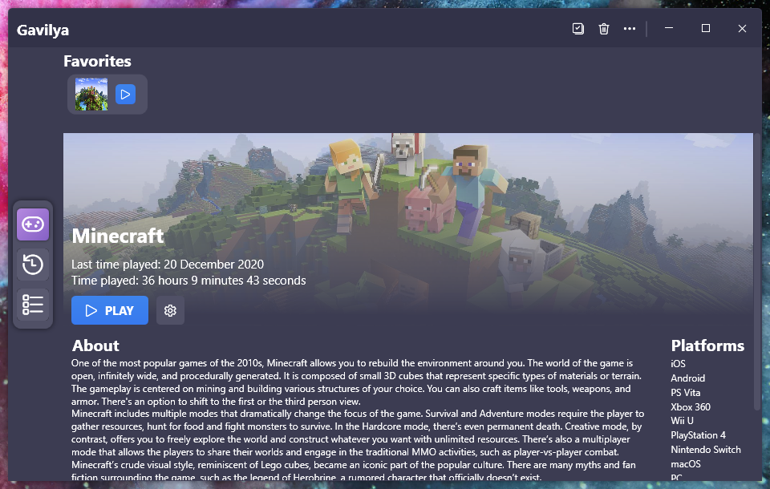
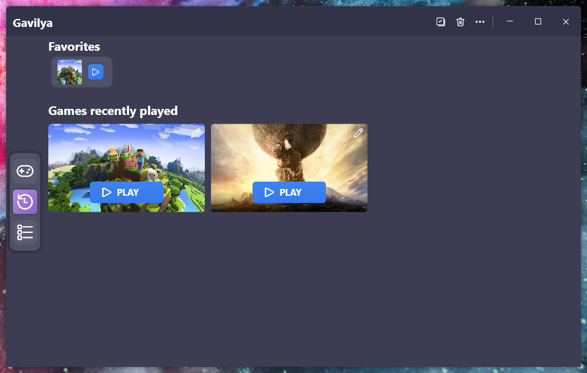
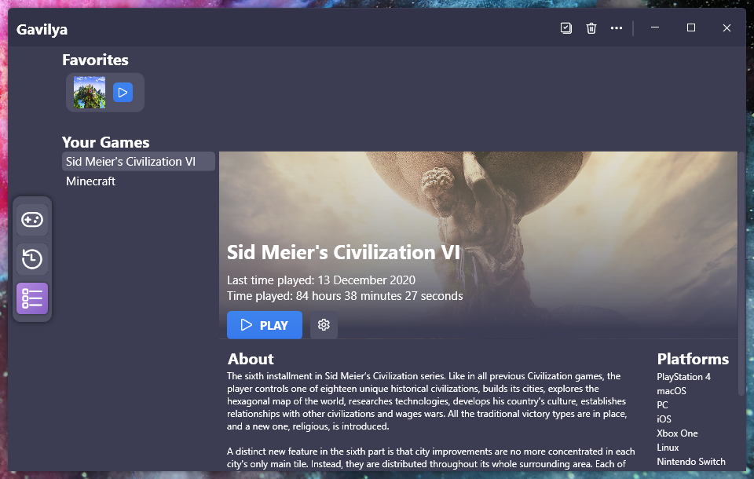

We've been working on a new project for a few months, and if you follow us on GitHub, you may already know what it is, but let's introduce what Gavilya is.

## Introduction
Gavilya is a software that brings all your video games together in one place. Today, there is a lot of game launcher that you need to use depending on the game you wanna play. This is often annoying and this is why we created Gavilya.

## Integrations and Features
Gavilya uses the RAWG.io video games database to get all your games informations automatically. Gavilya uses the RAWG API to get the background image of a game, the game's description and even on wich platforms the game is available on. If you think that the game found by Gavilya in the RAWG database is wrong, you can change the associated game in the "Edit" window.

You can also know which games you played recently, or even know how long you've played a specific game. Gavilya uses a system that can detect if you are playing a game and count the time you've been playing it. Sometimes this system doesn't works with games that have a different process name than it's executable file (like Minecraft). This is why you can manually set the process to look for (for Minecraft it's "javaw").

## Open Source
Gavilya is also one of our open-source projects. You can contribute to the code, report issues and bugs with Gavilya and more. Click here to go to the GitHub repo.

## Download
[Click here](https://bit.ly/Gavilya) to download Gavilya.

## Screenshots

