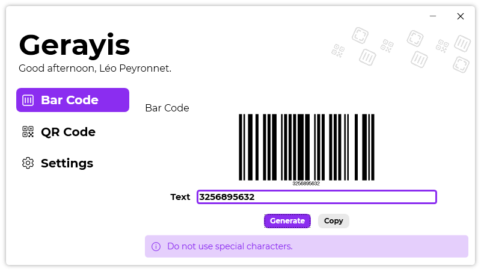
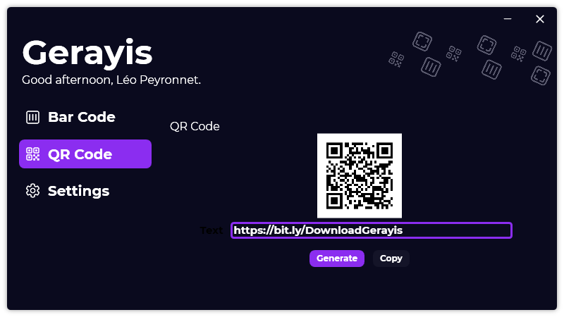

We are starting this month with the release of a new software: Gerayis. Gerayis is the next evolution of Bar Code Generator 2.

## Introduction
It's been a few years already since we've released the first version of Bar Code Generator (at the time, named in french "Générateur de codes barre"). Then, last year, 2020, we've released Bar Code Generator 2, with a brand new design, and the possibility to generate QR Codes. 

The second version main purpose was to deliver to our users, a brand new user experience, while also adding new features. 
Gerayis is the next of evolution of Bar Code Generator, with a design and user experience similar to [Passliss](https://blog.leocorporation.dev/2021/02/introducing-passliss.html)'.

## Features
Gerayis has the same features than Bar Code Generator 2, but they are improved, like the QR Code generator which is using a different library than Bar Code Generator 2: [QRCoder](https://www.nuget.org/packages/QRCoder).
Gerayis also includes an improved dark theme and an updated language system.

## Open Source
Gerayis is Open-Source, and you can check the GitHub repo by [clicking here](https://github.com/Leo-Corporation/Gerayis).

## Download
[Click here](https://bit.ly/DownloadGerayis) to download Gerayis.