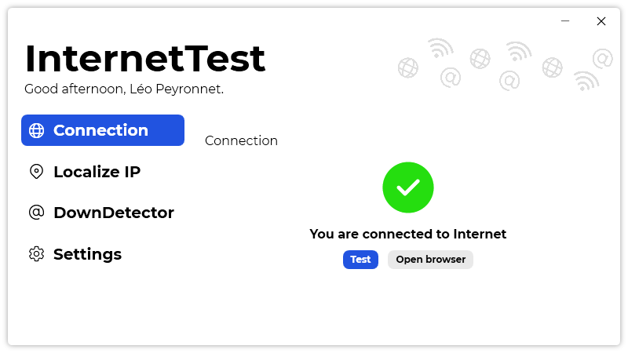

Approximately a year ago, we have announced the fourth version of InternetTest. Today, we are proud to announce the InternetTest 5, the next evolution of the utility.

## Introduction

InternetTest was one of our first software and is also one of the first open-sourced project that we have published on GitHub. InternetTest main purpose was to enable users to check if they are connected to Internet. Why? Because even if you can check it directly by looking to the icon in the Windows system tray, this icon can sometimes be misleading, and therefore we have created InternetTest.

Today, InternetTest features have diversified and now, you can also localize IPs, check if a website is down, and you can also customize features, such as dark theme and the default test site.

## Version 5 (Codename Syghroni)

As you lately saw, we are redesigning a lot of our current software, and we are not done yet! InternetTest is now exception, and this fifth version does not include brand new features, but focuses on the user experience and user interface, to make you love InternetTest.

As you can see in the pictures below, the new design follows the same guidelines that Passliss or Gerayis uses.

InternetTest 5 is also using darker colors for dark theme.

## Upgrading

Be aware that InternetTest 5 will not be proposed as an update of InternetTest 4, if you want to upgrade, you will have to do it manually by downloading InternetTest 5. After installing InternetTest 5, you can remove InternetTest 4, since no updates will be delivered to it.

## Download

[Click here](https://tinyurl.com/DownloadInternetTest) to download InternetTest 5.