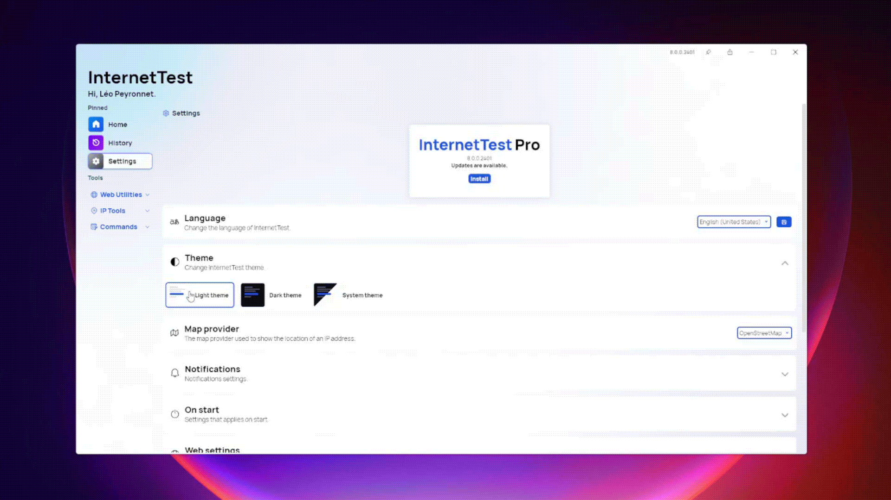

## Introduction

In 2018, we introduced InternetTest as a straightforward utility designed to check your internet connection. Since then, the app has undergone significant enhancements, embracing both new features and sleek designs.

The 2020 release, InternetTest 4, marked a notable milestone by incorporating advanced functionalities such as the IP Locator and Down Detector. Subsequently, in the following year, InternetTest 5 was unveiled, representing a major leap forward with a modernized codebase that laid the foundation for version 6.

The pinnacle of our journey arrived in 2022 with the launch of InternetTest Pro 7 – a revolutionary iteration that set itself apart from its predecessors. This version introduced groundbreaking features, including a WiFi password recovery utility, a fresh design, and a user-centric approach.

Today, we are thrilled to present the latest advancement in the InternetTest series: InternetTest Pro 8. This iteration elevates your experience to unprecedented heights, building upon the legacy of its predecessors and delivering a seamless blend of cutting-edge features and user-friendly design.

## Features

### New dashboard

We are proud to unveil the new InternetTest Pro 8 dashboard: We turned the home page of InternetTest to a place where you can quickly get the information your need at a glance. Indeed, we added a new information section where you can check the status of your connection, your network's name and your public IP address. Furthermore, we decided to rethink the "Suggested actions" section by replacing it with "Quick action": You can now easily run a speed test, recover lost WiFi passwords and connect to a network in just a few clicks. Alongside with these improvements you will also notice that we decided to improve the design of the feature cards, adding more depth to the app's interface.

However, you will notice that some of the features added to the dashboard were previously available in the "Status" and "My IP" page, and this is why we made the decision to remove theses two pages from the app. This change will make the app less crowded with basic pages that only included a single feature.

### Redesigned DownDetector page

Previously, the DownDetector page posed challenges for new users due to its less-than-intuitive design, characterized by a cluttered UI with numerous elements. Recognizing the need for improvement, we took a fresh approach to this feature with the release of InternetTest Pro 8.

In our redesign, we have streamlined the user experience by introducing a more user-friendly interface. Now, you'll find a designated box where you can input the URL of a website for inclusion in the verification process. This allows you to compile a list of websites that will undergo testing when you click the "Test all websites" button. On the left side, a new "Scheduled Tests" section has been incorporated, enabling you to efficiently schedule tests at specified intervals for seamless execution. With these enhancements, monitoring website performance has never been more straightforward and accessible.

### New customization options

With the features previously mentioned, we decided to add new customization options. In the settings of the app, you can now provide a default time interval to use when using scheduled tests in the DownDetector page. In addition, we also added the possibility to hide by default disabled network adapters in the WiFi Networks page.

### Instant theme switching

InternetTest Pro 8 also brings a brand new theming system that is more flexible and dynamic. Indeed, you can now change the theme of the app without having to restart it. Speaking of theme, you will also notice that we updated to background mesh gradient for the main window. Plus, we redesigned some styles of navigation button making them more consistent with the rest of the app.

### Improved codebase

When InternetTest Pro was launched in 2022, a standout addition was the incorporation of Synethia into the dashboard. Synethia, an algorithm designed to analyze user preferences within the app, utilized collected data<a href="#note-1">(1)</a> to craft a personalized dashboard. This tailored interface suggested the most relevant features based on individual usage patterns. Initially, the integration was manually executed without the official package, which is now offered by Devyus, the creators of Synethia.

In this 8th major version, we dedicated time to completely reworking the Synethia implementation, now leveraging the official Synthia package. It's important to note that upgrading from InternetTest Pro 7 will result in the loss of previously collected data.

Additionally, we invested effort in addressing numerous issues and bugs within the app, resulting in improved overall stability. These enhancements contribute to a more seamless and reliable user experience.

### Portable mode

Introducing a new level of flexibility, InternetTest Pro 8 now offers users the choice between two distinct versions: Setup and Portable. The Setup version involves a traditional installation process, while the Portable option provides a convenient alternative, allowing users to run the app without the need for installation through a portable executable file. It's important to note that while Portable mode delivers heightened convenience, some features, such as automatic updates, are not available. For users opting for Portable mode, updating the application requires redownloading the updated portable executable file to ensure access to the latest enhancements. This choice empowers users to tailor their experience based on their preferences and usage requirements.

## Get the app

InternetTest Pro is available on Windows and requires the .NET 6 Windows Desktop Runtime. Please note that in the future, we plan to upgrade to the .NET 8 Windows Desktop Runtime which will be needed to execute the app.

- [Click here](https://tinyurl.com/DownloadITP7) to get the **Setup** version of InternetTest Pro
- [Click here](https://tinyurl.com/DownloadITPP) to get the **Portable** version of InternetTest Pro

---

(1): Synethia operates by collecting and storing data anonymously on your computer. It's essential to underscore that no data is transmitted to Léo Corporation or any third-party entities.
