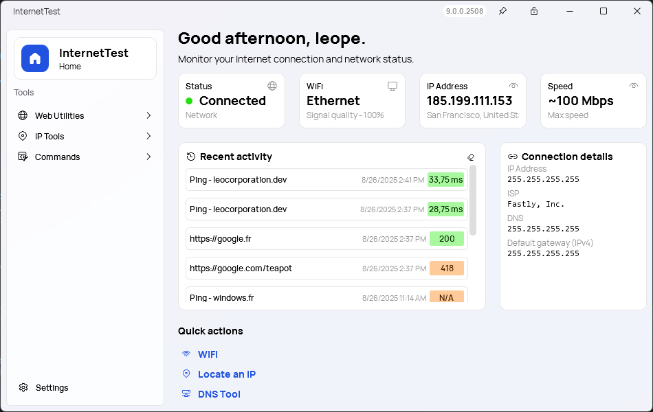
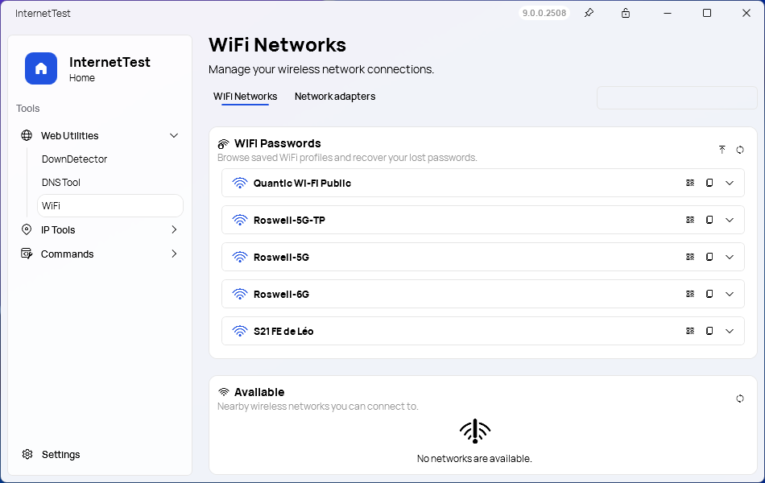
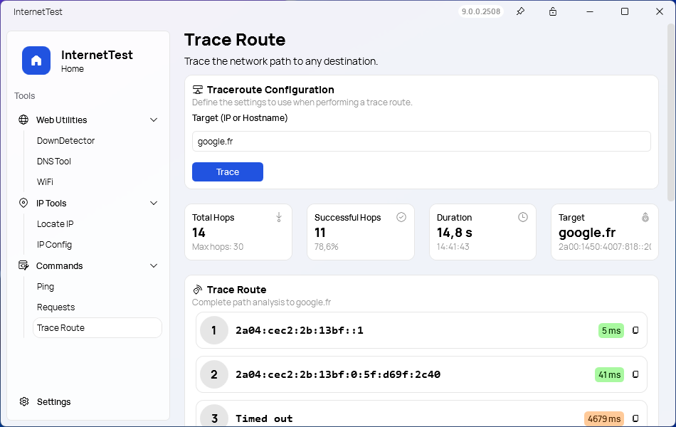
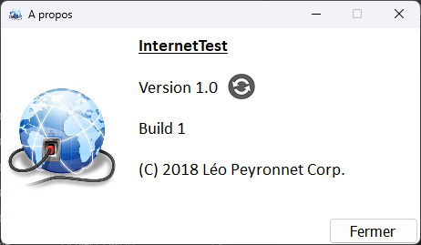

## Project Overview

InternetTest Pro 9 marks a major milestone in the evolution of the application. This release is the result of a complete rewrite, moving to a modern MVVM architecture in WPF and adopting a new design language that fits naturally into Windows 11. The legacy code has been retired in favor of a cleaner, more maintainable structure that will make the project more reliable and future-proof.

At the visual level, every page has been redesigned. The application now uses a MicaWindow style, giving it a modern, lightweight look that integrates with the system theme and wallpaper. The overall navigation has been streamlined, and the interface is more consistent across features.

## New Features

### Home page

One of the most significant changes in InternetTest Pro 9 is the introduction of the new Home page. This redesigned entry point now provides all the key information about your current connection at a glance. It shows your connection status, WiFi network name, IP address, ISP details, DNS configuration, and speed. In addition, a recent activity section makes it possible to quickly review the last actions performed in the app, which is why the History page has been removed. The Home page is no longer just a landing screen; it is a complete dashboard that centralizes everything you need when launching the app.

### Unified WiFi Tools

The WiFi experience has also been improved. In earlier versions, WiFi networks and WiFi password recovery were separate pages. They are now combined into a single page, offering a clearer and more coherent experience for managing wireless connections and recovering saved passwords.

### New design

All other tools have been modernized as well. The DNS Tool, Traceroute, Ping, and IPConfig pages have been redesigned with a more accessible interface, offering the same depth of information in a cleaner layout. These changes reflect an overall effort to unify the experience while keeping the functionality users rely on.

### Retired Features

Some features have also been retired in this version. Synethia is no longer included, and support for Windows 7, 8, and 8.1 has been dropped. InternetTest Pro is now focused on Windows 10 and Windows 11, ensuring compatibility with modern technologies while allowing development to move forward without legacy constraints.

## Retrospective

InternetTest has come a long way since its first release. The project started as a simple utility for testing whether your internet connection was working or not. Over time, more tools were added: DNS lookups, traceroute, ping, IP geolocation, and eventually WiFi utilities. Each version expanded its scope, gradually transforming InternetTest into a complete connectivity toolkit for Windows.

With InternetTest Pro, the application entered a new phase, providing not just isolated tools but a unified platform with a polished design and extended features. Version 9 represents another turning point, as the project undergoes its most ambitious rewrite to date. It brings together everything learned from previous versions into a refined experience that is faster, cleaner, and built for the future.

## Download and Learn More

InternetTest Pro 9 will be available for Windows 10 and Windows 11. To learn more about the project and its features, visit the [official website](https://leocorporation.dev/store/internettest) or explore the source code on [GitHub](https://github.com/Leo-Corporation/InternetTest).

This release is more than just an update. It is the foundation for the next chapter of InternetTest, with a modern architecture, a unified design, and a focus on clarity and usability. Whether you are troubleshooting, monitoring, or simply exploring your connection, InternetTest Pro 9 provides the tools to understand and optimize your internet experience.