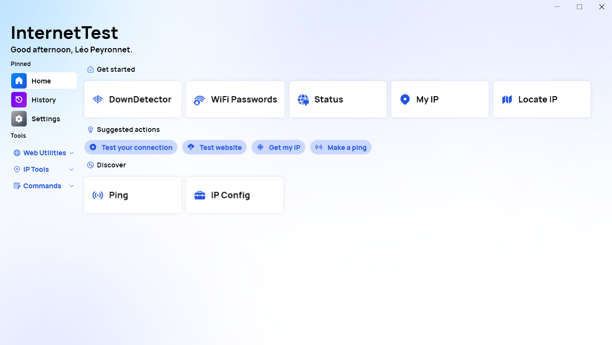
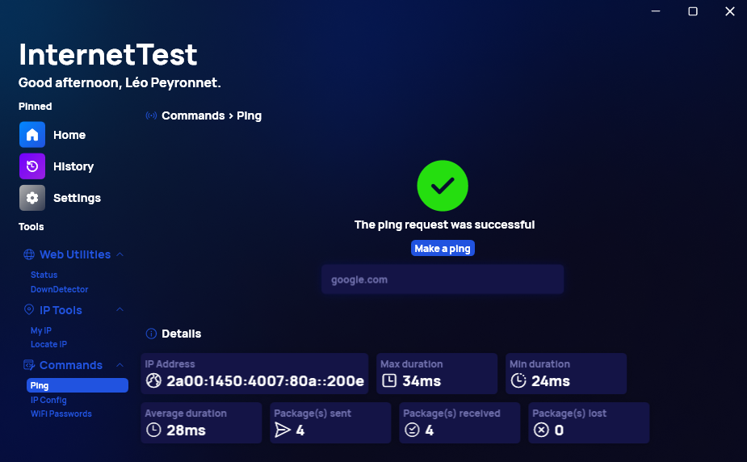
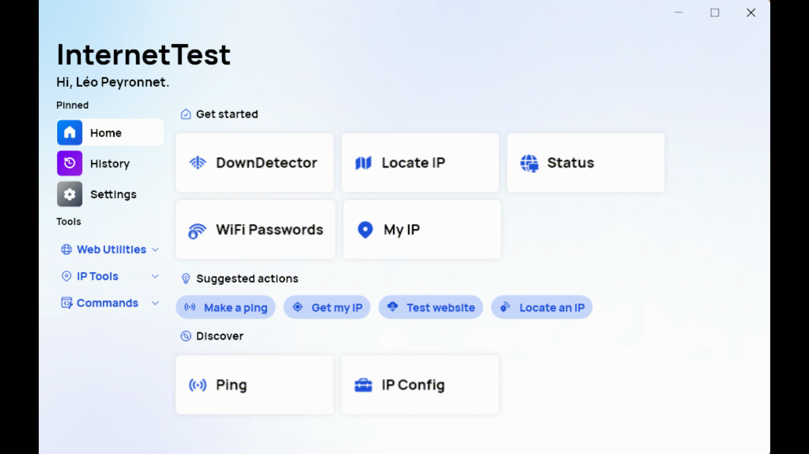
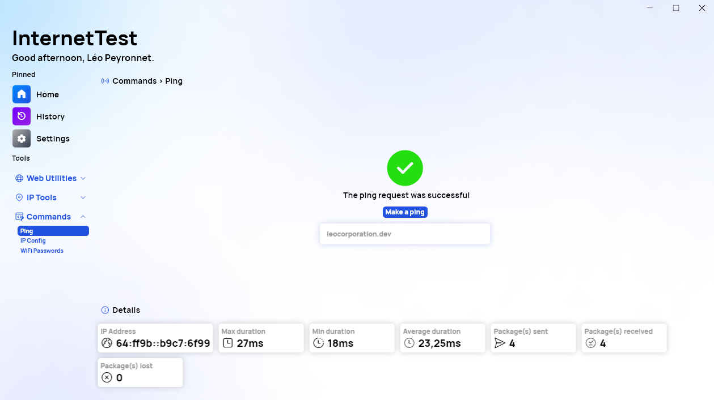
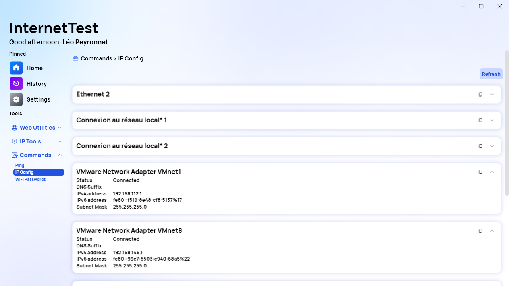
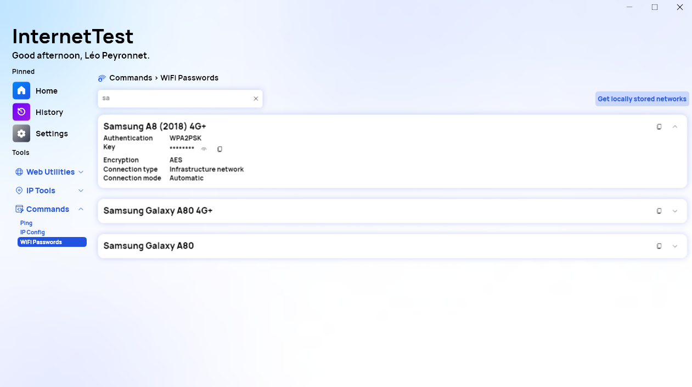
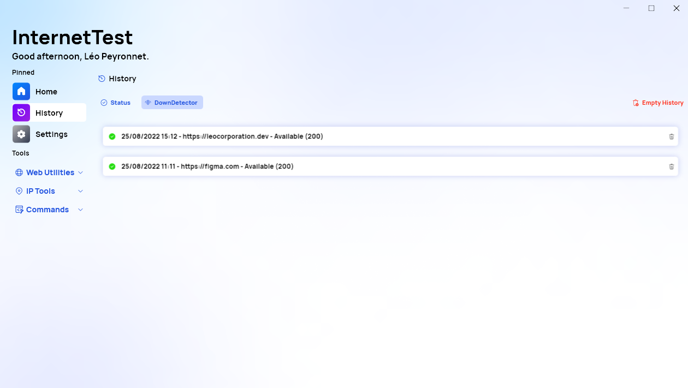
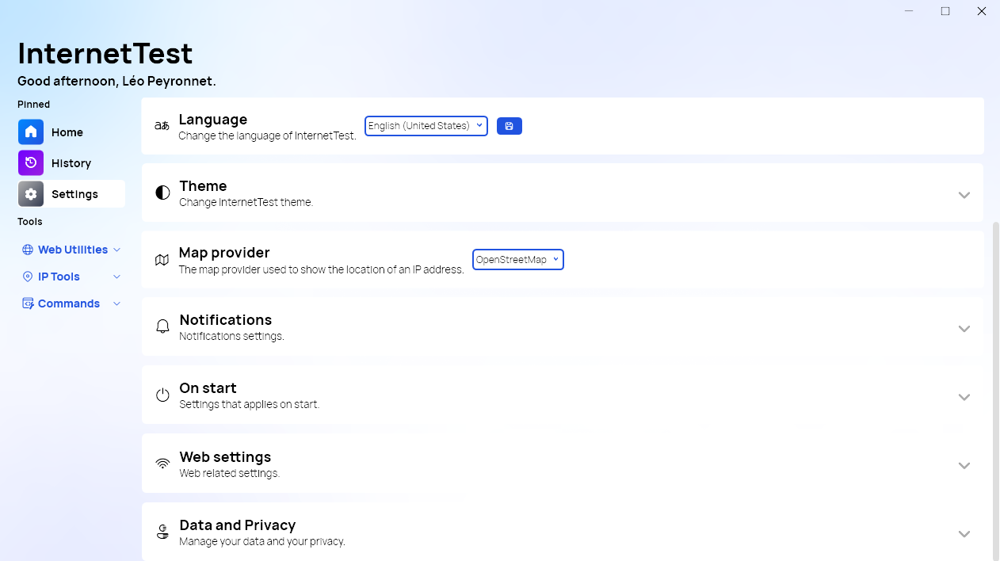

We are excited to introduce you the next generation of the InternetTest application; it is called InternetTest Pro!

## Introduction

InternetTest is one of our oldest products still maintained and has evolved during all those years, from a simple utility to check if your internet connection is working as expected, to an app that helps you to locate an IP address, check if websites are working or not, and more.
We are experience creators, and we are more than happy to share with you the pioneer of a new era, InternetTest Pro.

## A new and improved user interface

InternetTest Pro, also called InternetTest 7, offers a new user interface; you will notice a brand-new side bar with “pinned” actions and different menus. You can access your favorite functionalities using this new side bar, or by using the “Home” dashboard; it is a place specially made for you where you can quickly find useful actions and features. We have added subtle animations as well.

We are also introducing an improved light and dark theme; the background of the window is no longer white: Instead, there is a subtle mesh gradient with different colors. The accent color is also more used in different part of the app. Finally, you will notice that there are less shades of gray, and more shades of blue used everywhere in InternetTest.

## An experience conceived for you

We want our users to have the best experience possible when they use our apps. We believe that our products should adapt to their needs, and that our users should not have to adapt to the limitations of our applications. Therefore, we want to introduce you Synethia, an algorithm that can understand your habits and which features you’d like to use. When you are using InternetTest Pro, Synethia will collect data on how you spent time with each feature, and which interactions you have made. The data is then analyzed, and this how the “Home” dashboard shows you recommended actions and features. The more you use InternetTest Pro, the more Synethia will be able to understand your needs.

Now, we are aware that this feature will raise privacy concerns about the data collected, and we want to be fully transparent with you. The data is stored on your device anonymously and is NOT send to Léo Corporation. It is NOT used by any third-party application or company other than InternetTest itself. You have full control over your data; you can reset it or erase it completely. You can, at any time, disable Synethia in the Settings. Synethia cannot interact with other apps or program.

## A new set of features

InternetTest Pro has all the features included in InternetTest 6, which are: Connection Status, Down Detector, My IP, and Locate an IP. With this new version we are introducing three new features: Ping, IP Config, and WiFi Passwords (recovery).

### Ping

The Ping feature allows you to send a ping request to specified IP address or URL. It works exactly like the “ping” command in Windows. You can get useful information when you make a ping, such as the maximum/minimum and average duration of each request, the number of packages sent, received, or lost, and the IP address if you provided an URL.

### IP Config

The IP Config feature works the same as the “ipconfig” command available in the Windows command prompt. You will be able to get a list of all the network interfaces registered on your system. By default, only the connected interfaces details are expanded. You can copy the information of each interface. This information contains: Status (connected/disconnected), the DNS Suffix, the local IPv4 and IPv6 address, the subnet mask, and the default gateway IP address (in IPv4 and IPv6).

### WiFi Passwords

This feature allows you to recover all passwords of all the WiFi networks you have already been connected to. By default, the page is empty for security reasons, you will need to click on the “Get locally stored networks” button to see all registered networks on your device. You can then expand each network details to learn more about the encryption algorithm, the authentication mode, the connection type/mode, and most importantly, the network key. The key is hidden by default; click on the “eye” icon next to it to show the key.

## A new history

We are also glad to announce a unified history page. On this page you will be able to see the results of each test made using the “Status” or “Down Detector” feature. You can erase the history at any time.

## Simplified settings

We are also committed to improvements of the settings page: Some sections are gone because we grouped them in a single category. For example, the default test website and the default HTTP protocol are now in the same “Web” category. The update system has also been reworked, so you can quickly see if InternetTest Pro is up to date or not. The theme and the default page picker have all been simplified.

## What is next for InternetTest 6?

The support for InternetTest 6 will end; it won’t receive new features anymore. InternetTest Pro will not be offered as an upgrade of InternetTest 6 because we consider it as a different product. We will let our users choose whether they want to upgrade or not.

## Download

[Click here](https://tinyurl.com/DownloadITP7) to explore your new experience with InternetTest Pro.

## Video

Check the official trailer for InternetTest Pro.



  

    <iframe width="560" height="315" src="https://www.youtube.com/embed/ozg_5TjYoZ0" title="YouTube video player" frameborder="0" allow="accelerometer; autoplay; clipboard-write; encrypted-media; gyroscope; picture-in-picture; web-share" allowfullscreen></iframe>
  


