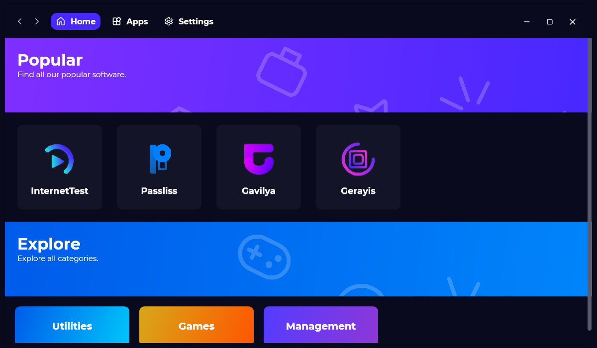
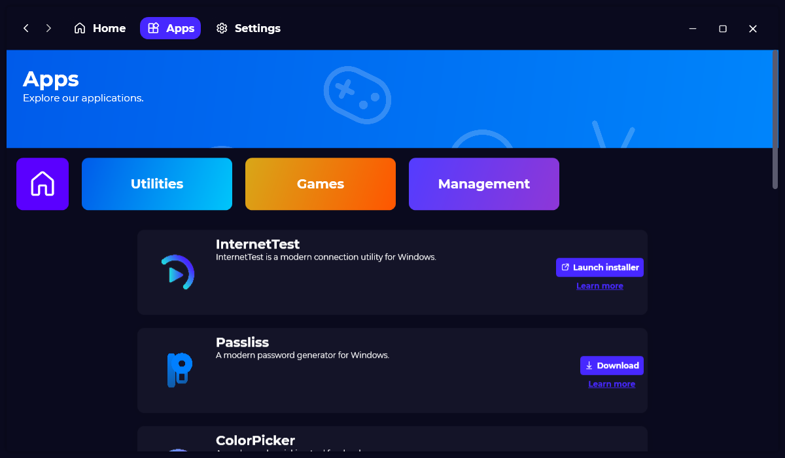

Last year, we have launched the successor of the “Léo Corporation Store”, Xalyus Store. It came out with a brand-new design and brand features. Today, we are happy to introduce the next evolution of Xalyus Store.

## Introduction

When we started creating softwares, we always wanted a place where people could download them. We thought making a website was great, and we did so. But we also wanted a place on desktop, where we could showcase and display our apps. Therefore, we create a software called “Store”. With it, you could download any of our softwares directly from your computer. Then, we wanted to have a complete redesign of this app, and so we decided to modernize it by building a brand-new one: Xalyus Store.

Xalyus Store was our redesigned tore, with the same concepts but more polished. However, we encountered the same problem with the “Store”: If we want to add new softwares, update any informations, we needed to update Xalyus Store, which isn’t a great way of distributing new softwares. This is why we are here today, introducing the second major version of Xalyus Store.

## Completely autonomous

This next evolution of Xalyus Store is complete autonomous: You don’t have to update it to check if new softwares are available, everything is automatic! You may not see a lot of changes compared to the first version, but they are massive since it is about an entire new infrastructure and delivering system.

## Modern design

To keep our softwares consistent, the new Xalyus Store has a new and modern user interface, alongside with new themes. You can choose between light and dark theme or stick to your system’s default theme if you are using Windows 10.

## Trust and secure

As you may now, most of our softwares are Open-Source on GitHub. This means that the code of our softwares is available to anyone, even malicious people who may try to inject malicious code in our softwares and distribute an infected copy to you. Xalyus Store is one of our trusted sources for downloading softwares, the risk of having a virus using it, is almost inexistent.

## Upgrading

The new Xalyus Store is not an update of the first version of Xalyus Store, you’ll need to remove the old Xalyus Store and download the new one.

## Download

[Click here](https://tinyurl.com/DownloadXalyusStore) to download Xalyus Store.

