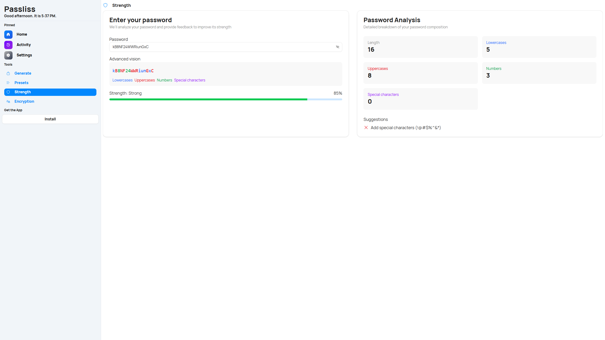
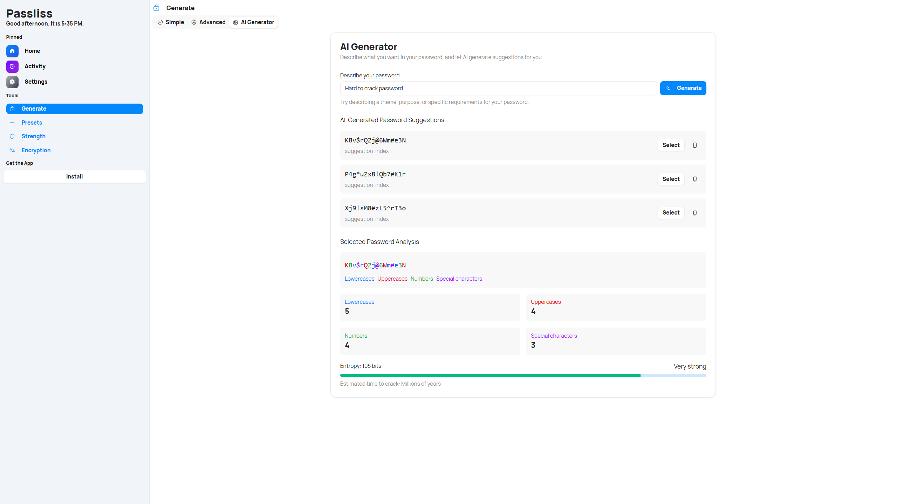
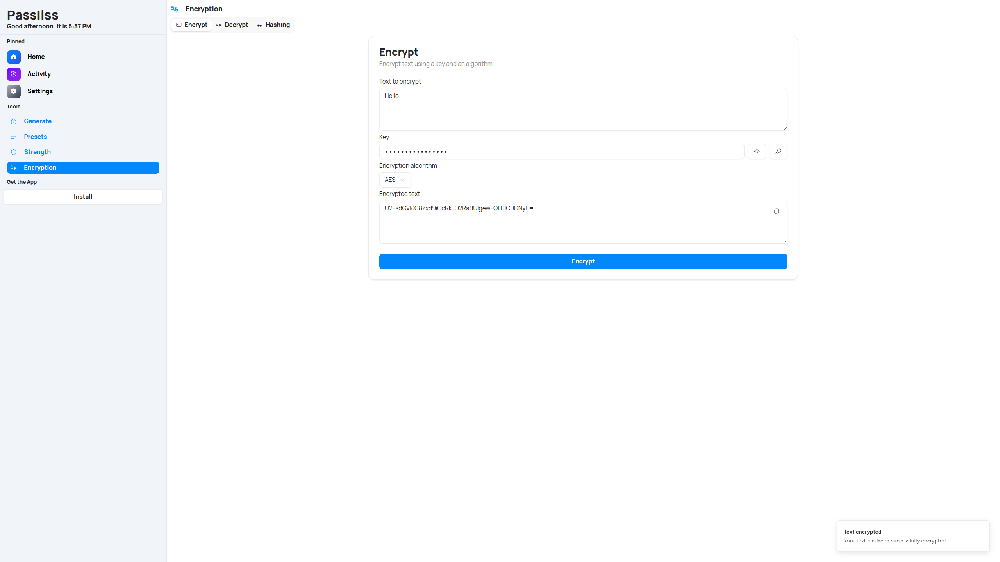
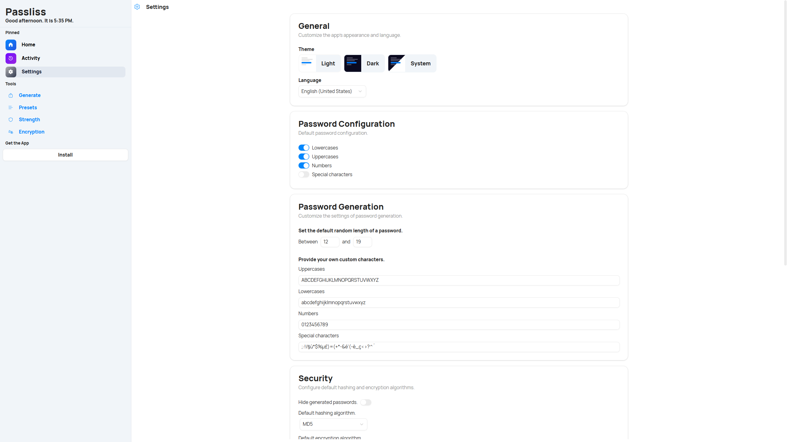
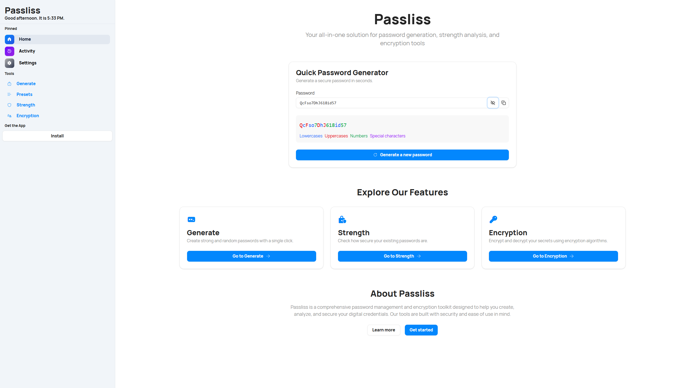

Passliss 5 marks a significant evolution in password management. Built from the ground up with security and user experience in mind, this new version brings together cutting-edge technology and thoughtful design to help you generate, test, and manage strong passwords more efficiently than ever before.

## Smarter Passwords with AI

One of the standout features in Passliss 5 is the new AI-powered password generation system. You can now create strong and unique passwords simply by typing a prompt. Thanks to the integration of OpenAI’s GPT-4o-mini, Passliss can understand your intent and generate passwords that are both secure and context-aware, offering a more intuitive approach to digital protection.

## Improved Strength Analysis

The strength analysis tool has been completely redesigned. With a clearer interface and deeper insights, the new Strength page helps you understand not just how strong your password is, but why. Detailed suggestions and real-time feedback guide you toward creating more secure credentials for all your accounts.

## More Control on the Generate Page

The Generate page in Passliss 5 has been expanded with more control and flexibility. You can now toggle between a simplified interface for quick generation and an advanced section for fine-tuning every aspect of your password. There's also support for generating multiple passwords at once and exporting them as CSV, making it ideal for managing several accounts.

## Robust Encryption and Hashing

Security goes beyond passwords. With the enhanced Encryption page, you can now encrypt and decrypt any string using trusted algorithms like AES and Triple-DES. Passliss 5 also introduces a new hashing section, allowing you to hash sensitive data directly within the app.

## Full Customization and Personalization

Passliss 5 gives you full control over your environment. From changing the language and theme to setting default values for password length and encryption algorithms, everything is customizable. You can also export and import your preferences, or reset everything to default in a few clicks.

## A Streamlined and Modern Experience

With a completely redesigned interface, Passliss 5 offers a clean, modern look that adapts to any screen size. Powered by Next.js, React, and TypeScript, the app is fast, responsive, and reliable. The navigation has been refined to make every feature easy to find and use, and performance has been optimized across the board.

Passliss 5 isn’t just an update — it’s a complete rethinking of what password tools can be. From powerful new components to thoughtful UI improvements, it brings together everything you need to stay safe in a digital world without compromising on ease of use. Whether you're managing a single account or hundreds, Passliss 5 provides the tools and intelligence to do it securely and efficiently.

## Launch

Passliss 5 is available now. Whether you're discovering it for the first time or upgrading from a previous version, this release is built to meet your needs with precision and care. Step into the future of password management with Passliss 5.

[Click here](https://passliss.leocorporation.dev/) to launch Passliss in your web browser.

## Learn more

[Click here](https://leocorporation.dev/store/passliss) to learn more about Passliss

## Changelog

### New

-   Added basic components
-   Added locale system
-   Added assets
-   Added home page components
-   Added new components
-   Added Install App button
-   Added navbar layout
-   Added password generation methods
-   Added shadcn/ui components
-   Added new browser utilities
-   Added locales
-   Added OpenAI
-   Added Prompt Item
-   Added Password Item
-   Added Generate page
-   Added new navigation system
-   Added strength suggestion item
-   Added strength page
-   Added Select component
-   Added Encryption page
-   Added Alert dialog component
-   Added global version system
-   Added Theme System
-   Added locale switcher system
-   Added Settings page
-   Added Popover component
-   Added Activity Item component
-   Added Timeline component
-   Added Activity page
-   Added Checkbox component
-   Added Preset Item
-   Added Presets page
-   Added new Encrypt section
-   Added new Decrypt section
-   Added new Hash section
-   Added Encryption algo field
-   Added Sonner
-   Redesigned Activity Overview section
-   Added Progress component
-   Added locales for Strength suggestions
-   Added new Password Strength system
-   Added new Strength page
-   Added locales for Generate page
-   Added new Simple Section in Generate
-   Added Advanced Section in Generate page
-   Added the possibility to generate multiple passwords
-   Added the possibility to export passwords as CSV
-   Added new AI section
-   Added PWA support
-   Added dev container file
-   Improved presets dialog
-   Redesigned Preset Editor
-   Added new components
-   Redesigned Strength Dialog
-   Added new Dashboard Card design
-   Added new Home page

### Fixed

-   Fixed button colors
-   Fixed navbar style issue
-   Fixed icons alignment
-   Fixed ts compiler issue
-   Fixed several compilation issues
-   Fixed scrolling issue
-   Fixed typo in default numbers config
-   Fixed Activity items is null error
-   Fixed typescript issues
-   Fixed some UI issues
-   Fixed type error
-   Fixed layout issue on Chrome
-   Fixed scroll issue

### Updated

-   Unified password utils
-   Updated ring input color
-   Updated dependencies
-   Minor UI tweaks
-   Simplified password generation process
-   Changed default AI model to GPT 4o-mini
-   Removed legacy components
-   Removed hard coded colors
-   Removed old password vision component
-   Improved icon size
