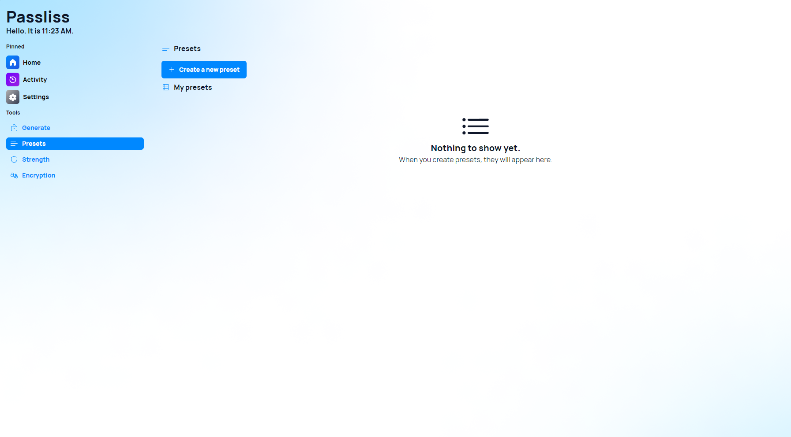
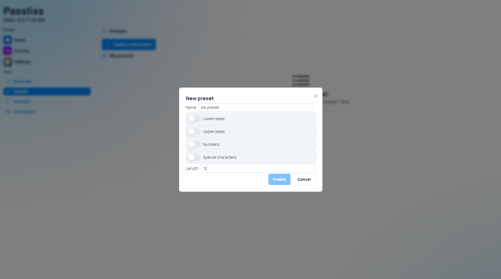
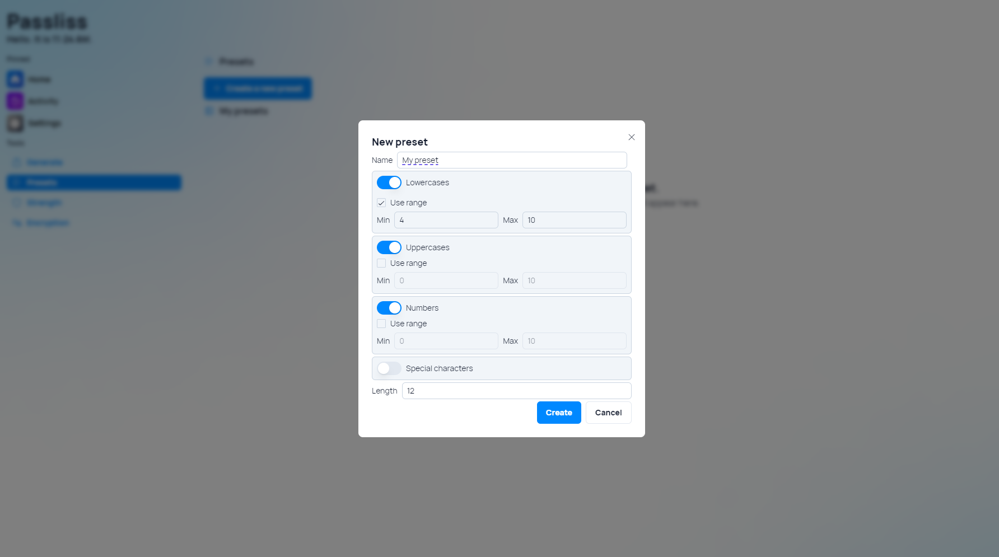
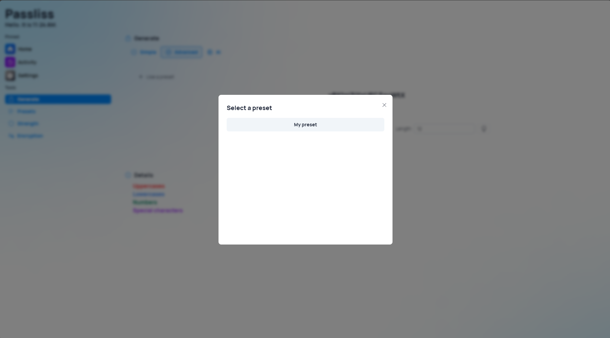
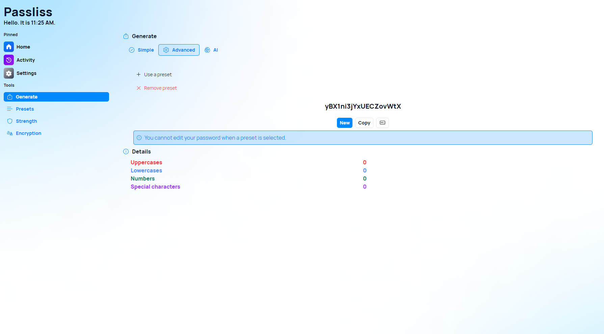

In an era where cybersecurity threats are becoming increasingly sophisticated, the importance of robust password management cannot be overstated. With each passing day, we entrust more of our personal and professional lives to the digital realm, necessitating the need for strong, unique passwords to safeguard our sensitive information. This fourth major version of Passliss is here to answer new needs when it comes to password generation. Let's see what's new!

## Introducing Presets

With Passliss for the Web 4, we are thrilled to introduce a groundbreaking new feature: Presets. Presets revolutionize the password generation experience by allowing users to create default configurations that align with their specific preferences and security needs. Gone are the days of manually adjusting settings for each password generation session—Presets streamline the process, ensuring that users can generate passwords tailored to their exact specifications with just a few clicks.

### Customization Made Easy

Presets empower users to customize every aspect of their password generation process, from the inclusion of uppercase and lowercase letters to the incorporation of numbers and special characters. Want a password that includes uppercase letters and numbers but excludes special characters? No problem. With Presets, users can effortlessly define their desired configuration, eliminating the need for repetitive adjustments.

### Fine-Tuned Control

What sets Presets apart is its granular level of control over password generation parameters. For each character type—uppercase, lowercase, numbers, and special characters—users can set both a minimum and maximum number of characters to include in their passwords. This level of flexibility ensures that users can strike the perfect balance between complexity and memorability, catering to their individual preferences and security requirements.

### Target Length Setting

In addition to specifying the minimum and maximum character counts for each character type, Presets also allow users to set a target length for their passwords. Whether you prefer shorter, more concise passwords or longer, more robust ones, you can easily define your desired password length with a single setting. Presets then intelligently adjust the distribution of characters within the password to meet your specified target length, ensuring that each generated password is optimized for both security and usability.

### Effortless Password Generation

With Presets, generating secure passwords has never been easier. Once users have configured their desired preset settings, they can simply select their preferred preset from the dropdown menu when generating a new password. Passliss for the Web 4 will then automatically apply the preset configuration, instantly generating a password that aligns with the user's specifications. This streamlined process saves time and eliminates the guesswork, allowing users to focus on what matters most—keeping their online accounts secure.

## Other improvements

We also took time to improve some areas of the app and improve existing features. This fourth major version isn't a complete revolution, but rather focuses on improving the user experience across the app.

## Launch

[Click here](https://passliss.leocorporation.dev/) to launch Passliss in your web browser.

## Learn more

[Click here](https://leocorporation.dev/store/passliss) to learn more about Passliss
