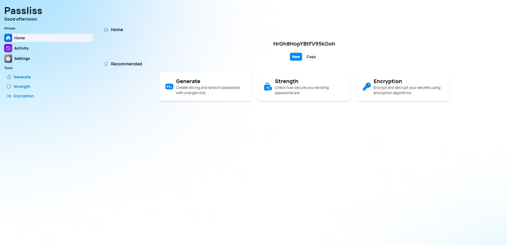
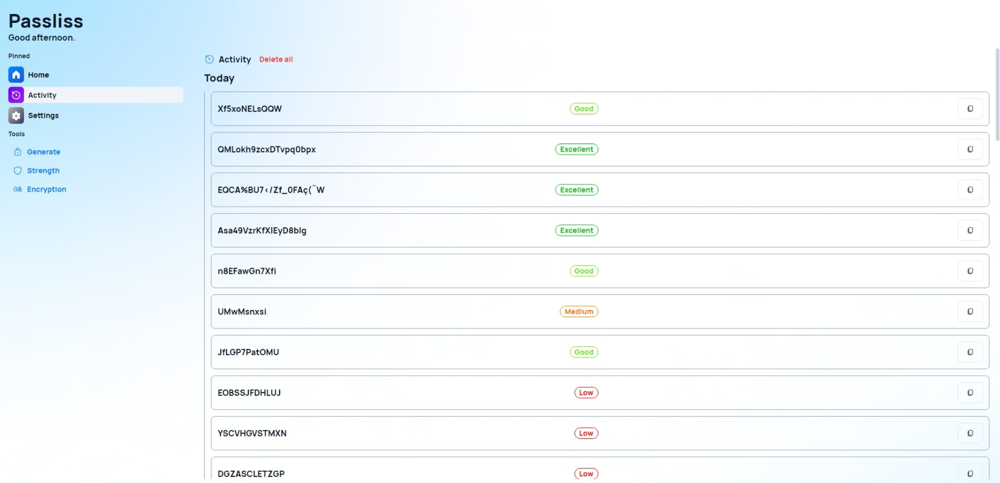
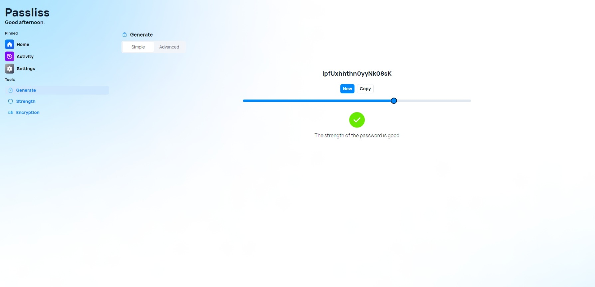
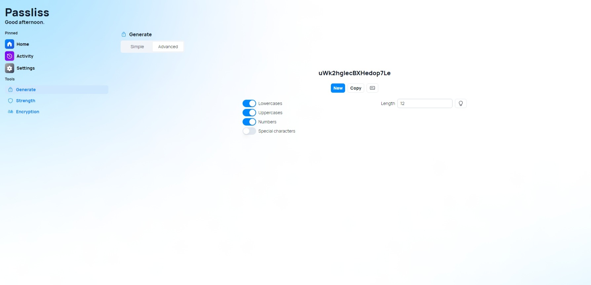
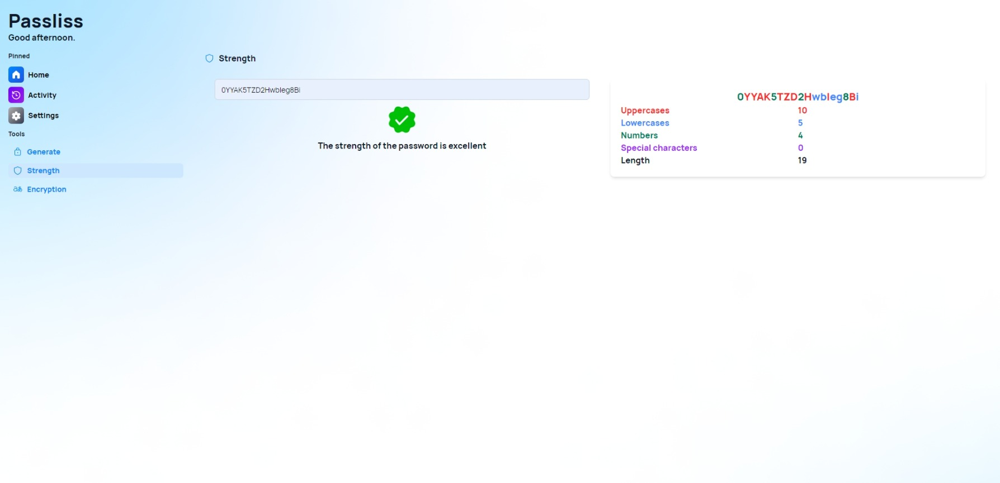
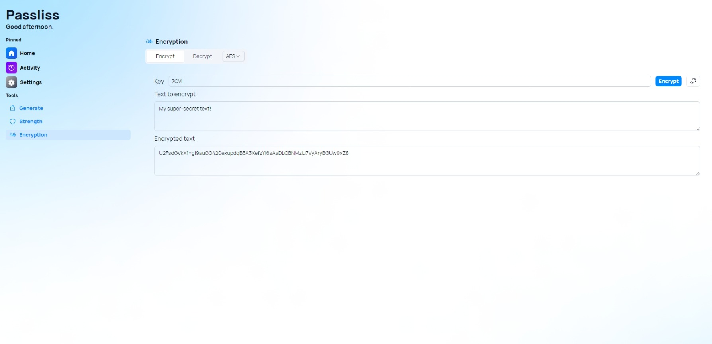
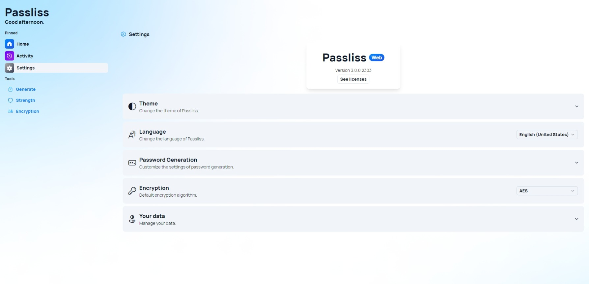

## Introduction

Are you tired of struggling to come up with strong and unique passwords for all of your accounts? Look no further than Passliss for the Web, the latest and greatest iteration of Léo Corporation's simple yet powerful password generator.

## New features

### The new Home page

With Passliss for the Web, you can generate a strong password with just a click of a button. The home dashboard allows for quick generation, giving you the option to generate a password as soon as you load the page or by clicking a button. Plus, with the recommended features displayed as cards, you can easily explore and customize your password to fit your needs.

### Introducing Activities

The Activity page in Passliss for the Web allows you to keep track of all the passwords you've generated so far. This feature provides you with a list of your recently generated passwords along with their strength ratings. With this information at your fingertips, you can quickly identify which passwords are weak and need to be updated.

### Generate passwords easily

The Generate page in Passliss for the Web is designed to make password generation easy and customizable. The basic view allows you to generate a password by strength, where you can select the desired strength with a slider and generate and copy buttons. The password strength rating is displayed in real-time, allowing you to adjust the strength slider to your desired level.

However, if you want more control over your passwords, the advanced view is where you should be. Here, you can customize the password characters to your liking, including uppercases, lowercases, numbers, and special characters. You can even input custom characters to create unique passwords. Additionally, you can choose the length of the password and generate multiple passwords at once. Whether you want a quick and easy password or a fully customized one, Passliss for the Web has you covered.

### Ensure your safety

But Passliss for the Web doesn't just stop at password generation. The strength page allows you to estimate the strength of your current passwords and provides you with a detailed view of their strength with different colors. With this feature, you can identify weak passwords and take action to make them stronger. Passliss for the Web reminds you that the strength estimation is just an estimate, so you should always use your best judgment when creating and using passwords.

### Encrypt your secrets

Passliss also has another great feature: The encryption page. It allows you to encrypt and decrypt strings using different encryption algorithms, including AES and Triple-DES. These are widely recognized as some of the most secure and reliable encryption algorithms available today.

AES, or Advanced Encryption Standard, is a symmetric-key encryption algorithm that is used to protect sensitive data. It is widely considered to be one of the most secure encryption algorithms available, and is used by governments, financial institutions, and other organizations to secure their data.

Triple-DES, or Triple Data Encryption Standard, is another symmetric-key encryption algorithm that uses three individual keys for increased security. While it is not as widely used as AES, it is still a reliable encryption algorithm that provides strong protection for your data.

### Customize your experience

Passliss for the Web also comes with a settings page, allowing you to set your preferred theme, language, default random length, list of characters, and even your default encryption algorithm. And with the ability to export and import settings, you can easily transfer your preferences to other devices.

### Built using innovative technologies

Built using NextJS, TypeScript, and Shadcn/ui with TailwindCSS and RadixUI, Passliss for the Web is also a progressive web application available for both desktop and mobile devices. Plus, the responsive UI ensures a seamless experience across all devices.

## Launch now!

Don't settle for weak and easily hackable passwords. Upgrade to Passliss for the Web and secure your online presence today!

[Click here](https://passliss.leocorporation.dev) to launch Passliss in your browser.

## Trailer

Watch the trailer!



  

    <iframe width="560" height="315" src="https://www.youtube.com/embed/ac-83iKkJlU" title="YouTube video player" frameborder="0" allow="accelerometer; autoplay; clipboard-write; encrypted-media; gyroscope; picture-in-picture; web-share" allowfullscreen></iframe>
  



## QnA

### What’s the future of Passliss Desktop?

Passliss Desktop is going to be discontinued in favor of Passliss for the Web. This means that users will need to use the new web experience to generate and manage their passwords. Passliss for the Web offers more features, more security, and more convenience than Passliss Desktop.

However, users can still enjoy a desktop-like experience by installing Passliss for the Web as a progressive web application (PWA). This will allow them to access Passliss for the Web from their desktop or mobile device without opening a browser. To install Passliss for the Web as a PWA, users simply need to [visit the website](https://passliss.leocorporation.dev/) and follow the instructions on their device.

We hope that users will enjoy using Passliss for the Web and appreciate its benefits over Passliss Desktop. We thank them for their support and feedback over the years and look forward to providing them with the best password generator possible.

### Can I upgrade directly from Passliss Desktop to Passliss for the Web?

No, you cannot upgrade from Passliss Desktop to Passliss Web because they are two different products. Passliss Desktop is a standalone application that runs on Windows and generates passwords locally. Passliss Web is a web-based application that runs on any device with a browser and generates passwords online. They have different features, settings, and interfaces.

However, you can still use both products if you wish. You can keep using Passliss Desktop until it is discontinued and then switch to Passliss Web. Or you can start using Passliss Web right away and enjoy its benefits over Passliss Desktop. The choice is yours.

### Is Passliss for the Web free?

Yes, Passliss for the Web is free and open source. You can use it without paying anything or registering anything. You can also access the source code and contribute to the development of Passliss for the Web on [GitHub](https://github.com/Leo-Corporation/Passliss). We believe in making password security accessible and transparent for everyone.
