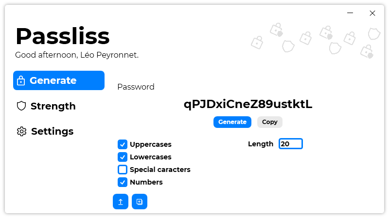
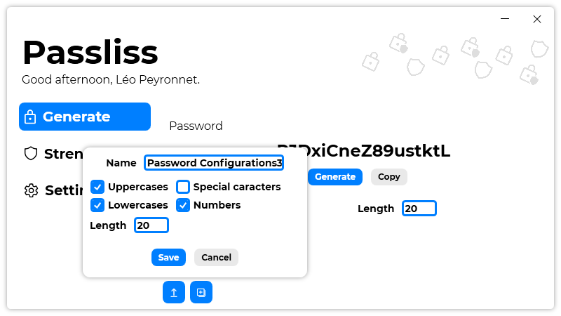
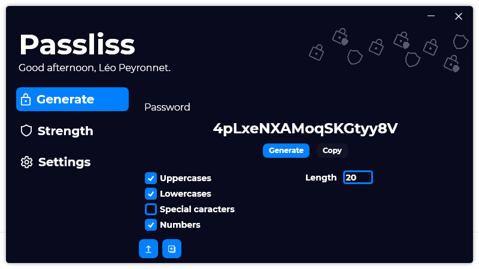

After a month of developpment, Passliss, the successor of Password Generator 3 is out and generaly available for the public.

## Introduction
Password Generator is part of our most popular softwares since the launch of the third version. This third version was designed to be built on a more modern platform (C# - Windows Forms) and also to deliver a more modern UI (Guna.UI) For Passliss, we chose to focus on one thing: innovation. Passliss is our second software to be built using WPF, and our first software to use our new design guidelines, which mainely focus on User eXperience (UX) but also on User Interface (UI). Thanks to this guidelines, Passliss is offering to our users an intuitive and modern experience.

## Features
Passliss offers a few useful features to make password generation easier. Let's start with the password generation customization system, the main page. You an easily customize the password that isgoing to be generated, you can choose if the password will include lower case, upper case, numbers and special caracters. You can also choose the length of the password. You can save your configuration by using Password Configurations, which allows you to save a specific password generation configuration.

Passliss can also evaluate the strenght of a password. There is multiples levels of strenght:
- Low, you should change your password
- Medium, adding more complexity to your password would be a nice addition
- Good, you can safely use this password
- Excellent, the chances of someone finding your password are near inexistant.

Passliss also has an auto-update system and a dark mode!

## Open Source
Passliss is also Open Source on [GitHub](https://github.com/Leo-Corporation/Passliss).

## Download
[Click here](https://tinyurl.com/Passliss) to download Passliss.