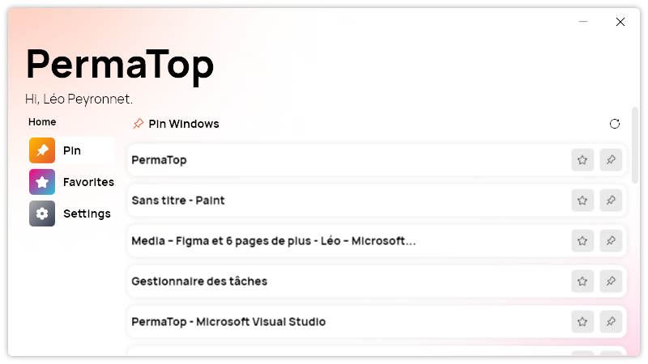
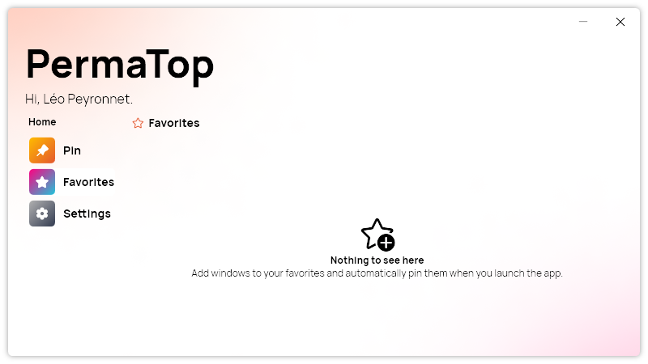
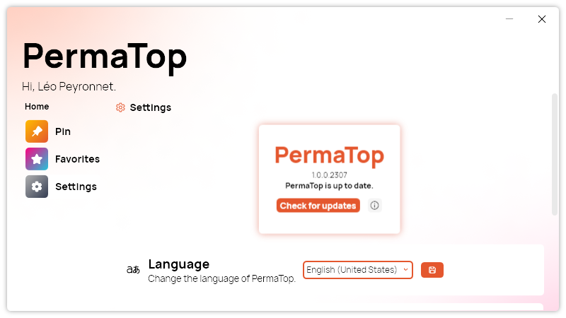
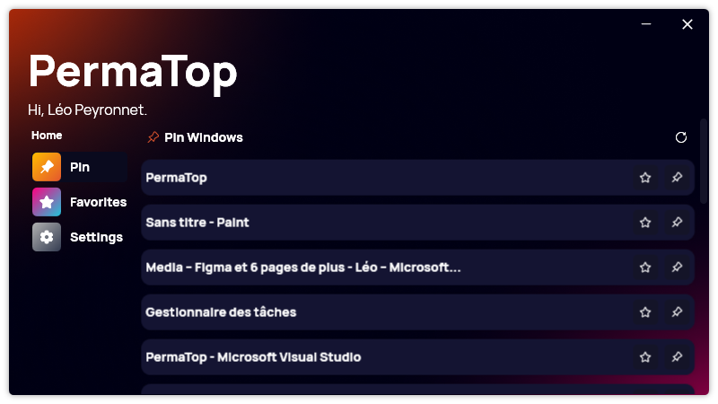

## Introduction

Are you tired of constantly switching between windows and losing focus on your essential tasks? Look no further! We are thrilled to introduce PermaTop, the ultimate Windows utility designed to enhance your productivity by keeping windows always on top of each other.
In our fast-paced digital world, multitasking is the norm. But with so many open windows, it's easy to lose focus and become overwhelmed. PermaTop is here to change that. This powerful tool allows you to pin any window, ensuring it stays on top of all others. No more burying important information beneath a pile of applications – keep your essential tools and resources visible and accessible at all times!

## Features

### Pin Windows

PermaTop empowers you with the ability to pin any window, be it an application, document, or browser, to ensure it remains in the foreground at all times. No more juggling between windows or losing track of critical information!

### Favorites for Instant Pinning

Say goodbye to repetitive pinning tasks! PermaTop allows you to mark your favorite windows, which will be automatically pinned each time you launch the app. With just one click, your essential tools and resources are instantly at your disposal.

### Customization at Your Fingertips

PermaTop goes beyond a one-size-fits-all approach. It offers a plethora of customization options, allowing you to tailor the utility to suit your specific workflow and preferences. From pinning behavior to visual styles, PermaTop adapts to you.

### Seamless User Experience

Using PermaTop is as simple as it gets. Upon launching the application, a list of opened windows is displayed, enabling you to effortlessly pin any window with a single click. No complex setup or learning curve, just pure productivity at your fingertips.

### Boost Productivity, Streamline Workflows

With PermaTop in your arsenal, you can wave goodbye to the frustration of window management. Stay focused, switch between tasks seamlessly, and elevate your productivity to new heights.

## Try PermaTop Today

Ready to take control of your Windows experience? [Download PermaTop](https://tinyurl.com/PermaTop) now and unlock a world of productivity possibilities. Whether you're a multitasking enthusiast, a professional handling multiple projects, or someone who values efficiency, PermaTop is your ticket to an optimized workflow.

Don't let windows obscure your path to success. Embrace PermaTop and witness the transformation in your productivity today!
