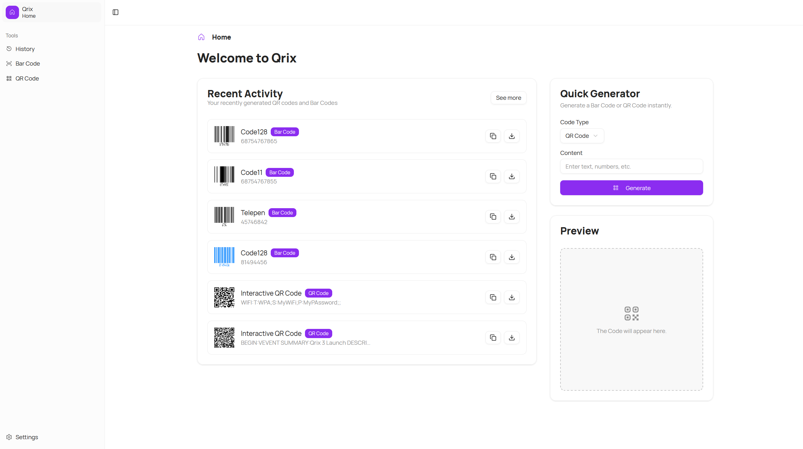
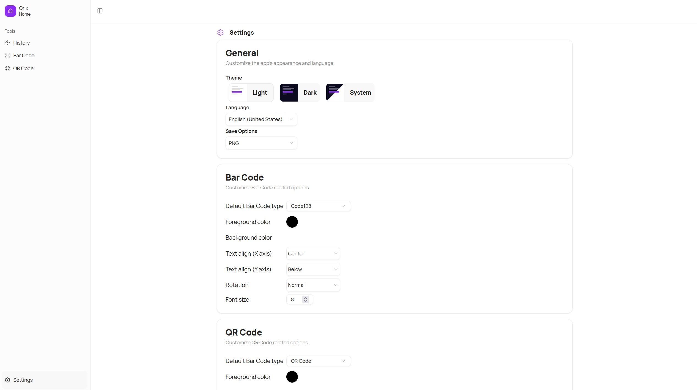

We're excited to unveil Qrix v3, a major release that marks the beginning of a new era for our app. This version isn't just an update — it's a complete rebuild, leveraging the power of the new Next.js App Router. By adopting this modern framework, we've dramatically improved performance, routing capabilities, and flexibility throughout the entire application.

## What's New in Qrix v3

With this release, Qrix introduces a brand new Home page and Settings page, both redesigned from the ground up. The new Home page offers a clearer layout and a smoother user experience, welcoming you with a modern design that puts your most-used features front and center. The Settings page has also been rethought, making configuration easier to navigate and more intuitive, with new options like language selection, theme customization, and a cleaner overall structure.

Another standout feature in Qrix v3 is the new sidebar, built to improve navigation and clarity. It now includes indicators for the current page, better support for accessibility, and a more compact, focused design that works seamlessly across both desktop and mobile devices. Combined with our updated layout system, these changes make Qrix feel faster, more responsive, and more user-friendly at every turn.

## Enhanced Features

Under the hood, this release includes dozens of improvements: a fresh theme, localization support, a new versioning system, a smoother mobile layout, and the migration to Radix UI and shadcn/ui for more consistent and accessible components. We've also added a History page, QR code and Barcode tools, and a host of new utilities that improve the overall experience without getting in your way.

## Try Qrix v3 Today

[Try it now](https://qrix.leocorporation.dev) and explore the new experience. As always, we'd love your feedback.

## Changelog

### New

- Initialized new Qrix app with App Router (#100)
- Added assets
- Added main layout (#1001)
- Added Components
- Added new sidebar (#1002)
- Added Settings hooks
- Added components (#1003)
- Added barcode types
- Added new version system
- Added fonts
- Added new theme (#1003)
- Added locale service
- Added new settings page (#1003)
- Added the possibility to change language
- Added useHistory hook for managing barcode history
- Added missing font
- Added calendar and contact interfaces
- Added Barcode page (#1001)
- Added QR Code page (#1001)
- Added shadcn/ui table and drawer
- Added History Element component
- Added History page (#1001)
- Added indicator for current page in sidebar (#1002)
- Improved theme switcher (#1003)
- Added Prettier config with Tailwind CSS plugin
- Added locales
- Added Badge component
- Added new Home page
- Added Welcome message
- Improved mobile layout
- Added placeholder

### Fixed
- Fixed an issue with useSettings hook
- Fixed wrong primary color
- Fixed @typescript-eslint/no-explicit-any
- Fixed some UI issues
- Fixed TypeScript errors

### Updated

- Migrated RadixUI
