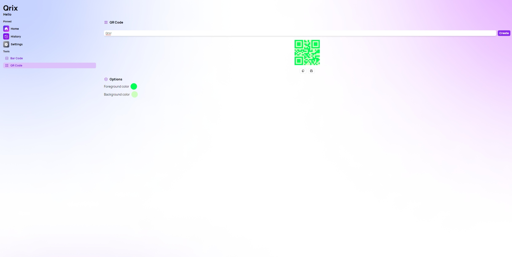
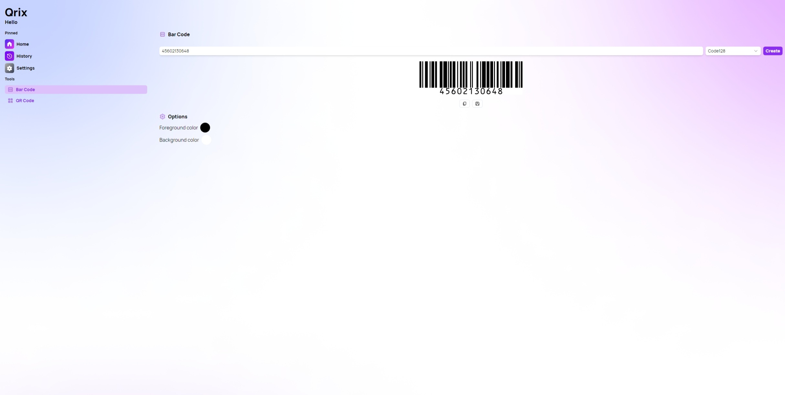
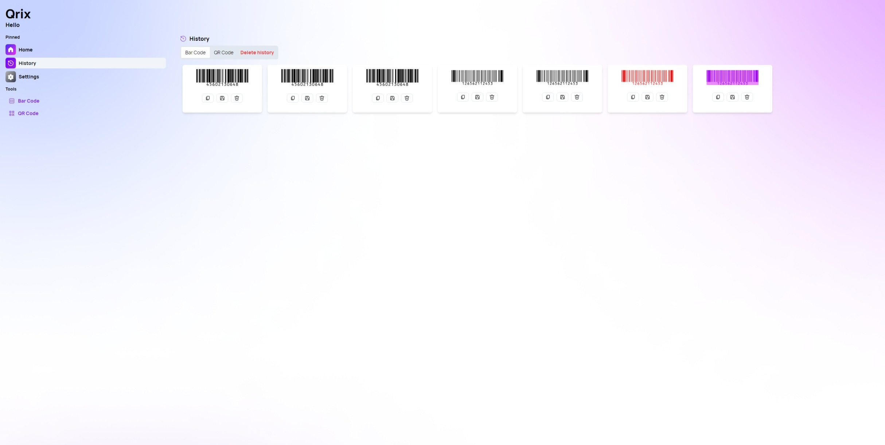
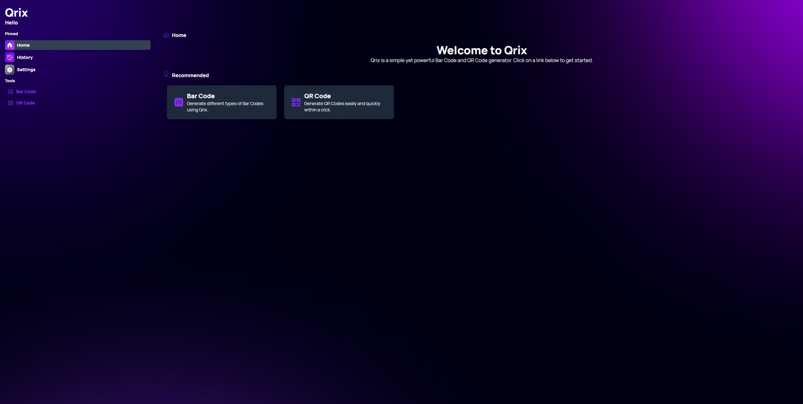

## Introduction

Welcome to Qrix, the web app that lets you create and customize bar codes and QR codes with ease. Qrix is designed to be simple, fast, and user-friendly. You can generate codes in various formats, such as Code128, Code11, UPC-A, ISBN, and more. You can also adjust the foreground and background colors of your codes and save or copy them for later use. Qrix supports light and dark themes and is available in English and French.
In this blog post, we will introduce you to some of the features of Qrix and show you how to use it. Whether you need to create codes for personal or professional purposes, Qrix can help you do it in a few clicks.

## Features

With its array of powerful features, Qrix is set to become your go-to tool for all your code generation needs.

### Diverse Code Types

Qrix offers an extensive range of bar code types to cater to your specific requirements. Whether you need a Code128, Code11, UPC-A, ISBN, or any other bar code format, Qrix has you covered. By supporting various code types, Qrix ensures that you can generate the right code for your products, documents, or any other data.
Currently these types are available:

- Code128
- Code11
- Code39
- Code49
- Code93
- EAN-13
- EAN-2
- EAN-5
- EAN-8
- UPC-A
- MSI
- ISBN

### Customization Options

Personalization is key when it comes to branding and visual appeal. Qrix acknowledges this and offers a wide range of customization options for your codes. You can easily adjust the foreground and background colors to match your brand's identity or aesthetic preferences. Qrix also provides a real-time preview, allowing you to fine-tune the appearance of your codes before saving or copying them.

### Saving and Copying Codes

Qrix provides flexible options for saving and sharing your generated codes. You can conveniently save your codes as PNG/JPG/BMP files, ensuring compatibility across various platforms and applications. Additionally, with a simple click, you can copy the codes directly to your clipboard, enabling swift integration into documents, presentations, or websites.

### History Feature

Keeping track of your generated codes is made effortless with Qrix's history feature. Every code you generate is automatically saved within the app, ensuring easy access and retrieval whenever you need it. This feature eliminates the hassle of manually managing files or searching for previously created codes, allowing you to focus on your tasks without interruption.

### Theme and Language Customization

Qrix understands the importance of user preferences. It offers a choice between light and dark themes, allowing you to create a visually comfortable environment that suits your needs. Moreover, Qrix supports multiple languages, including English and French, ensuring a seamless experience for users from different linguistic backgrounds.

### Cross-Device Compatibility

Qrix is designed to be highly accessible, enabling you to generate codes from any device with a web browser. Whether you're using a desktop computer, laptop, tablet, or smartphone, Qrix adapts responsively to different screen sizes and orientations. This versatility allows you to use Qrix wherever and whenever you need it, whether you're at your desk or on the go.
Qrix revolutionizes the way you generate bar codes and QR codes. With its diverse code types, customization options, history feature, and cross-device compatibility, Qrix empowers you to create codes quickly, efficiently, and with unmatched convenience.

## How to use Qrix

Using Qrix is very easy. Here are the steps to follow:

1. Go to https://qrix.leocorporation.dev and click on the "Bar Code" or “QR Code” option.
2. Select the type of code you want to generate from the dropdown menu.
3. Enter the data for your code in the input field. For example, if you want to generate a QR code for a website, enter the URL of the website.
4. Choose the foreground and background colors for your code from the color picker. You can also use the default colors if you prefer.
5. Click on the "Generate" button and see your code appear on the screen.
6. If you are satisfied with your code, you can save it as a PNG file by clicking on the "Save" button or copy it to your clipboard by clicking on the "Copy" button.

## Conclusion

Qrix is a web app that lets you create and customize bar codes and QR codes with ease. It is simple, fast, and user-friendly. It has many features that make it a great app for generating codes for personal or professional purposes. You can access it from any device that has a web browser.

If you want to try Qrix for yourself, go to https://qrix.leocorporation.dev and start creating your own codes today. You will be amazed by how easy and fun it is to use Qrix.

Thank you for reading this blog post. I hope you found it informative and helpful. If you have any questions or feedback about Qrix, feel free to leave a comment below or [contact us](https://leocorporation.dev/contact).

## What’s next for Gerayis?

After careful consideration and in line with our commitment to providing the best user experience possible, we have made the decision to discontinue support for Gerayis for Windows. Gerayis will still work but we won’t bring any new updates to it. For new features, users can migrate to Qrix. To get started with it, simply access it through your preferred web browser. The best part is that Qrix can also be installed as a Progressive Web App (PWA) on your Windows device. This means you can have the convenience of a dedicated app-like experience while still benefiting from the versatility of a web-based solution.
By transitioning to Qrix, you will gain access to all the features and functionality you enjoyed with Gerayis, and more.

We understand that change can sometimes be challenging, but we are confident that Qrix will exceed your expectations and become your go-to solution for code generation. Our team is dedicated to providing continuous support and updates for Qrix, ensuring that you have the best possible experience while using our app.

As we move forward, we encourage all Windows users to transition from Gerayis to Qrix. We appreciate your understanding and are excited to embark on this new chapter with you. Should you have any questions or need assistance during the transition, our support team is available to help.

## Video

Watch the official trailer for Qrix on our YouTube channel



  

    <iframe width="560" height="315" src="https://www.youtube.com/embed/0WgfrrMd_aU" title="YouTube video player" frameborder="0" allow="accelerometer; autoplay; clipboard-write; encrypted-media; gyroscope; picture-in-picture; web-share" allowfullscreen></iframe>
  


