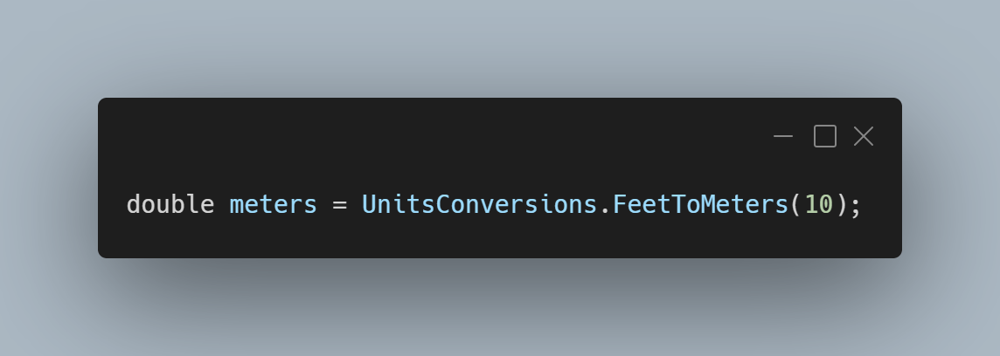

A new version of LeoCorpLibrary is now available, and it is the version 3.10.0.2109.

## Changelog
### New
- Added the possibility to get if a triangle is a right triangle (#246)
- Added the possibility to get a rectangle's area (#247)
- Added the possibility to get a cone's volume (#248)
- Added the possibility to convert feet to meters (#249)
- Added the possibility to convert meters to feet (#249)
- Added the possibility to convert pounds to kilograms (#250)
- Added the possibility to convert kilograms to pounds (#250)
### Updated
- Updated XML Documentation

## Links

- [NuGet –LeoCorpLibrary](https://www.nuget.org/packages/LeoCorpLibrary)
- [NuGet – LeoCorpLibrary.Core](https://www.nuget.org/packages/LeoCorpLibrary.Core)
- [GitHub](https://github.com/Leo-Corporation/LeoCorpLibrary)
- [GitHub Packages – LeoCorpLibrary](https://github.com/Leo-Corporation/LeoCorpLibrary/packages/345951?version=4.9.0.2208)
- [GitHub Packages – LeoCorpLibrary.Core](https://github.com/Leo-Corporation/LeoCorpLibrary/packages/530093?version=4.9.0.2208)

## Documentation

[Click here](https://leocorplibrary.leocorporation.dev/) to check the documentation of LeoCorpLibrary.

## Screenshot
