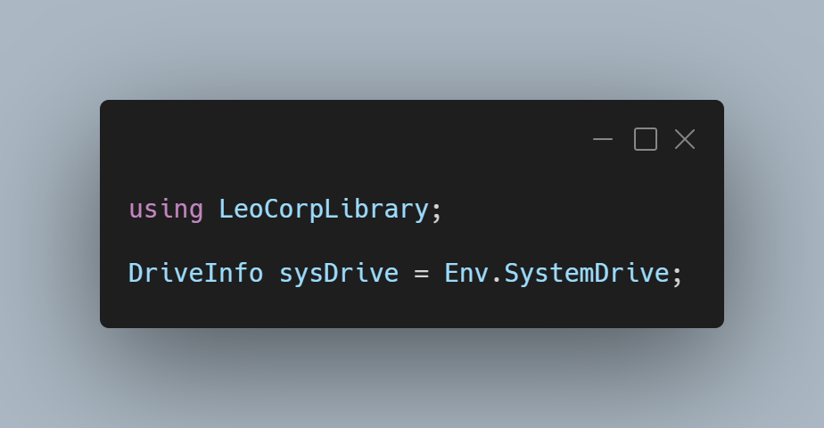

A new version is available for LeoCorpLibrary and LeoCorpLibrary.Core. Here's what's new:

## Changelog
### New
- Converted the "GetWindowsVersion()" method to a property (#169)
- Converted the "GetUnixTime()" method to a property (#169)
- Converted the "GetAppDataPath()" method to a property (#169)
- Added the "OperatingSystems" enum (#170)
- Added the possibility to get the OS (#170)
- Added the possibility to get the system drive (Windows only) (#171)

## Links

- [NuGet –LeoCorpLibrary](https://www.nuget.org/packages/LeoCorpLibrary)
- [NuGet – LeoCorpLibrary.Core](https://www.nuget.org/packages/LeoCorpLibrary.Core)
- [GitHub](https://github.com/Leo-Corporation/LeoCorpLibrary)
- [GitHub Packages – LeoCorpLibrary](https://github.com/Leo-Corporation/LeoCorpLibrary/packages/345951)
- [GitHub Packages – LeoCorpLibrary.Core](https://github.com/Leo-Corporation/LeoCorpLibrary/packages/530093)

## Image
